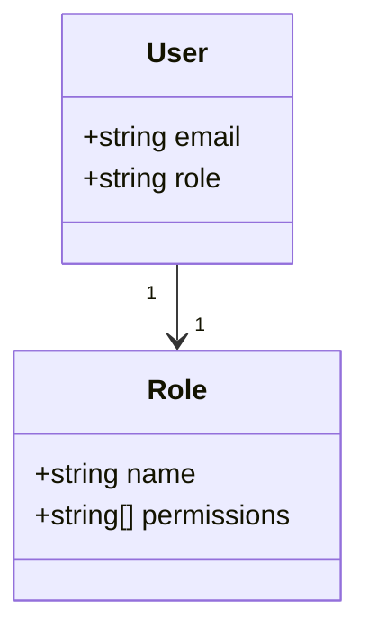
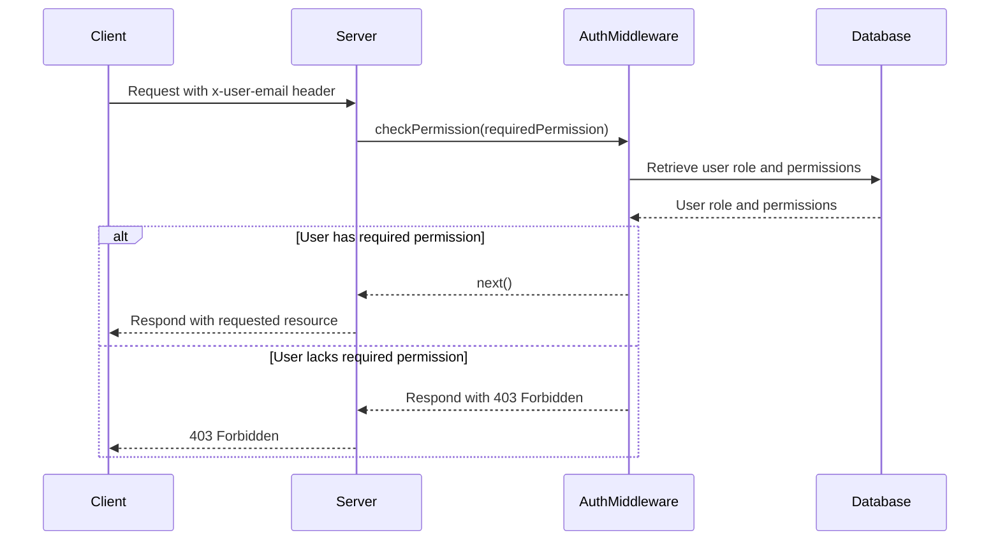
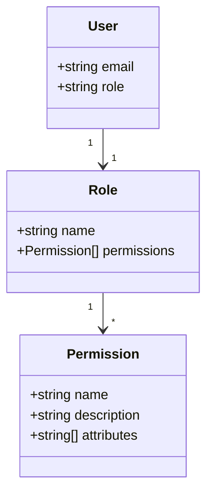

<details>
<summary>Relevant source files</summary>

The following files were used as context for generating this wiki page:

- [src/models.js](https://github.com/aanickode/access-control-service/blob/main/src/models.js)
- [src/authMiddleware.js](https://github.com/aanickode/access-control-service/blob/main/src/authMiddleware.js)
</details>

# Extending and Customizing

## Introduction

The provided source files define a basic access control system for managing user roles and permissions within an application. The `src/models.js` file defines the data models for `User` and `Role` objects, while `src/authMiddleware.js` contains a middleware function `checkPermission` that validates a user's permissions before allowing access to a protected resource.

This wiki page aims to provide an overview of how this access control system can be extended and customized to meet the specific requirements of a project. It will cover the key components, data flow, and potential customization points based on the information available in the provided source files.

## Access Control System Architecture

The access control system follows a role-based access control (RBAC) model, where users are assigned roles, and roles are associated with specific permissions. The system relies on a database (`db`) to store user and role information.



Sources: [src/models.js](https://github.com/aanickode/access-control-service/blob/main/src/models.js)

## Authentication Middleware

The `checkPermission` middleware function in `src/authMiddleware.js` is responsible for validating a user's permissions before allowing access to a protected resource. Here's how it works:



Sources: [src/authMiddleware.js](https://github.com/aanickode/access-control-service/blob/main/src/authMiddleware.js)

The `checkPermission` middleware function expects the client to provide a `x-user-email` header with the authenticated user's email. It then retrieves the user's role and associated permissions from the database (`db`). If the user's role has the required permission, the request is allowed to proceed; otherwise, a `403 Forbidden` response is sent.

## Customization Points

### Data Models

The `User` and `Role` data models defined in `src/models.js` can be extended to include additional properties or relationships as needed. For example, you might want to add fields like `firstName`, `lastName`, or `createdAt` to the `User` model, or include a `description` field for roles.

```js
export const User = {
  email: 'string',
  role: 'string',
  firstName: 'string',
  lastName: 'string',
  createdAt: 'date'
};

export const Role = {
  name: 'string',
  permissions: ['string'],
  description: 'string'
};
```

Sources: [src/models.js](https://github.com/aanickode/access-control-service/blob/main/src/models.js)

### Permission Handling

The current implementation assumes a simple string-based permission system, where each role has an array of permission strings. This can be extended to support more complex permission models, such as hierarchical or attribute-based access control (ABAC).

For example, you could define a `Permission` model and associate it with roles, allowing for more granular control over permissions:



Sources: [src/models.js](https://github.com/aanickode/access-control-service/blob/main/src/models.js)

The `checkPermission` middleware would then need to be updated to handle the new permission model, potentially involving more complex logic for evaluating permissions based on attributes or conditions.

### Database Integration

The current implementation assumes the existence of a `db` object that provides access to user and role information. In a real-world scenario, this would likely be replaced with an actual database integration, such as a SQL or NoSQL database.

To integrate with a database, you would need to replace the `db` object with appropriate database queries or ORM (Object-Relational Mapping) methods to retrieve user and role information. The `checkPermission` middleware would then need to be updated to use these database integration methods.

### Authentication and Authorization Flows

The provided source files do not cover the authentication and authorization flows for obtaining the `x-user-email` header or managing user sessions. In a production system, you would need to implement these flows, potentially involving components like:

- User registration and login mechanisms
- JSON Web Token (JWT) or session-based authentication
- Integration with external identity providers (e.g., OAuth, SAML)
- User management and role assignment interfaces

These components would need to be integrated with the access control system to provide a complete authentication and authorization solution.

## Conclusion

The provided source files offer a basic foundation for an access control system based on roles and permissions. By understanding the key components and data flow, developers can extend and customize the system to meet their specific requirements, such as adding more complex permission models, integrating with databases, or implementing authentication and authorization flows. Careful planning and adherence to best practices are essential when extending and customizing access control systems to ensure security and maintainability.