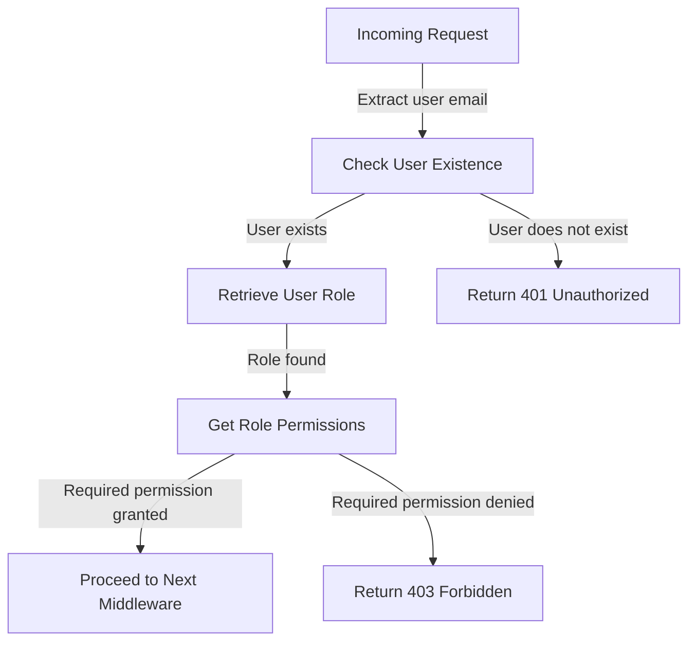
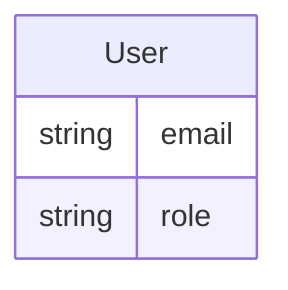
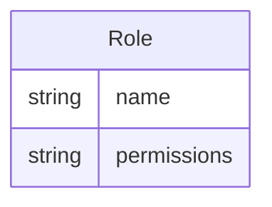
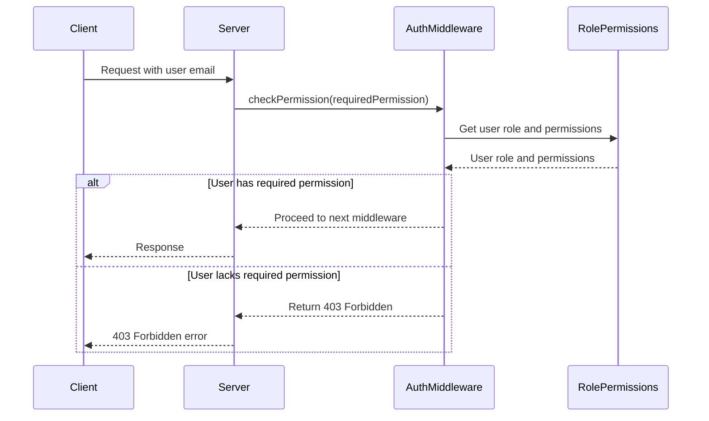

Relevant source files

The following files were used as context for generating this wiki page:

- [src/authMiddleware.js](https://github.com/aanickode/access-control-service/blob/main/src/authMiddleware.js)
- [src/models.js](https://github.com/aanickode/access-control-service/blob/main/src/models.js)

# Extending and Customizing

## Introduction

The "Extending and Customizing" feature within this project refers to the ability to modify and adapt the access control and authorization mechanisms based on specific requirements. This functionality is primarily implemented in the `authMiddleware.js` and `models.js` files, which define the core logic and data structures for user authentication and role-based access control (RBAC).

Sources: [src/authMiddleware.js](), [src/models.js]()

## User Authentication

The `authMiddleware.js` file contains a middleware function `checkPermission` that serves as the entry point for user authentication and authorization. This function is designed to be used as an Express.js middleware, allowing it to be easily integrated into various routes or endpoints within the application.

### Authentication Flow

The authentication flow implemented in `checkPermission` follows these steps:

1. Extract the user's email from the request headers (`x-user-email`).
2. Check if the user exists in the `db.users` object.
3. If the user exists, retrieve their assigned role.
4. Based on the role, fetch the associated permissions from the `db.roles` object.
5. If the user has the required permission, proceed to the next middleware.
6. If the user does not exist or lacks the required permission, return a 401 Unauthorized or 403 Forbidden error, respectively.

Sources: [src/authMiddleware.js:3-19]()

## Data Models

The `models.js` file defines the data structures used for representing users and roles within the application.

### User Model

The `User` model has the following fields:

| Field | Type     | Description                  |
|-------|----------|------------------------------|
| email | `string` | The user's email address     |
| role  | `string` | The name of the user's role  |

Sources: [src/models.js:1-4]()

### Role Model

The `Role` model has the following fields:

| Field       | Type       | Description                                    |
|-------------|------------|------------------------------------------------|
| name        | `string`   | The name of the role                           |
| permissions | `string[]` | An array of permission names associated with the role |

Sources: [src/models.js:6-9]()

## Role-Based Access Control (RBAC)

The application implements a role-based access control (RBAC) system, where users are assigned roles, and roles are associated with specific permissions. The `checkPermission` middleware function enforces this RBAC mechanism by checking if the user's role has the required permission before allowing access to a protected resource or route.

1. The client sends a request to the server, including the user's email in the headers.
2. The server invokes the `checkPermission` middleware, passing the required permission for the requested resource.
3. The `checkPermission` middleware retrieves the user's role and associated permissions from the `RolePermissions` component (representing the `db.roles` object).
4. If the user's role has the required permission, the middleware allows the request to proceed to the next middleware or route handler.
5. If the user's role lacks the required permission, the middleware returns a 403 Forbidden error response.

Sources: [src/authMiddleware.js:3-19](), [src/models.js:6-9]()

## Extending and Customizing

To extend or customize the access control and authorization mechanisms, developers can modify the existing code or add new functionality based on their specific requirements. Here are some potential areas for extension and customization:

### Adding or Modifying Permissions

To add or modify permissions, developers can update the `db.roles` object in the data store or modify the `Role` model in `models.js`. This allows for the introduction of new permissions or the modification of existing ones.

### Implementing Custom Authorization Logic

While the current implementation relies on a simple role-based access control mechanism, developers can extend the `checkPermission` middleware function to incorporate more complex authorization logic. This could involve considering additional factors such as user attributes, resource properties, or context-specific rules.

### Integrating with External Authentication and Authorization Systems

The current implementation uses an in-memory data store (`db.users` and `db.roles`) for user and role information. Developers can modify the code to integrate with external authentication and authorization systems, such as OAuth providers, LDAP directories, or dedicated access control solutions.

### Enhancing Error Handling and Logging

The current implementation provides basic error responses (401 Unauthorized and 403 Forbidden). Developers can enhance the error handling and logging mechanisms to provide more detailed error messages, log relevant information, or integrate with centralized logging systems.

### Implementing Caching or Performance Optimizations

Depending on the application's scale and performance requirements, developers may need to implement caching mechanisms or other performance optimizations for user and role data retrieval, especially when integrating with external systems or handling large volumes of requests.

Sources: [src/authMiddleware.js](), [src/models.js]()

## Conclusion

The "Extending and Customizing" feature within this project revolves around the ability to modify and adapt the access control and authorization mechanisms based on specific requirements. The `authMiddleware.js` and `models.js` files provide the core functionality for user authentication, role-based access control, and data modeling. By understanding the existing implementation and leveraging the provided extension points, developers can tailor the access control system to meet their unique needs, ensuring secure and controlled access to protected resources within the application.