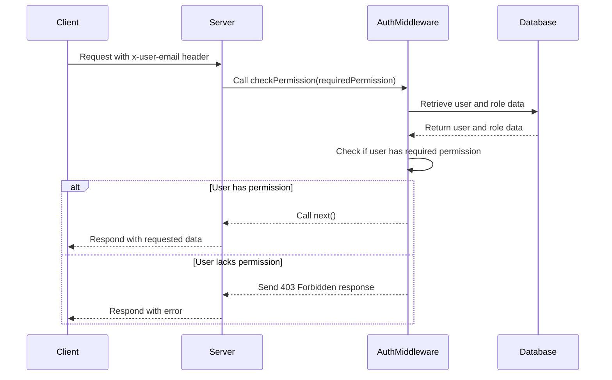

<details>
<summary>Relevant source files</summary>

The following files were used as context for generating this wiki page:

- [src/models.js](https://github.com/aanickode/access-control-service/blob/main/src/models.js)
- [src/authMiddleware.js](https://github.com/aanickode/access-control-service/blob/main/src/authMiddleware.js)
</details>

# Extending and Customizing

## Introduction

The provided source files define a basic access control system for managing user roles and permissions within an application. The `src/models.js` file defines the data models for `User` and `Role` objects, while `src/authMiddleware.js` contains a middleware function `checkPermission` that validates user permissions based on their assigned role.

This wiki page aims to provide an overview of how to extend and customize this access control system to meet specific project requirements. It covers the core components, data flow, and potential customization points based on the information available in the provided source files.

## Core Components

### User and Role Models

The `src/models.js` file defines the data models for `User` and `Role` objects:

```javascript
export const User = {
  email: 'string',
  role: 'string'
};

export const Role = {
  name: 'string',
  permissions: ['string']
};
```

- The `User` model represents a user entity with an `email` property (string) and a `role` property (string) that references a specific role.
- The `Role` model represents a role entity with a `name` property (string) and a `permissions` property (array of strings) that defines the permissions associated with that role.

Sources: [src/models.js](https://github.com/aanickode/access-control-service/blob/main/src/models.js)

### Authentication Middleware

The `src/authMiddleware.js` file exports a `checkPermission` function that serves as a middleware for validating user permissions:

```javascript
export function checkPermission(requiredPermission) {
  return function (req, res, next) {
    const userEmail = req.headers['x-user-email'];
    if (!userEmail || !db.users[userEmail]) {
      return res.status(401).json({ error: 'Unauthorized: no user context' });
    }

    const role = db.users[userEmail];
    const permissions = db.roles[role] || [];

    if (!permissions.includes(requiredPermission)) {
      return res.status(403).json({ error: 'Forbidden: insufficient permissions' });
    }

    next();
  };
}
```

The `checkPermission` function takes a `requiredPermission` parameter and returns a middleware function that performs the following steps:

1. Extracts the user's email from the `x-user-email` header in the request.
2. Checks if the user exists in the `db.users` object (not provided in the source files).
3. Retrieves the user's role from `db.users[userEmail]`.
4. Retrieves the permissions associated with the user's role from `db.roles[role]` (not provided in the source files).
5. Verifies if the `requiredPermission` is included in the user's permissions.
6. If the user has the required permission, the middleware calls `next()` to proceed to the next middleware or route handler.
7. If the user is not authenticated or lacks the required permission, the middleware sends a 401 (Unauthorized) or 403 (Forbidden) response with an appropriate error message.

Sources: [src/authMiddleware.js](https://github.com/aanickode/access-control-service/blob/main/src/authMiddleware.js)

## Data Flow

The following sequence diagram illustrates the data flow when the `checkPermission` middleware is used to validate user permissions:



1. The client sends a request to the server with the `x-user-email` header containing the user's email.
2. The server calls the `checkPermission` middleware, passing the required permission as an argument.
3. The `checkPermission` middleware retrieves the user and role data from the database (not provided in the source files).
4. The middleware checks if the user's role has the required permission based on the retrieved data.
5. If the user has the required permission, the middleware calls `next()`, allowing the request to proceed to the next middleware or route handler.
6. The server responds with the requested data.
7. If the user lacks the required permission, the middleware sends a 403 Forbidden response with an error message.
8. The server forwards the error response to the client.

Sources: [src/authMiddleware.js](https://github.com/aanickode/access-control-service/blob/main/src/authMiddleware.js)

## Customization Points

Based on the provided source files, here are some potential customization points for extending and customizing the access control system:

### Data Models

The `User` and `Role` models defined in `src/models.js` can be extended with additional properties or modified to suit specific project requirements. For example:

- Adding additional user properties like `firstName`, `lastName`, or `createdAt`.
- Introducing hierarchical roles or role inheritance by adding a `parentRole` property to the `Role` model.
- Defining more granular permissions or introducing permission groups instead of a flat list of permissions.

### Authentication and Authorization Logic

The `checkPermission` middleware in `src/authMiddleware.js` can be customized to accommodate different authentication and authorization strategies:

- Implementing role-based access control (RBAC) by introducing role hierarchies or permission inheritance.
- Introducing attribute-based access control (ABAC) by considering additional user attributes or contextual information.
- Integrating with external authentication providers or identity management systems.
- Caching user and role data for improved performance.
- Implementing more advanced authorization logic, such as handling dynamic permissions or rule-based access control.

### Error Handling and Logging

The current implementation provides basic error responses (401 Unauthorized and 403 Forbidden). Customizations could include:

- Implementing more detailed error messages or error codes.
- Introducing error logging or auditing mechanisms.
- Handling and responding to different types of authentication or authorization failures.

### Integration with Other Systems

The access control system can be integrated with other components or systems within the project:

- Integrating with a user management system or authentication service.
- Exposing APIs or interfaces for managing users, roles, and permissions.
- Implementing role and permission management interfaces or admin dashboards.
- Integrating with logging, monitoring, or auditing systems for tracking access control events.

Sources: [src/models.js](https://github.com/aanickode/access-control-service/blob/main/src/models.js), [src/authMiddleware.js](https://github.com/aanickode/access-control-service/blob/main/src/authMiddleware.js)

## Conclusion

The provided source files define a basic access control system with user and role models, as well as a middleware function for validating user permissions. While the current implementation is functional, there are various customization points and potential extensions to adapt the system to specific project requirements. These include modifying the data models, enhancing the authentication and authorization logic, improving error handling and logging, and integrating with other systems or components within the project.