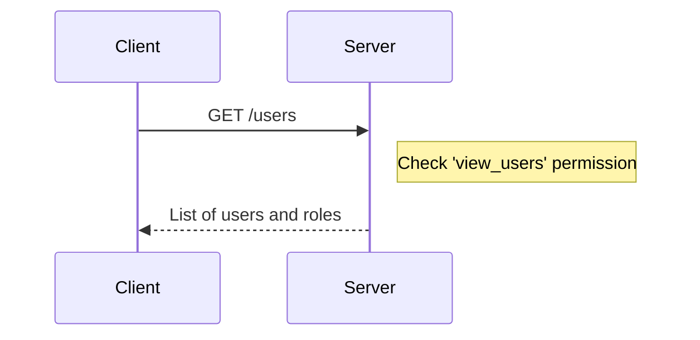
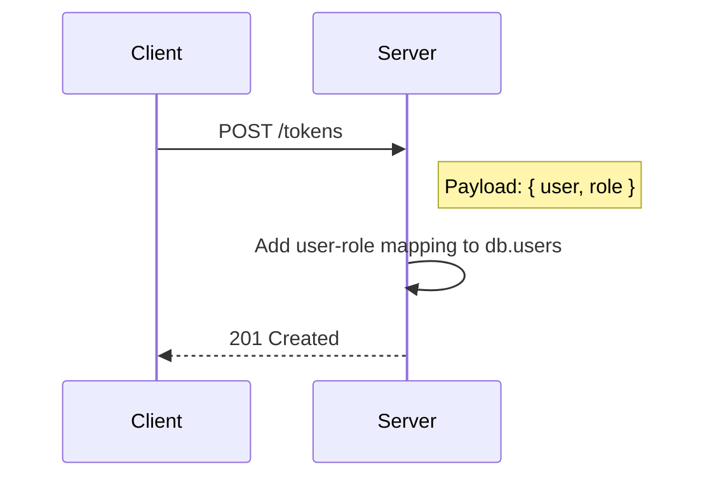
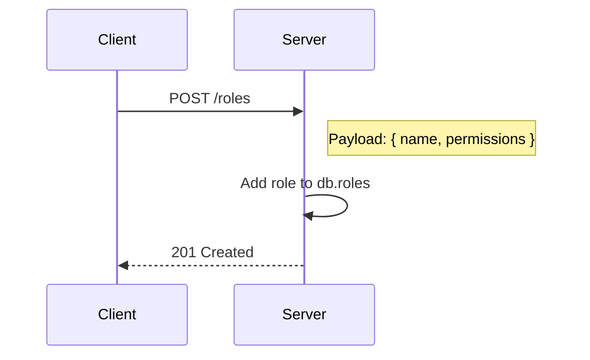
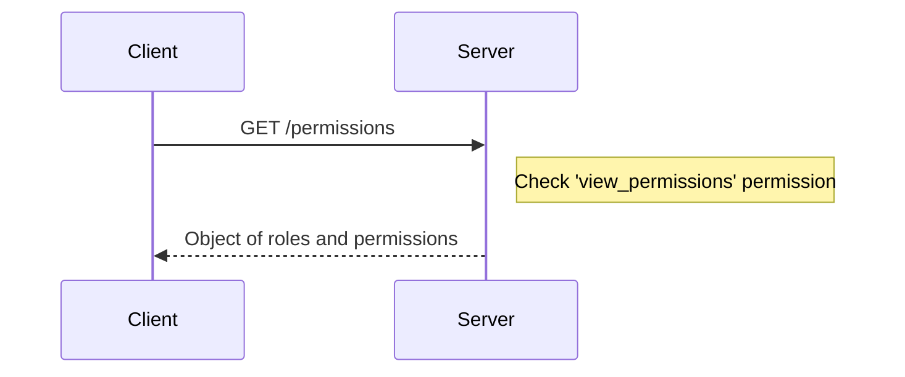
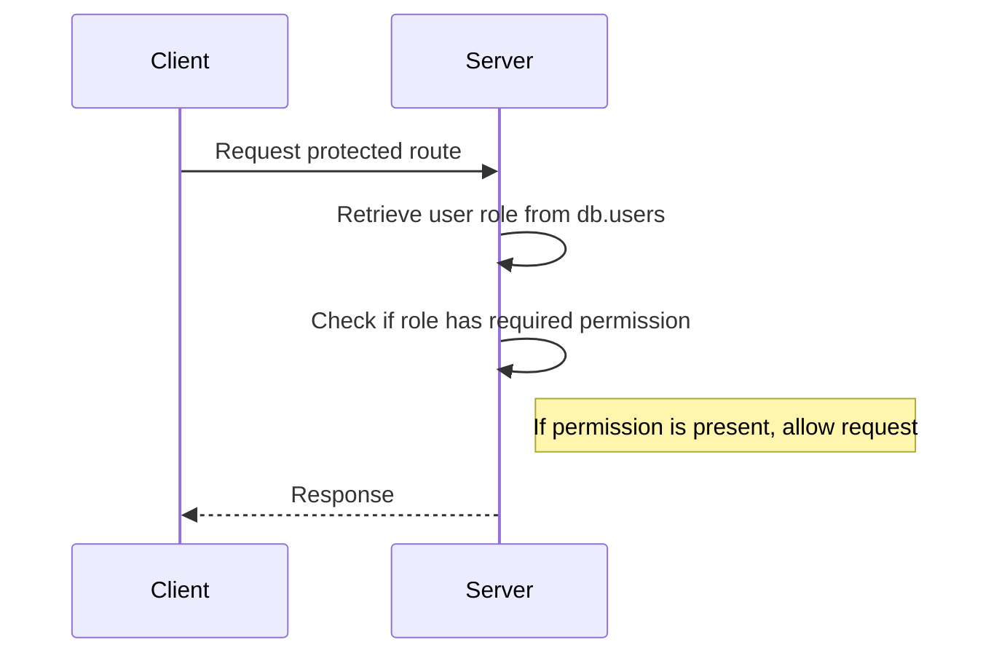

<details>
<summary>Relevant source files</summary>

The following files were used as context for generating this wiki page:

- [src/routes.js](https://github.com/aanickode/access-control-service/blob/main/src/routes.js)
- [src/models.js](https://github.com/aanickode/access-control-service/blob/main/src/models.js)
</details>

# Extending and Customizing

## Introduction

This wiki page covers the "Extending and Customizing" aspect of the project, which primarily deals with the management of user roles and permissions. The project provides a set of routes and data models to handle user authentication, role creation, and permission assignment.

The key components involved in this functionality are:

- **Users**: Entities with associated email addresses and roles.
- **Roles**: Named collections of permissions.
- **Permissions**: Strings representing specific access rights or capabilities.

The project uses an in-memory data store (`db`) to persist user, role, and permission data. The `routes.js` file defines the API endpoints for interacting with this data, while the `models.js` file defines the data structures for users and roles.

Sources: [src/routes.js](), [src/models.js]()

## User Management

### User Representation

Users are represented by an object with the following structure:

```javascript
{
  email: 'string',
  role: 'string'
}
```

The `email` field serves as the unique identifier for a user, while the `role` field associates the user with a specific role.

Sources: [src/models.js:1-4]()

### Retrieving User Information

The `/users` endpoint allows retrieving a list of all registered users and their associated roles.



This endpoint is protected by the `checkPermission` middleware, which verifies that the requesting user has the `'view_users'` permission.

Sources: [src/routes.js:6-8]()

### Assigning Roles to Users

The `/tokens` endpoint allows assigning a role to a user.



To assign a role, the client sends a POST request with a JSON payload containing the `user` (email) and `role` (name) fields. The server then updates the `db.users` object with the provided mapping.

Sources: [src/routes.js:18-23]()

## Role Management

### Role Representation

Roles are represented by an object with the following structure:

```javascript
{
  name: 'string',
  permissions: ['string']
}
```

The `name` field is the unique identifier for a role, while the `permissions` field is an array of strings representing the permissions associated with that role.

Sources: [src/models.js:6-8]()

### Creating Roles

The `/roles` endpoint allows creating new roles with associated permissions.



To create a role, the client sends a POST request with a JSON payload containing the `name` (role name) and `permissions` (array of permission strings) fields. The server then updates the `db.roles` object with the provided role definition.

This endpoint is protected by the `checkPermission` middleware, which verifies that the requesting user has the `'create_role'` permission.

Sources: [src/routes.js:9-15]()

### Retrieving Role Permissions

The `/permissions` endpoint allows retrieving the list of all defined roles and their associated permissions.



This endpoint is protected by the `checkPermission` middleware, which verifies that the requesting user has the `'view_permissions'` permission.

Sources: [src/routes.js:16-17]()

## Permission Checking

The `checkPermission` middleware is used to protect certain routes by verifying that the requesting user has the required permission(s).



The middleware retrieves the user's role from the `db.users` object and checks if the associated permissions in `db.roles` include the required permission. If the permission is present, the request is allowed to proceed; otherwise, it is denied.

Sources: [src/routes.js:6,9,16]()

## Conclusion

The "Extending and Customizing" aspect of this project provides a simple yet flexible system for managing user roles and permissions. It allows defining roles with specific permissions, assigning roles to users, and protecting routes based on the required permissions. While the current implementation uses an in-memory data store, it can be extended to integrate with a persistent database or other authentication and authorization systems.

Sources: [src/routes.js](), [src/models.js]()