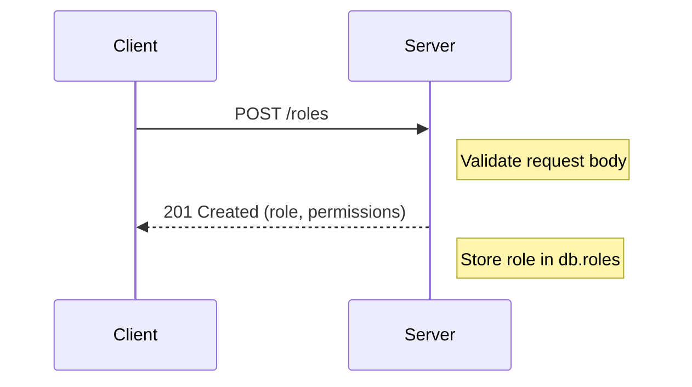
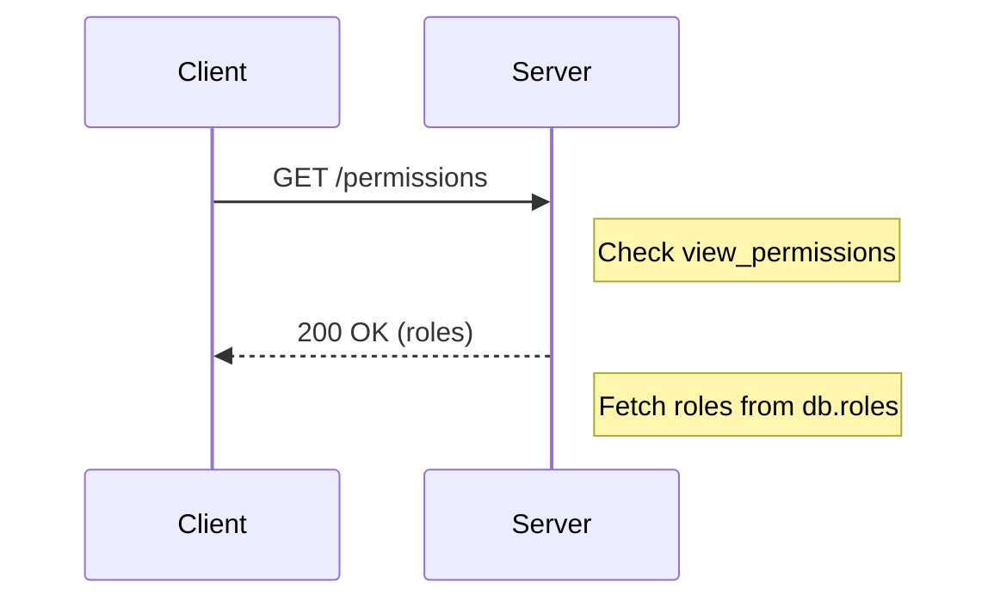
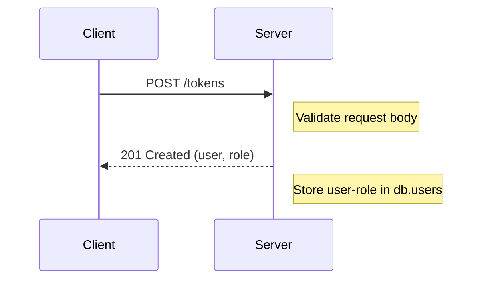
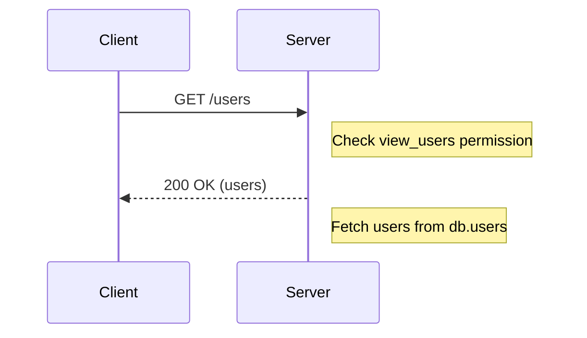

Relevant source files

The following files were used as context for generating this wiki page:

- [src/models.js](https://github.com/aanickode/access-control-service/blob/main/src/models.js)
- [src/routes.js](https://github.com/aanickode/access-control-service/blob/main/src/routes.js)

# Extending and Customizing

## Introduction

This wiki page covers the process of extending and customizing the access control system within the project. The access control system manages user roles, permissions, and authentication tokens. It provides a set of APIs to create and manage roles, view permissions, and assign roles to users.

Sources: [src/routes.js]()

## Role Management

### Role Creation

The system allows creating new roles with a set of associated permissions. The `POST /roles` endpoint is used for this purpose. It expects a JSON payload containing the `name` of the role and an array of `permissions`.

Sources: [src/routes.js:9-15]()

#### Request Body

| Field       | Type     | Description                  |
| ----------- | -------- | ---------------------------- |
| `name`      | `string` | The name of the new role     |
| `permissions` | `string[]` | An array of permission names |

Sources: [src/routes.js:12-13]()

### Viewing Permissions

The `GET /permissions` endpoint retrieves a list of all defined roles and their associated permissions. This endpoint requires the `view_permissions` permission.

Sources: [src/routes.js:18-20]()

## User Management

### Assigning Roles

The `POST /tokens` endpoint is used to assign a role to a user. It expects a JSON payload containing the `user` (email) and the `role` name.

Sources: [src/routes.js:22-28]()

#### Request Body

| Field  | Type     | Description                  |
| ------ | -------- | ---------------------------- |
| `user` | `string` | The email of the user        |
| `role` | `string` | The name of the role to assign |

Sources: [src/routes.js:25]()

### Viewing Users

The `GET /users` endpoint retrieves a list of all users and their assigned roles. This endpoint requires the `view_users` permission.

Sources: [src/routes.js:5-7]()

## Data Models

### User

The `User` model represents a user in the system.

| Field   | Type     | Description                  |
| ------- | -------- | ---------------------------- |
| `email` | `string` | The email of the user        |
| `role`  | `string` | The name of the assigned role |

Sources: [src/models.js:2-4]()

### Role

The `Role` model represents a role in the system.

| Field        | Type       | Description                  |
| ------------ | ---------- | ---------------------------- |
| `name`       | `string`   | The name of the role         |
| `permissions`| `string[]` | An array of permission names |

Sources: [src/models.js:6-8]()

## Conclusion

The access control system provides a simple yet flexible way to manage user roles, permissions, and authentication tokens. It allows creating new roles with custom permissions, assigning roles to users, and retrieving information about users and their permissions. This system can be extended and customized by adding new endpoints, modifying the data models, or integrating with other authentication and authorization mechanisms.