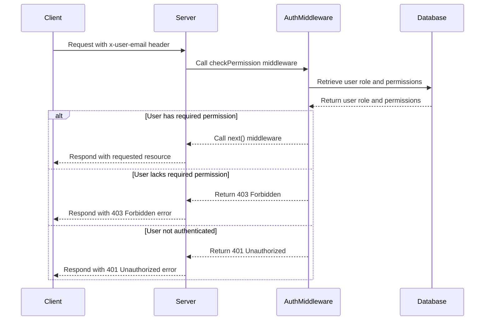

<details>
<summary>Relevant source files</summary>

The following files were used as context for generating this wiki page:

- [src/authMiddleware.js](https://github.com/aanickode/access-control-service/blob/main/src/authMiddleware.js)
- [src/models.js](https://github.com/aanickode/access-control-service/blob/main/src/models.js)

</details>

# Extending and Customizing

## Introduction

The "Extending and Customizing" feature within this project refers to the ability to define and manage user roles, permissions, and access control mechanisms. It provides a flexible and extensible system for granting or restricting access to certain resources or functionalities based on a user's assigned role and the associated permissions.

This feature is implemented through the `authMiddleware.js` and `models.js` files, which define the core logic and data structures for handling user authentication and authorization.

## User and Role Models

The `models.js` file defines the data models for `User` and `Role` objects, which serve as the foundation for the access control system.

### User Model

```javascript
export const User = {
  email: 'string',
  role: 'string'
};
```

The `User` model represents a user entity within the system. It has the following properties:

- `email` (string): The unique email address associated with the user.
- `role` (string): The name of the role assigned to the user, which determines their permissions.

Sources: [src/models.js:1-3]()

### Role Model

```javascript
export const Role = {
  name: 'string',
  permissions: ['string']
};
```

The `Role` model defines the structure of a role within the system. It consists of the following properties:

- `name` (string): The unique name of the role.
- `permissions` (array of strings): An array of permission names granted to users with this role.

Sources: [src/models.js:5-7]()

## Authentication and Authorization Middleware

The `authMiddleware.js` file contains the core logic for handling user authentication and authorization based on the defined roles and permissions.

### `checkPermission` Function

```javascript
export function checkPermission(requiredPermission) {
  return function (req, res, next) {
    const userEmail = req.headers['x-user-email'];
    if (!userEmail || !db.users[userEmail]) {
      return res.status(401).json({ error: 'Unauthorized: no user context' });
    }

    const role = db.users[userEmail];
    const permissions = db.roles[role] || [];

    if (!permissions.includes(requiredPermission)) {
      return res.status(403).json({ error: 'Forbidden: insufficient permissions' });
    }

    next();
  };
}
```

The `checkPermission` function is a higher-order function that takes a `requiredPermission` string as an argument and returns a middleware function. This middleware function is responsible for checking if the authenticated user has the required permission to access a particular resource or functionality.

Here's how the middleware function works:

1. It extracts the user's email from the `x-user-email` header of the incoming request.
2. If the email is not present or the user is not found in the `db.users` object, it returns a 401 Unauthorized response.
3. It retrieves the user's role from the `db.users` object using the email.
4. It fetches the list of permissions associated with the user's role from the `db.roles` object.
5. If the `requiredPermission` is not included in the list of permissions, it returns a 403 Forbidden response.
6. If the user has the required permission, it calls the `next()` function to proceed to the next middleware or route handler.

Sources: [src/authMiddleware.js:1-20]()

## Extending and Customizing Roles and Permissions

To extend or customize the roles and permissions within the system, you can modify the `db.users` and `db.roles` objects, which are assumed to be in-memory data stores or placeholders for a more robust database implementation.

### Adding a New Role

To add a new role, you can extend the `db.roles` object with a new key-value pair, where the key is the role name, and the value is an array of permissions associated with that role.

```javascript
db.roles['newRole'] = ['permission1', 'permission2', ...];
```

Sources: [src/authMiddleware.js:12](), [src/models.js:6]()

### Assigning Roles to Users

To assign a role to a user, you can update the `db.users` object by adding a new key-value pair, where the key is the user's email, and the value is the name of the role.

```javascript
db.users['user@example.com'] = 'newRole';
```

Sources: [src/authMiddleware.js:10](), [src/models.js:2]()

### Modifying Existing Roles and Permissions

You can modify existing roles and their associated permissions by updating the corresponding values in the `db.roles` object.

```javascript
// Modify permissions for an existing role
db.roles['existingRole'] = ['newPermission1', 'newPermission2', ...];

// Add or remove permissions from an existing role
db.roles['anotherRole'].push('additionalPermission');
db.roles['anotherRole'] = db.roles['anotherRole'].filter(p => p !== 'removedPermission');
```

Sources: [src/authMiddleware.js:12](), [src/models.js:6]()

## Sequence Diagram: Authorization Flow

The following sequence diagram illustrates the flow of user authentication and authorization when accessing a protected resource or functionality:



This diagram shows the interaction between the client, server, authentication middleware, and the database (represented by the `db` object) during the authorization process.

1. The client sends a request to the server, including the `x-user-email` header for authentication.
2. The server invokes the `checkPermission` middleware from `authMiddleware.js`.
3. The middleware retrieves the user's role and associated permissions from the database (represented by the `db` object).
4. If the user has the required permission, the middleware calls the `next()` function to proceed to the next middleware or route handler, and the server responds with the requested resource.
5. If the user lacks the required permission, the middleware returns a 403 Forbidden response.
6. If the user is not authenticated (no email or user not found), the middleware returns a 401 Unauthorized response.

Sources: [src/authMiddleware.js:1-20]()

## Conclusion

The "Extending and Customizing" feature in this project provides a flexible and extensible system for managing user roles, permissions, and access control. By modifying the `db.users` and `db.roles` objects, you can add new roles, assign roles to users, and modify existing roles and their associated permissions. The `checkPermission` middleware function serves as the gatekeeper, ensuring that only authorized users with the required permissions can access protected resources or functionalities.