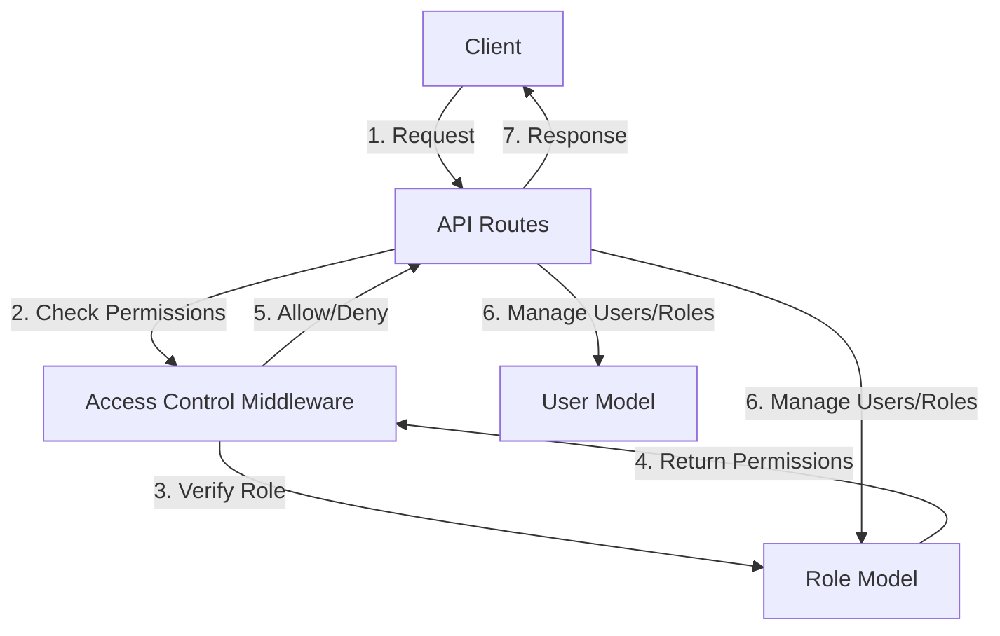

<details>
<summary>Relevant source files</summary>

The following files were used as context for generating this wiki page:

- [src/models.js](https://github.com/aanickode/access-control-service/blob/main/src/models.js)
- [src/routes.js](https://github.com/aanickode/access-control-service/blob/main/src/routes.js)
</details>

# Extending and Customizing

## Introduction

This wiki page covers the "Extending and Customizing" aspect of the project, which primarily deals with managing user roles, permissions, and access control. The project provides a set of API endpoints and data models to handle user authentication, role creation, and permission management.
Sources: [src/routes.js](), [src/models.js]()

The key components involved in extending and customizing the system are:

- **User Model**: Represents a user with an email and a role.
- **Role Model**: Defines a role with a name and a list of associated permissions.
- **API Routes**: Expose endpoints for managing users, roles, and permissions.

## User and Role Models

The project defines two data models: `User` and `Role`. These models serve as the foundation for managing user identities and access control.

### User Model

The `User` model represents a user entity with the following properties:

```javascript
export const User = {
  email: 'string',
  role: 'string'
};
```

- `email`: A string representing the user's email address, which serves as a unique identifier.
- `role`: A string representing the user's assigned role.

Sources: [src/models.js:1-4]()

### Role Model

The `Role` model defines a role entity with the following properties:

```javascript
export const Role = {
  name: 'string',
  permissions: ['string']
};
```

- `name`: A string representing the name of the role.
- `permissions`: An array of strings representing the permissions associated with the role.

Sources: [src/models.js:6-9]()

## API Routes

The project exposes several API routes for managing users, roles, and permissions. These routes are defined in the `src/routes.js` file.

### User Management

#### Get Users

```javascript
router.get('/users', checkPermission('view_users'), (req, res) => {
  res.json(Object.entries(db.users).map(([email, role]) => ({ email, role })));
});
```

This route retrieves a list of all users in the system. It requires the `view_users` permission to access.

Sources: [src/routes.js:6-9]()

### Role Management

#### Create Role

```javascript
router.post('/roles', checkPermission('create_role'), (req, res) => {
  const { name, permissions } = req.body;
  if (!name || !Array.isArray(permissions)) {
    return res.status(400).json({ error: 'Invalid role definition' });
  }
  db.roles[name] = permissions;
  res.status(201).json({ role: name, permissions });
});
```

This route allows creating a new role in the system. It requires the `create_role` permission to access. The request body should contain the `name` and `permissions` properties for the new role.

Sources: [src/routes.js:11-18]()

#### Get Permissions

```javascript
router.get('/permissions', checkPermission('view_permissions'), (req, res) => {
  res.json(db.roles);
});
```

This route retrieves a list of all roles and their associated permissions in the system. It requires the `view_permissions` permission to access.

Sources: [src/routes.js:20-23]()

### User Authentication

#### Generate Token

```javascript
router.post('/tokens', (req, res) => {
  const { user, role } = req.body;
  if (!user || !role) {
    return res.status(400).json({ error: 'Missing user or role' });
  }
  db.users[user] = role;
  res.status(201).json({ user, role });
});
```

This route generates an authentication token for a user by associating the user's email with a role. The request body should contain the `user` (email) and `role` properties.

Sources: [src/routes.js:25-32]()

## Access Control Middleware

The project likely includes an access control middleware (not shown in the provided files) that checks if a user has the required permission to access a specific route. This middleware is used in the `/users` and `/roles` routes, as shown in the `checkPermission` function calls.

```javascript
router.get('/users', checkPermission('view_users'), (req, res) => { ... });
router.post('/roles', checkPermission('create_role'), (req, res) => { ... });
router.get('/permissions', checkPermission('view_permissions'), (req, res) => { ... });
```

The `checkPermission` function likely verifies the user's role and associated permissions before allowing access to the protected route.

Sources: [src/routes.js:6](), [src/routes.js:11](), [src/routes.js:20]()

## Data Flow Diagram

The following diagram illustrates the high-level data flow and interactions between the components involved in extending and customizing the system:



1. The client sends a request to the API routes.
2. The API routes invoke the access control middleware to check if the user has the required permissions.
3. The access control middleware verifies the user's role by consulting the Role Model.
4. The Role Model returns the associated permissions for the user's role.
5. The access control middleware allows or denies access based on the permissions.
6. If access is granted, the API routes can manage users and roles by interacting with the User Model and Role Model.
7. The API routes send the appropriate response back to the client.

Sources: [src/routes.js](), [src/models.js]()

## Extending and Customizing Workflow

To extend and customize the system, follow these general steps:

1. **Define New Roles**: Create new roles by sending a POST request to the `/roles` endpoint with the desired role name and permissions. This requires the `create_role` permission.

2. **Assign Roles to Users**: Associate users with roles by sending a POST request to the `/tokens` endpoint with the user's email and the desired role.

3. **Manage Permissions**: Retrieve the list of roles and their associated permissions by sending a GET request to the `/permissions` endpoint. This requires the `view_permissions` permission.

4. **Implement Access Control**: Integrate the access control middleware (not shown in the provided files) to protect routes and resources based on the user's role and permissions.

5. **Extend User and Role Models**: If needed, extend the `User` and `Role` models to include additional properties or relationships based on project requirements.

6. **Add New Routes**: Implement new routes for managing additional resources or functionalities, and apply appropriate permission checks using the access control middleware.

By following this workflow, you can customize the system's access control and authorization mechanisms, define new roles and permissions, and extend the functionality to meet specific project requirements.

Sources: [src/routes.js](), [src/models.js]()

## Conclusion

The "Extending and Customizing" aspect of the project revolves around managing user roles, permissions, and access control. The provided API routes and data models enable creating and managing roles, assigning roles to users, and controlling access to resources based on permissions. By leveraging these components, developers can tailor the system to meet specific authorization and authentication requirements, ensuring secure and controlled access to various functionalities within the application.