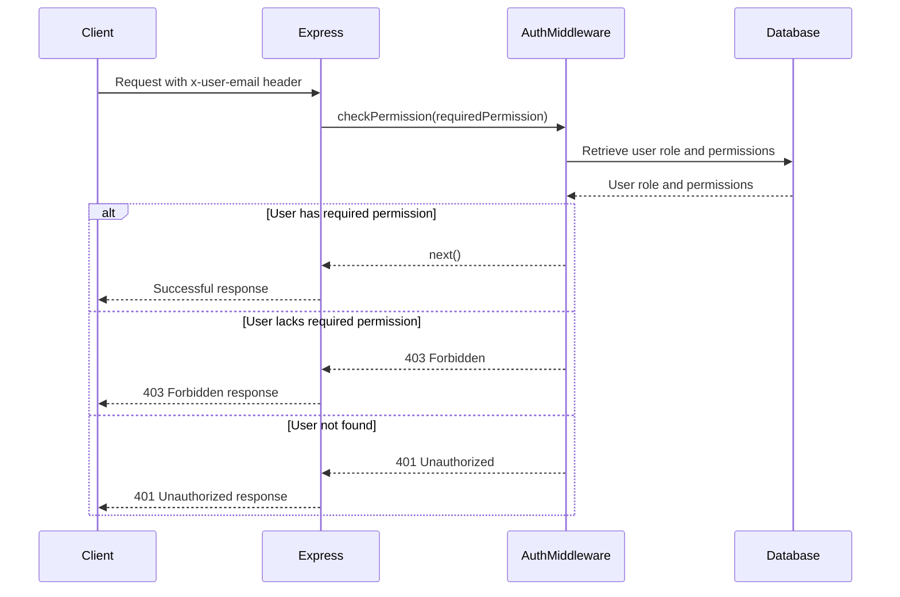

<details>
<summary>Relevant source files</summary>

The following files were used as context for generating this wiki page:

- [src/authMiddleware.js](https://github.com/aanickode/access-control-service/blob/main/src/authMiddleware.js)
- [src/models.js](https://github.com/aanickode/access-control-service/blob/main/src/models.js)
</details>

# Extending and Customizing

## Introduction

The "Extending and Customizing" feature in this project refers to the ability to modify and enhance the access control and authorization mechanisms based on user roles and permissions. This functionality is crucial for ensuring proper security and access management within the application.

The core components involved in this feature are the `User` and `Role` models, along with the `checkPermission` middleware function. These elements work together to validate user permissions and control access to specific routes or resources within the application.

## User and Role Models

The `User` and `Role` models define the structure and properties of user and role objects within the application. These models are defined in the `src/models.js` file.

### User Model

The `User` model has the following properties:

```javascript
export const User = {
  email: 'string',
  role: 'string'
};
```

- `email` (string): Represents the user's email address, which serves as a unique identifier.
- `role` (string): Specifies the role associated with the user, which determines their permissions.

Sources: [src/models.js:1-3]()

### Role Model

The `Role` model has the following properties:

```javascript
export const Role = {
  name: 'string',
  permissions: ['string']
};
```

- `name` (string): Represents the name or identifier of the role.
- `permissions` (array of strings): An array containing the permissions granted to users with this role.

Sources: [src/models.js:5-7]()

## Access Control Middleware

The `checkPermission` middleware function is responsible for validating user permissions and controlling access to specific routes or resources within the application. This function is defined in the `src/authMiddleware.js` file.

```javascript
export function checkPermission(requiredPermission) {
  return function (req, res, next) {
    const userEmail = req.headers['x-user-email'];
    if (!userEmail || !db.users[userEmail]) {
      return res.status(401).json({ error: 'Unauthorized: no user context' });
    }

    const role = db.users[userEmail];
    const permissions = db.roles[role] || [];

    if (!permissions.includes(requiredPermission)) {
      return res.status(403).json({ error: 'Forbidden: insufficient permissions' });
    }

    next();
  };
}
```

The `checkPermission` function takes a `requiredPermission` parameter, which represents the permission required to access a specific route or resource. It returns a middleware function that can be used in Express.js routes.

Here's how the middleware function works:

1. It checks if the `x-user-email` header is present in the request and if the user exists in the `db.users` object.
2. If the user is not found, it returns a 401 Unauthorized response with an error message.
3. It retrieves the user's role from the `db.users` object.
4. It fetches the permissions associated with the user's role from the `db.roles` object.
5. If the required permission is not included in the user's permissions, it returns a 403 Forbidden response with an error message.
6. If the user has the required permission, it calls the `next()` function to proceed to the next middleware or route handler.

Sources: [src/authMiddleware.js:1-23]()

## Extending and Customizing Workflow

To extend or customize the access control functionality, you can follow these steps:

1. **Define new roles**: Create new role objects in the `db.roles` object, specifying the permissions associated with each role.
2. **Assign roles to users**: Update the `db.users` object to assign the appropriate roles to users based on their access requirements.
3. **Implement new permissions**: If you need to introduce new permissions, add them to the `permissions` array of the relevant roles in the `db.roles` object.
4. **Apply access control middleware**: Use the `checkPermission` middleware function in your Express.js routes to protect specific resources or functionalities based on the required permissions.

By following this workflow, you can easily extend and customize the access control system to meet the specific requirements of your application.

## Sequence Diagram: Access Control Middleware



This sequence diagram illustrates the flow of the `checkPermission` middleware function and its interaction with the database to validate user permissions and control access to routes or resources.

Sources: [src/authMiddleware.js:1-23](), [src/models.js:1-7]()

## Conclusion

The "Extending and Customizing" feature in this project provides a flexible and scalable access control system based on user roles and permissions. By leveraging the `User` and `Role` models, as well as the `checkPermission` middleware function, developers can easily manage and control access to various parts of the application. This feature ensures proper security and authorization, while also allowing for easy extensibility and customization as the application's requirements evolve.