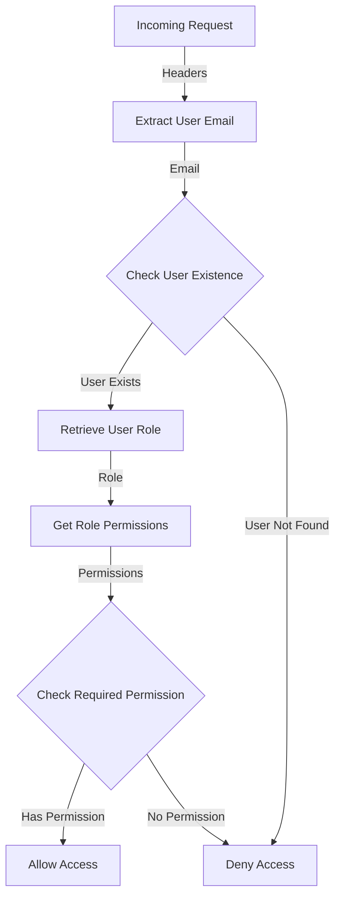

<details>
<summary>Relevant source files</summary>

The following files were used as context for generating this wiki page:

- [src/authMiddleware.js](https://github.com/aanickode/access-control-service/blob/main/src/authMiddleware.js)
- [src/models.js](https://github.com/aanickode/access-control-service/blob/main/src/models.js)

</details>

# Extending and Customizing

## Introduction

This wiki page covers the process of extending and customizing the access control system within the project. The access control system is responsible for managing user roles, permissions, and enforcing authorization rules based on the assigned permissions. It provides a middleware function `checkPermission` that can be used to protect routes or resources by requiring specific permissions.

Sources: [src/authMiddleware.js](), [src/models.js]()

## User and Role Models

The project defines two core data models: `User` and `Role`. These models are used to represent user information and role-based access control (RBAC) configurations.

### User Model

The `User` model has the following fields:

| Field | Type     | Description                  |
|-------|----------|------------------------------|
| email | `string` | The user's email address     |
| role  | `string` | The name of the user's role  |

Sources: [src/models.js:1-4]()

### Role Model

The `Role` model has the following fields:

| Field       | Type       | Description                                  |
|-------------|------------|----------------------------------------------|
| name        | `string`   | The name of the role                         |
| permissions | `string[]` | An array of permission names for this role   |

Sources: [src/models.js:6-9]()

## Access Control Flow

The access control system follows a specific flow to determine whether a user has the required permission to access a protected resource or route.



1. The system extracts the user's email from the request headers (`x-user-email`).
2. It checks if the user exists in the `db.users` object.
3. If the user exists, it retrieves the user's role from the `db.users` object.
4. Using the role, it looks up the associated permissions in the `db.roles` object.
5. The system then checks if the required permission is included in the user's role permissions.
6. If the user has the required permission, access is granted. Otherwise, access is denied.

Sources: [src/authMiddleware.js:3-18]()

## Authorization Middleware

The `checkPermission` function is a middleware that enforces authorization based on the required permission.

```javascript
export function checkPermission(requiredPermission) {
  return function (req, res, next) {
    const userEmail = req.headers['x-user-email'];
    if (!userEmail || !db.users[userEmail]) {
      return res.status(401).json({ error: 'Unauthorized: no user context' });
    }

    const role = db.users[userEmail];
    const permissions = db.roles[role] || [];

    if (!permissions.includes(requiredPermission)) {
      return res.status(403).json({ error: 'Forbidden: insufficient permissions' });
    }

    next();
  };
}
```

1. The `checkPermission` function takes a `requiredPermission` string as an argument.
2. It returns a middleware function that can be used to protect routes or resources.
3. The middleware function first checks if the `x-user-email` header is present and if the user exists in the `db.users` object.
4. If the user is not found, it returns a 401 Unauthorized response.
5. If the user exists, it retrieves the user's role and associated permissions from the `db.roles` object.
6. If the required permission is not included in the user's permissions, it returns a 403 Forbidden response.
7. If the user has the required permission, the `next()` middleware function is called to proceed with the request.

Sources: [src/authMiddleware.js:3-18]()

## Extending and Customizing

To extend or customize the access control system, you can modify the following components:

### Adding or Modifying User Roles

To add or modify user roles, update the `db.roles` object with the new role configurations. Each role should have a unique name and an array of associated permissions.

```javascript
db.roles = {
  'admin': ['read', 'write', 'delete'],
  'editor': ['read', 'write'],
  'viewer': ['read'],
  'newRole': ['customPermission1', 'customPermission2']
};
```

Sources: [src/authMiddleware.js:12]()

### Assigning Roles to Users

To assign roles to users, update the `db.users` object with the user's email and corresponding role.

```javascript
db.users = {
  'user1@example.com': 'admin',
  'user2@example.com': 'editor',
  'user3@example.com': 'viewer',
  'user4@example.com': 'newRole'
};
```

Sources: [src/authMiddleware.js:6]()

### Protecting Routes or Resources

To protect routes or resources with specific permissions, use the `checkPermission` middleware function and pass the required permission as an argument.

```javascript
import { checkPermission } from './authMiddleware.js';

app.get('/protected-resource', checkPermission('read'), (req, res) => {
  // This route requires the 'read' permission
  res.json({ data: 'Protected resource data' });
});
```

Sources: [src/authMiddleware.js:3]()

## Conclusion

The access control system in this project provides a flexible and extensible way to manage user roles, permissions, and enforce authorization rules. By modifying the `db.roles` and `db.users` objects, you can customize the available roles, permissions, and user assignments. The `checkPermission` middleware function can be used to protect routes or resources by requiring specific permissions, ensuring that only authorized users can access sensitive data or functionality.