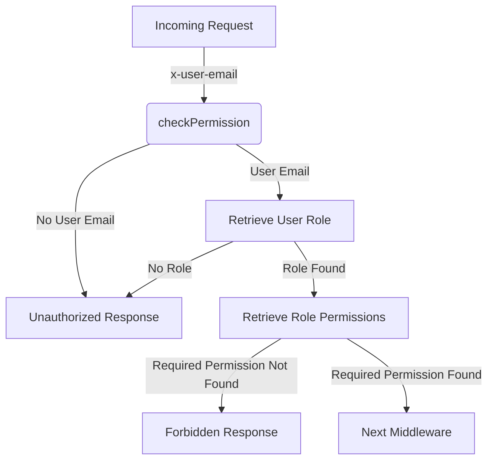

<details>
<summary>Relevant source files</summary>

The following files were used as context for generating this wiki page:

- [src/authMiddleware.js](https://github.com/aanickode/access-control-service/blob/main/src/authMiddleware.js)
- [src/models.js](https://github.com/aanickode/access-control-service/blob/main/src/models.js)
</details>

# Extending and Customizing

## Introduction

The "Extending and Customizing" functionality within this project revolves around the access control and authorization mechanisms implemented in the provided source files. It allows for defining user roles, associating permissions with those roles, and enforcing access control based on the user's role and the required permissions for specific operations or resources.

This feature enables the customization of the application's authorization logic by defining and managing roles, permissions, and their relationships. It provides a flexible and extensible approach to control access to various parts of the application based on the user's assigned role and the permissions associated with that role.

Sources: [src/authMiddleware.js](), [src/models.js]()

## Role and Permission Management

The project defines two primary data models: `User` and `Role`. The `User` model represents individual users and includes fields such as `email` and `role`. The `Role` model defines roles within the application and includes fields such as `name` and `permissions`.

```javascript
export const User = {
  email: 'string',
  role: 'string'
};

export const Role = {
  name: 'string',
  permissions: ['string']
};
```

Sources: [src/models.js:1-6]()

Roles are associated with a list of permissions, which are represented as strings. These permissions can be customized and extended based on the application's requirements, allowing for fine-grained access control.

## Authorization Flow

The authorization flow is implemented in the `checkPermission` middleware function, which is responsible for verifying if a user has the required permission to access a specific resource or perform a particular operation.



Sources: [src/authMiddleware.js:3-19]()

The `checkPermission` middleware function follows these steps:

1. It checks if the `x-user-email` header is present in the incoming request. If not, it returns an "Unauthorized" response.
2. If the `x-user-email` header is present, it retrieves the user's role from the `db.users` object.
3. If the user's role is not found, it returns an "Unauthorized" response.
4. If the user's role is found, it retrieves the list of permissions associated with that role from the `db.roles` object.
5. If the required permission is not included in the list of permissions for the user's role, it returns a "Forbidden" response.
6. If the required permission is found, it allows the request to proceed to the next middleware.

This flow ensures that only authorized users with the appropriate permissions can access protected resources or perform specific operations within the application.

## Extending Roles and Permissions

To extend the roles and permissions in the application, you can modify the `db.roles` object and add new roles with their associated permissions. For example:

```javascript
db.roles = {
  'admin': ['read', 'write', 'delete'],
  'editor': ['read', 'write'],
  'viewer': ['read']
};
```

Sources: [src/authMiddleware.js:12]()

In this example, three roles are defined: `admin`, `editor`, and `viewer`. Each role has a different set of permissions associated with it. You can add, remove, or modify these permissions based on your application's requirements.

To associate a user with a specific role, you can update the `db.users` object:

```javascript
db.users = {
  'user1@example.com': 'admin',
  'user2@example.com': 'editor',
  'user3@example.com': 'viewer'
};
```

Sources: [src/authMiddleware.js:9]()

In this example, `user1@example.com` is associated with the `admin` role, `user2@example.com` is associated with the `editor` role, and `user3@example.com` is associated with the `viewer` role.

By extending and customizing the roles and permissions, you can implement fine-grained access control and authorization logic tailored to your application's specific needs.

## Conclusion

The "Extending and Customizing" feature in this project provides a flexible and extensible approach to managing user roles, permissions, and access control. By defining roles, associating permissions with those roles, and enforcing authorization based on the user's role and required permissions, you can customize the application's authorization logic to meet your specific requirements.

This feature allows you to control access to various parts of the application, ensuring that only authorized users with the appropriate permissions can perform specific operations or access protected resources. By extending and customizing the roles and permissions, you can implement fine-grained access control and authorization logic tailored to your application's needs.