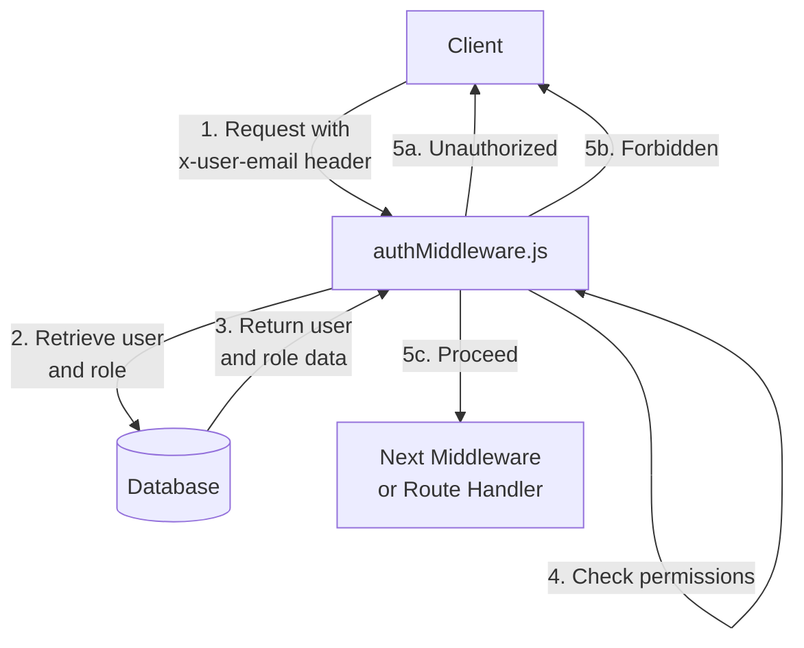

<details>
<summary>Relevant source files</summary>

The following files were used as context for generating this wiki page:

- [src/authMiddleware.js](https://github.com/aanickode/access-control-service/blob/main/src/authMiddleware.js)
- [src/models.js](https://github.com/aanickode/access-control-service/blob/main/src/models.js)

</details>

# Extending and Customizing

## Introduction

The "Extending and Customizing" feature in this project refers to the ability to define and manage user roles, permissions, and access control mechanisms. It provides a flexible way to grant or restrict access to certain resources or functionalities based on the user's assigned role and associated permissions.

This feature is implemented through the `authMiddleware.js` and `models.js` files, which define the core logic and data models for user authentication and authorization.

## User and Role Models

The `models.js` file defines the data structures for `User` and `Role` objects, which serve as the foundation for the access control system.

### User Model

```javascript
export const User = {
  email: 'string',
  role: 'string'
};
```

The `User` model represents a user entity with the following properties:

- `email` (string): The unique email address of the user.
- `role` (string): The name of the role assigned to the user.

Sources: [src/models.js:1-3]()

### Role Model

```javascript
export const Role = {
  name: 'string',
  permissions: ['string']
};
```

The `Role` model defines a role entity with the following properties:

- `name` (string): The unique name of the role.
- `permissions` (array of strings): The list of permissions associated with the role.

Sources: [src/models.js:5-7]()

## Authentication and Authorization Middleware

The `authMiddleware.js` file contains the core logic for authenticating users and authorizing access based on their assigned roles and permissions.

### `checkPermission` Function

```javascript
export function checkPermission(requiredPermission) {
  return function (req, res, next) {
    const userEmail = req.headers['x-user-email'];
    if (!userEmail || !db.users[userEmail]) {
      return res.status(401).json({ error: 'Unauthorized: no user context' });
    }

    const role = db.users[userEmail];
    const permissions = db.roles[role] || [];

    if (!permissions.includes(requiredPermission)) {
      return res.status(403).json({ error: 'Forbidden: insufficient permissions' });
    }

    next();
  };
}
```

The `checkPermission` function is a higher-order function that takes a `requiredPermission` string as an argument and returns a middleware function. This middleware function is responsible for checking if the authenticated user has the required permission to access a specific resource or functionality.

Here's how the middleware function works:

1. It retrieves the user's email from the `x-user-email` header of the incoming request.
2. If the user's email is not present or the user is not found in the `db.users` object, it returns a 401 Unauthorized response.
3. It retrieves the user's role from the `db.users` object using the email.
4. It retrieves the list of permissions associated with the user's role from the `db.roles` object.
5. If the `requiredPermission` is not included in the list of permissions, it returns a 403 Forbidden response.
6. If the user has the required permission, it calls the `next()` function to proceed to the next middleware or route handler.

Sources: [src/authMiddleware.js:1-21]()

## Data Flow Diagram

The following diagram illustrates the high-level data flow and interactions between the components involved in the "Extending and Customizing" feature:



1. The client sends a request with the `x-user-email` header containing the user's email.
2. The `authMiddleware.js` retrieves the user's role from the database based on the provided email.
3. The database returns the user's role and associated permissions.
4. The `authMiddleware.js` checks if the user's role has the required permission for the requested resource or functionality.
5. Based on the permission check, the middleware responds with:
   a. 401 Unauthorized if the user is not found or the email is missing.
   b. 403 Forbidden if the user does not have the required permission.
   c. Proceeds to the next middleware or route handler if the user has the required permission.

Sources: [src/authMiddleware.js:1-21](), [src/models.js:1-7]()

## Extending and Customizing Roles and Permissions

To extend or customize the roles and permissions in this system, you can modify the `db.users` and `db.roles` objects (assuming they are mutable data structures). Here's an example of how you might add a new role and associate it with specific permissions:

1. Define a new role in the `db.roles` object:

```javascript
db.roles['admin'] = ['read', 'write', 'delete'];
```

2. Assign the new role to a user in the `db.users` object:

```javascript
db.users['admin@example.com'] = 'admin';
```

With these changes, a user with the email `admin@example.com` will be assigned the `admin` role, which has the `read`, `write`, and `delete` permissions.

You can then use the `checkPermission` middleware to protect routes or resources that require specific permissions:

```javascript
import { checkPermission } from './authMiddleware.js';

app.get('/protected-resource', checkPermission('read'), (req, res) => {
  // This route is only accessible to users with the 'read' permission
  res.send('Protected resource');
});
```

In this example, the `/protected-resource` route is protected by the `checkPermission('read')` middleware, which ensures that only users with the `read` permission can access it.

Sources: [src/authMiddleware.js:1-21](), [src/models.js:1-7]()

## Summary

The "Extending and Customizing" feature in this project provides a flexible and extensible way to manage user roles and permissions. By defining roles and associating them with specific permissions, you can control access to various resources or functionalities within your application. The `authMiddleware.js` file contains the core logic for authenticating users and authorizing access based on their assigned roles and permissions, while the `models.js` file defines the data structures for user and role entities.

To extend or customize the system, you can modify the `db.users` and `db.roles` objects to add new roles and associate them with the desired permissions. You can then use the `checkPermission` middleware to protect routes or resources that require specific permissions.