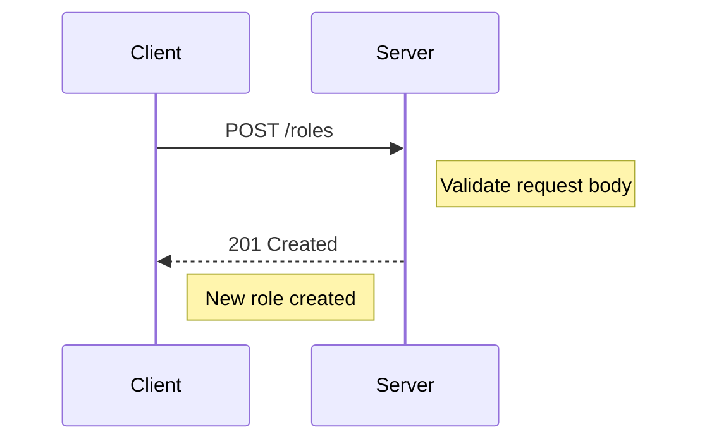
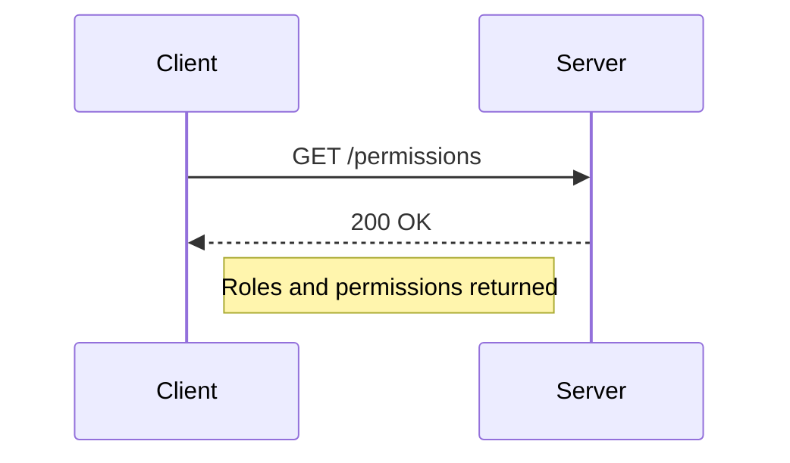
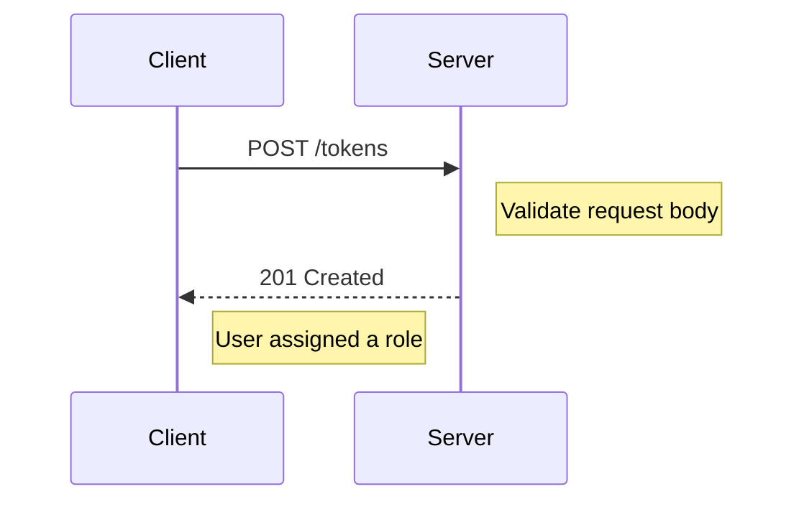
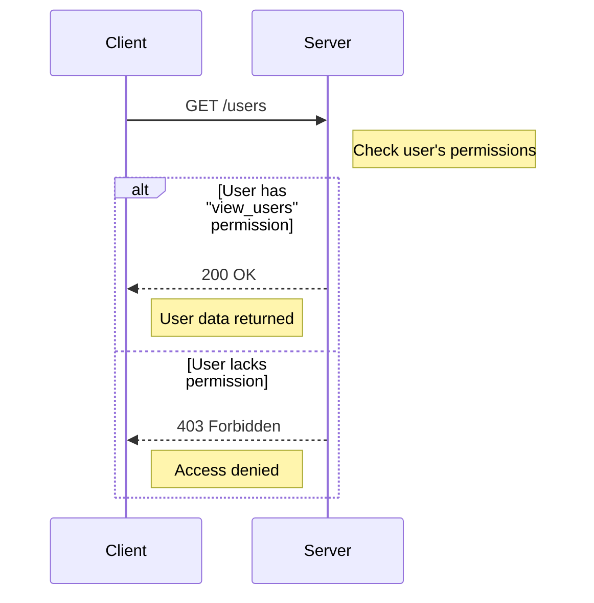

<details>
<summary>Relevant source files</summary>

The following files were used as context for generating this wiki page:

- [src/models.js](https://github.com/aanickode/access-control-service/blob/main/src/models.js)
- [src/routes.js](https://github.com/aanickode/access-control-service/blob/main/src/routes.js)
</details>

# Extending and Customizing

## Introduction

This wiki page covers the "Extending and Customizing" aspect of the project, which primarily deals with the management of user roles, permissions, and access control. The project provides a set of routes and data models to handle user authentication, role creation, and permission assignment. These features allow for flexible customization of access control policies within the application.
Sources: [src/routes.js](), [src/models.js]()

## Data Models

The project defines two main data models: `User` and `Role`. These models serve as the foundation for managing user identities and their associated permissions.

### User Model

The `User` model represents a user entity within the system. It consists of the following fields:

| Field | Type     | Description                  |
|-------|----------|-----------------------------|
| email | `string` | The unique email address of the user. |
| role  | `string` | The name of the role assigned to the user. |

Sources: [src/models.js:1-4]()

### Role Model

The `Role` model defines a set of permissions associated with a specific role. It has the following fields:

| Field       | Type       | Description                  |
|-------------|------------|------------------------------|
| name        | `string`   | The unique name of the role. |
| permissions | `string[]` | An array of permission strings associated with the role. |

Sources: [src/models.js:6-9]()

## Role Management

The project provides routes for creating and managing roles within the system.

### Creating a Role

To create a new role, a `POST` request should be made to the `/roles` endpoint with the following request body:

```json
{
  "name": "string",
  "permissions": ["string"]
}
```

The `name` field represents the unique name of the role, and the `permissions` field is an array of strings defining the permissions associated with the role.



Sources: [src/routes.js:10-16]()

### Viewing Permissions

To retrieve a list of all roles and their associated permissions, a `GET` request can be made to the `/permissions` endpoint.



The server will respond with a JSON object containing the role names as keys and their corresponding permission arrays as values.

Sources: [src/routes.js:19-21]()

## User Authentication

The project includes a route for authenticating users and assigning them roles.

### Obtaining a Token

To obtain a token for a user, a `POST` request should be made to the `/tokens` endpoint with the following request body:

```json
{
  "user": "string",
  "role": "string"
}
```

The `user` field represents the user's identifier (e.g., email address), and the `role` field specifies the name of the role to be assigned to the user.



Upon successful authentication, the server will respond with a JSON object containing the `user` and `role` fields.

Sources: [src/routes.js:23-30]()

## Access Control

The project implements access control by requiring specific permissions for certain routes.

### Checking Permissions

The `checkPermission` middleware function is used to verify if a user has the required permission to access a particular route. This middleware is applied to routes that require specific permissions.



In the example above, the `/users` route requires the `view_users` permission. If the authenticated user has this permission, the server will respond with the user data. Otherwise, a `403 Forbidden` response will be sent.

Sources: [src/routes.js:6,8]()

## Conclusion

The "Extending and Customizing" aspect of the project provides a flexible and extensible system for managing user roles, permissions, and access control. By leveraging the provided routes and data models, developers can customize and enforce access policies within the application based on specific requirements.