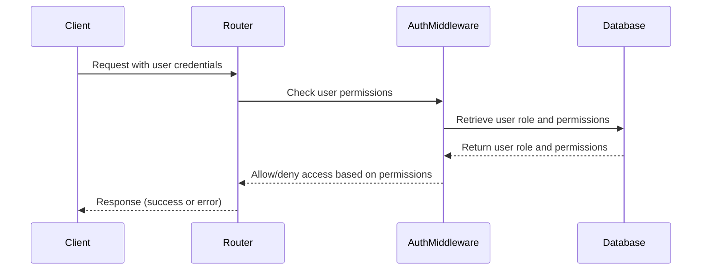
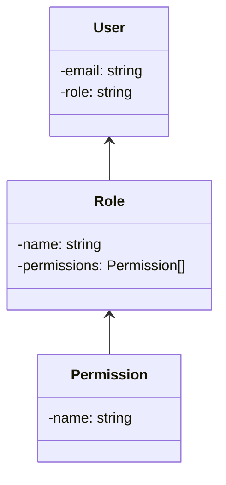

<details>
<summary>Relevant source files</summary>

The following files were used as context for generating this wiki page:

- [src/models.js](https://github.com/aanickode/access-control-service/blob/main/src/models.js)
- [src/routes.js](https://github.com/aanickode/access-control-service/blob/main/src/routes.js)
</details>

# Extending and Customizing

## Introduction

The "Extending and Customizing" feature within this project revolves around managing user roles, permissions, and access control. It provides functionality to create and view roles with associated permissions, assign roles to users, and retrieve user information based on granted permissions. This feature is crucial for implementing role-based access control (RBAC) and ensuring secure and controlled access to resources within the application.

Sources: [src/routes.js](), [src/models.js]()

## Role Management

### Role Definition

Roles are defined as objects with two properties: `name` (string) and `permissions` (array of strings). The `Role` model in `src/models.js` specifies this structure:

```javascript
export const Role = {
  name: 'string',
  permissions: ['string']
};
```

Sources: [src/models.js:3-6]()

### Creating Roles

New roles can be created by sending a POST request to the `/roles` endpoint. The request body should contain the `name` and `permissions` properties for the new role. The `checkPermission` middleware is used to ensure that only users with the `create_role` permission can create new roles.

```javascript
router.post('/roles', checkPermission('create_role'), (req, res) => {
  const { name, permissions } = req.body;
  if (!name || !Array.isArray(permissions)) {
    return res.status(400).json({ error: 'Invalid role definition' });
  }
  db.roles[name] = permissions;
  res.status(201).json({ role: name, permissions });
});
```

Sources: [src/routes.js:9-17]()

### Viewing Permissions

The `/permissions` endpoint allows users with the `view_permissions` permission to retrieve a list of all roles and their associated permissions. This information is stored in the `db.roles` object.

```javascript
router.get('/permissions', checkPermission('view_permissions'), (req, res) => {
  res.json(db.roles);
});
```

Sources: [src/routes.js:18-21]()

## User Management

### User Model

The `User` model in `src/models.js` defines the structure of a user object, which includes an `email` (string) and a `role` (string) property.

```javascript
export const User = {
  email: 'string',
  role: 'string'
};
```

Sources: [src/models.js:1-2]()

### Assigning Roles to Users

The `/tokens` endpoint allows creating or updating a user's role assignment. It expects a `user` (email) and a `role` (name) in the request body. The user's role is then stored in the `db.users` object, which maps user emails to their assigned roles.

```javascript
router.post('/tokens', (req, res) => {
  const { user, role } = req.body;
  if (!user || !role) {
    return res.status(400).json({ error: 'Missing user or role' });
  }
  db.users[user] = role;
  res.status(201).json({ user, role });
});
```

Sources: [src/routes.js:22-29]()

### Viewing Users

The `/users` endpoint retrieves a list of all users and their assigned roles. However, access to this endpoint is restricted by the `checkPermission` middleware, which ensures that only users with the `view_users` permission can access this information.

```javascript
router.get('/users', checkPermission('view_users'), (req, res) => {
  res.json(Object.entries(db.users).map(([email, role]) => ({ email, role })));
});
```

Sources: [src/routes.js:5-8]()

## Access Control Flow

The following sequence diagram illustrates the flow of access control and permission checking within the application:



The `checkPermission` middleware is responsible for verifying if the user has the required permission(s) to access a particular route or perform a specific action. It retrieves the user's role and associated permissions from the database and checks if the requested permission is granted for that role.

Sources: [src/routes.js:5,9,18]()

## Role-Based Access Control (RBAC) Architecture

The following class diagram illustrates the high-level architecture and relationships between the key components involved in the role-based access control system:



- `User` objects have an associated `Role`.
- `Role` objects contain an array of `Permission` objects.
- The `checkPermission` middleware checks if a user's assigned role grants the requested permission before allowing access to a route or resource.

Sources: [src/models.js](), [src/routes.js]()

## Conclusion

The "Extending and Customizing" feature in this project provides a flexible and secure way to manage user roles, permissions, and access control. It allows administrators to create and manage roles with specific permissions, assign roles to users, and control access to resources based on the granted permissions. This feature is essential for implementing role-based access control (RBAC) and ensuring that users can only access and perform actions they are authorized for within the application.