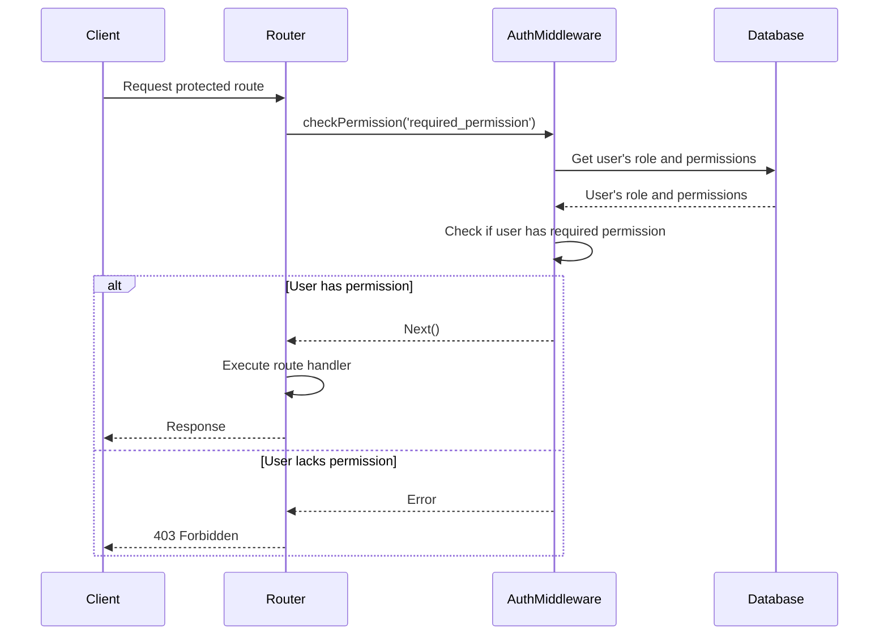

<details>
<summary>Relevant source files</summary>

The following files were used as context for generating this wiki page:

- [src/models.js](https://github.com/aanickode/access-control-service/blob/main/src/models.js)
- [src/routes.js](https://github.com/aanickode/access-control-service/blob/main/src/routes.js)
</details>

# Extending and Customizing

## Introduction

This wiki page covers the "Extending and Customizing" aspect of the project, which appears to be related to an access control system or service. The provided source files define data models for `User` and `Role` entities, as well as a set of API routes for managing users, roles, permissions, and authentication tokens.

The system allows for creating new roles with specific permissions, assigning roles to users, and retrieving information about users, roles, and permissions. This functionality can be extended or customized by modifying the existing models, routes, and middleware components.

Sources: [src/models.js](), [src/routes.js]()

## Data Models

The project defines two main data models: `User` and `Role`.

### User Model

The `User` model represents a user entity and has the following fields:

| Field | Type     | Description |
|-------|----------|-------------|
| email | `string` | The user's email address, likely used as a unique identifier. |
| role  | `string` | The name of the role assigned to the user. |

```javascript
export const User = {
  email: 'string',
  role: 'string'
};
```

Sources: [src/models.js:1-4]()

### Role Model

The `Role` model represents a role entity with associated permissions:

| Field       | Type       | Description |
|-------------|------------|-------------|
| name        | `string`   | The name of the role. |
| permissions | `string[]` | An array of permission strings associated with the role. |

```javascript
export const Role = {
  name: 'string',
  permissions: ['string']
};
```

Sources: [src/models.js:6-9]()

## API Routes

The project exposes several API routes for managing users, roles, permissions, and authentication tokens. These routes are defined in the `src/routes.js` file and utilize an in-memory database (`db`) for data storage.

### User Management

#### Get Users

Retrieves a list of all users and their assigned roles.

```mermaid
graph TD
    A[/users GET] -->|checkPermission('view_users')| B[Get users from db]
    B --> C[Map user data]
    C --> D[Return user list]
```

- **Route**: `/users`
- **Method**: `GET`
- **Required Permission**: `view_users`
- **Response**: An array of user objects with `email` and `role` properties.

Sources: [src/routes.js:6-9]()

### Role Management

#### Create Role

Creates a new role with the specified name and permissions.

```mermaid
graph TD
    A[/roles POST] -->|checkPermission('create_role')| B[Validate request body]
    B -->|Valid| C[Store role in db]
    C --> D[Return created role]
    B -->|Invalid| E[Return error]
```

- **Route**: `/roles`
- **Method**: `POST`
- **Required Permission**: `create_role`
- **Request Body**:
  - `name` (string): The name of the new role.
  - `permissions` (string[]): An array of permission strings for the new role.
- **Response**: The created role object with `name` and `permissions` properties.
- **Error Response**: `400 Bad Request` if the request body is invalid.

Sources: [src/routes.js:10-17]()

#### Get Permissions

Retrieves a list of all roles and their associated permissions.

```mermaid
graph TD
    A[/permissions GET] -->|checkPermission('view_permissions')| B[Get roles from db]
    B --> C[Return roles]
```

- **Route**: `/permissions`
- **Method**: `GET`
- **Required Permission**: `view_permissions`
- **Response**: An object containing role names as keys and their associated permissions as values.

Sources: [src/routes.js:18-20]()

### Authentication

#### Create Token

Creates an authentication token by associating a user with a role.

```mermaid
graph TD
    A[/tokens POST] --> B[Validate request body]
    B -->|Valid| C[Store user-role mapping in db]
    C --> D[Return user and role]
    B -->|Invalid| E[Return error]
```

- **Route**: `/tokens`
- **Method**: `POST`
- **Request Body**:
  - `user` (string): The user's identifier (e.g., email).
  - `role` (string): The name of the role to assign to the user.
- **Response**: An object with `user` and `role` properties.
- **Error Response**: `400 Bad Request` if the request body is missing `user` or `role`.

Sources: [src/routes.js:21-29]()

## Authentication Middleware

The project includes an `authMiddleware.js` file (not provided) that likely contains a `checkPermission` middleware function. This middleware is used to protect certain routes by verifying that the requesting user has the required permission(s) based on their assigned role.



The `checkPermission` middleware likely retrieves the user's role and associated permissions from the database (or another data source) and verifies if the user has the required permission(s) specified in the route definition. If the user has the necessary permission(s), the middleware allows the request to proceed to the route handler. Otherwise, it returns a `403 Forbidden` error.

Sources: [src/routes.js:6,10,18]() (inferred from the usage of `checkPermission`)

## Extending and Customizing

The project's functionality can be extended or customized in several ways:

1. **Adding New Routes**: New API routes can be added to the `src/routes.js` file to expose additional functionality. These routes can interact with the existing data models or introduce new models as needed.

2. **Modifying Existing Routes**: The behavior of existing routes can be modified by changing the route handlers or adding additional middleware functions.

3. **Enhancing Data Models**: The `User` and `Role` data models can be extended by adding new fields or modifying existing ones. This may require updates to the corresponding API routes and database interactions.

4. **Implementing Authentication and Authorization**: While the project includes a basic `checkPermission` middleware, a more robust authentication and authorization system can be implemented. This could involve integrating with external authentication providers, implementing token-based authentication, or introducing more granular permission management.

5. **Persisting Data**: The current implementation uses an in-memory database (`db`) for data storage. To persist data across application restarts, a database integration (e.g., SQL, NoSQL) can be implemented, potentially requiring changes to the data models and database interactions.

6. **Improving Error Handling**: The project's error handling can be enhanced by providing more detailed error messages, implementing centralized error handling middleware, and adding error logging mechanisms.

7. **Adding Documentation and Tests**: Comprehensive documentation and test cases can be added to improve the project's maintainability and ensure consistent behavior during future extensions or customizations.

Sources: [src/models.js](), [src/routes.js]()

## Conclusion

This wiki page covered the "Extending and Customizing" aspect of the project by examining the provided source files. It explored the data models for `User` and `Role` entities, the API routes for managing users, roles, permissions, and authentication tokens, and the authentication middleware used for protecting routes based on permissions.

The page also discussed potential ways to extend and customize the project's functionality, such as adding new routes, modifying existing ones, enhancing data models, implementing robust authentication and authorization, persisting data, improving error handling, and adding documentation and tests.

By understanding the project's current architecture and components, developers can make informed decisions when extending or customizing the system to meet specific requirements or integrate with other systems.

Sources: [src/models.js](), [src/routes.js]()