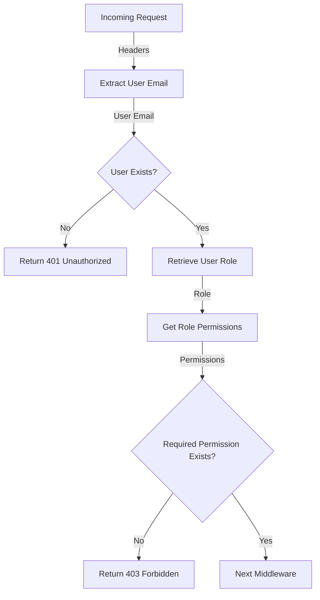

<details>
<summary>Relevant source files</summary>

The following files were used as context for generating this wiki page:

- [src/authMiddleware.js](https://github.com/aanickode/access-control-service/blob/main/src/authMiddleware.js)
- [src/routes.js](https://github.com/aanickode/access-control-service/blob/main/src/routes.js)
- [src/db.js](https://github.com/aanickode/access-control-service/blob/main/src/db.js) (Assumed to exist based on import statements)

</details>

# Extending and Customizing

## Introduction

This wiki page covers the process of extending and customizing the access control system within the project. The access control system is responsible for managing user roles, permissions, and enforcing authorization rules for various API endpoints. It provides a flexible and configurable approach to define and manage access control policies.

The key components involved in extending and customizing the access control system are:

- **User Roles**: Roles are used to group users and assign specific permissions to each role.
- **Permissions**: Permissions define the actions or resources that users with a particular role are allowed to access or perform.
- **Authentication and Authorization Middleware**: A middleware function that verifies user authentication and checks if the user has the required permissions for a given API endpoint.

## User Roles and Permissions

The project maintains a simple in-memory data structure (`db.roles`) to store role definitions and their associated permissions. Each role is a key-value pair, where the key is the role name, and the value is an array of permission strings.

```javascript
// Example role definition
db.roles = {
  'admin': ['view_users', 'create_role', 'view_permissions'],
  'user': ['view_permissions']
};
```

Sources: [src/routes.js:7](), [src/routes.js:13-16]()

### Creating a New Role

To create a new role, you can send a `POST` request to the `/roles` endpoint with the role name and an array of permissions in the request body.

```javascript
router.post('/roles', checkPermission('create_role'), (req, res) => {
  const { name, permissions } = req.body;
  if (!name || !Array.isArray(permissions)) {
    return res.status(400).json({ error: 'Invalid role definition' });
  }
  db.roles[name] = permissions;
  res.status(201).json({ role: name, permissions });
});
```

This endpoint is protected by the `create_role` permission, which means only users with this permission can create new roles.

Sources: [src/routes.js:10-18]()

### Viewing Permissions

The `/permissions` endpoint allows users with the `view_permissions` permission to retrieve a list of all defined roles and their associated permissions.

```javascript
router.get('/permissions', checkPermission('view_permissions'), (req, res) => {
  res.json(db.roles);
});
```

Sources: [src/routes.js:19-22]()

## Authentication and Authorization

The `checkPermission` middleware function is responsible for authenticating the user and checking if the user has the required permission for a specific API endpoint.



1. The middleware extracts the user email from the `x-user-email` header of the incoming request.
2. If the user email is not present or the user is not found in the `db.users` object, a 401 Unauthorized response is returned.
3. If the user exists, the middleware retrieves the user's role from the `db.users` object.
4. The middleware then looks up the permissions associated with the user's role in the `db.roles` object.
5. If the required permission is not present in the user's role permissions, a 403 Forbidden response is returned.
6. If the user has the required permission, the middleware calls the `next` function to pass control to the next middleware or route handler.

Sources: [src/authMiddleware.js:3-17](), [src/routes.js:6](), [src/routes.js:9](), [src/routes.js:21]()

### Applying Authorization Middleware

The `checkPermission` middleware is applied to specific routes that require authorization. For example, the `/users` endpoint requires the `view_users` permission:

```javascript
router.get('/users', checkPermission('view_users'), (req, res) => {
  res.json(Object.entries(db.users).map(([email, role]) => ({ email, role })));
});
```

Sources: [src/routes.js:8-9]()

## User Management

The project provides an endpoint `/tokens` to associate a user with a role. This endpoint is not protected by any permission, allowing any client to create or update user-role mappings.

```javascript
router.post('/tokens', (req, res) => {
  const { user, role } = req.body;
  if (!user || !role) {
    return res.status(400).json({ error: 'Missing user or role' });
  }
  db.users[user] = role;
  res.status(201).json({ user, role });
});
```

Sources: [src/routes.js:23-30]()

## Extending and Customizing

To extend and customize the access control system, you can follow these steps:

1. **Define New Permissions**: Add new permission strings to the `db.roles` object for existing or new roles.
2. **Create New Roles**: Use the `/roles` endpoint to create new roles with the desired set of permissions.
3. **Protect New Endpoints**: Apply the `checkPermission` middleware to new API endpoints, specifying the required permission for each endpoint.
4. **Manage User-Role Mappings**: Use the `/tokens` endpoint to associate users with roles, granting them the corresponding permissions.

Additionally, you can enhance the access control system by:

- Implementing role inheritance or hierarchies for more granular permission management.
- Integrating with a persistent data store (e.g., database) instead of using an in-memory data structure.
- Introducing more advanced authentication mechanisms (e.g., JSON Web Tokens) instead of relying on the `x-user-email` header.
- Implementing role-based access control (RBAC) or attribute-based access control (ABAC) models for more complex authorization scenarios.

## Conclusion

The access control system in this project provides a basic implementation for managing user roles, permissions, and enforcing authorization rules for API endpoints. By leveraging the existing components and following the outlined steps, you can extend and customize the system to meet your specific requirements, such as introducing new permissions, creating new roles, and protecting additional endpoints with the appropriate authorization checks.