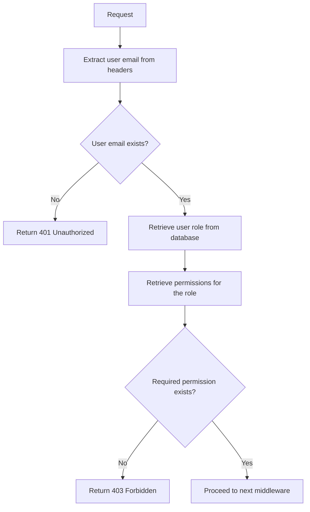

<details>
<summary>Relevant source files</summary>

The following files were used as context for generating this wiki page:

- [src/models.js](https://github.com/aanickode/access-control-service/blob/main/src/models.js)
- [src/authMiddleware.js](https://github.com/aanickode/access-control-service/blob/main/src/authMiddleware.js)
</details>

# Extending and Customizing

## Introduction

The project appears to be an access control service that manages user roles and permissions. The `src/models.js` file defines the data models for `User` and `Role` objects, while `src/authMiddleware.js` contains a middleware function `checkPermission` that verifies if a user has the required permission to access a resource.

This wiki page focuses on extending and customizing the access control system based on the provided source files. It covers the core components, data flow, and potential customization points for integrating the service into a larger application or modifying its behavior.

## Data Models

The `src/models.js` file defines the following data models:

### User

```javascript
export const User = {
  email: 'string',
  role: 'string'
};
```

The `User` model represents a user in the system, with the following properties:

- `email` (string): The email address of the user, which serves as a unique identifier.
- `role` (string): The name of the role assigned to the user.

Sources: [src/models.js:1-3]()

### Role

```javascript
export const Role = {
  name: 'string',
  permissions: ['string']
};
```

The `Role` model represents a role in the system, with the following properties:

- `name` (string): The name of the role.
- `permissions` (array of strings): A list of permissions associated with the role.

Sources: [src/models.js:5-7]()

## Access Control Middleware

The `src/authMiddleware.js` file exports a middleware function `checkPermission` that verifies if a user has the required permission to access a resource.

```javascript
export function checkPermission(requiredPermission) {
  return function (req, res, next) {
    const userEmail = req.headers['x-user-email'];
    if (!userEmail || !db.users[userEmail]) {
      return res.status(401).json({ error: 'Unauthorized: no user context' });
    }

    const role = db.users[userEmail];
    const permissions = db.roles[role] || [];

    if (!permissions.includes(requiredPermission)) {
      return res.status(403).json({ error: 'Forbidden: insufficient permissions' });
    }

    next();
  };
}
```

Sources: [src/authMiddleware.js:3-18]()

The `checkPermission` function takes a `requiredPermission` parameter and returns a middleware function that can be used in an Express.js application or similar frameworks.

Here's the flow of the `checkPermission` middleware:



1. The middleware extracts the user's email from the `x-user-email` header in the request.
2. If the user email is not present or the user is not found in the database, a 401 Unauthorized response is returned.
3. The user's role is retrieved from the database using the email.
4. The permissions associated with the user's role are retrieved from the database.
5. If the required permission is not included in the user's permissions, a 403 Forbidden response is returned.
6. If the user has the required permission, the middleware proceeds to the next middleware or route handler.

Sources: [src/authMiddleware.js:4-17]()

### Customization Points

Based on the provided source files, here are some potential customization points for extending and customizing the access control system:

1. **Data Storage**: The current implementation assumes the existence of a `db` object that stores user and role data. This could be replaced with a database integration or alternative data storage mechanisms.

2. **User Identification**: The middleware currently relies on the `x-user-email` header to identify the user. This could be customized to use different identification methods, such as JSON Web Tokens (JWT) or session-based authentication.

3. **Permission Hierarchy**: The current implementation treats permissions as a flat list associated with roles. A more advanced system could introduce a hierarchical permission structure or inheritance between roles.

4. **Permission Caching**: For improved performance, permissions could be cached in memory or a distributed cache to reduce database lookups.

5. **Audit Logging**: The comment in `src/authMiddleware.js` suggests that permission checks should be logged. Logging and auditing mechanisms could be implemented to track access attempts and permission violations.

6. **Error Handling**: The middleware currently returns simple JSON responses with error messages. More detailed error handling and response customization could be implemented.

7. **Role and Permission Management**: The current implementation lacks functionality for managing roles and permissions. Additional APIs or interfaces could be developed for creating, updating, and deleting roles and permissions.

8. **Integration with Authentication**: The access control system could be integrated with an authentication mechanism to handle user login, registration, and session management.

9. **Multi-tenancy**: If the access control system needs to support multiple tenants or organizations, additional data models and logic could be introduced to segregate and manage roles and permissions per tenant.

10. **Advanced Authorization Rules**: The current implementation checks for a single required permission. More complex authorization rules could be implemented, such as combining multiple permissions with logical operators (AND, OR) or supporting context-based permissions.

Sources: [src/authMiddleware.js:9]() (comment about logging changes)

## Conclusion

The provided source files implement a basic access control system with user and role models, and a middleware function to check permissions. While functional, the system can be extended and customized in various ways to meet specific requirements, such as integrating with databases, introducing permission hierarchies, implementing caching, logging, and advanced authorization rules. By understanding the core components and data flow, developers can build upon this foundation to create a more robust and feature-rich access control solution.