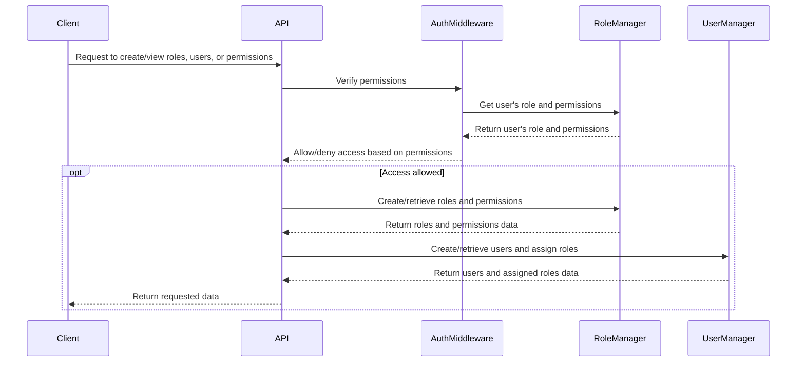
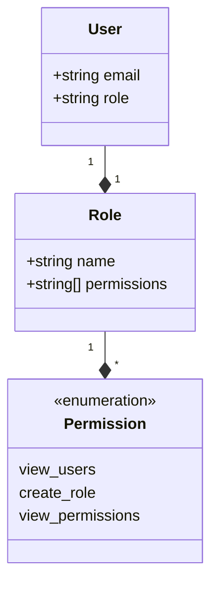

<details>
<summary>Relevant source files</summary>

The following files were used as context for generating this wiki page:

- [src/models.js](https://github.com/aanickode/access-control-service/blob/main/src/models.js)
- [src/routes.js](https://github.com/aanickode/access-control-service/blob/main/src/routes.js)
</details>

# Extending and Customizing

## Introduction

The "Extending and Customizing" feature within this project revolves around managing user roles, permissions, and access control. It allows administrators to define custom roles with specific permissions and assign those roles to users. This functionality is crucial for implementing role-based access control (RBAC) and ensuring that users have appropriate privileges within the application or system.

The implementation is based on a simple data model and a set of API endpoints exposed through an Express.js router. The core components involved are the `User`, `Role`, and their respective data structures and routes.

## Data Models

### User Model

The `User` model represents a user entity within the system. It has the following properties:

```javascript
export const User = {
  email: 'string',
  role: 'string'
};
```

- `email`: A string representing the user's email address, which serves as a unique identifier.
- `role`: A string representing the name of the role assigned to the user.

Sources: [src/models.js:1-4]()

### Role Model

The `Role` model defines a role within the system, which is associated with a set of permissions.

```javascript
export const Role = {
  name: 'string',
  permissions: ['string']
};
```

- `name`: A string representing the name of the role, which serves as a unique identifier.
- `permissions`: An array of strings, where each string represents a specific permission granted to the role.

Sources: [src/models.js:6-9]()

## API Endpoints

The project exposes several API endpoints through an Express.js router for managing users, roles, and permissions. These endpoints are defined in the `src/routes.js` file.

### Get Users

```javascript
router.get('/users', checkPermission('view_users'), (req, res) => {
  res.json(Object.entries(db.users).map(([email, role]) => ({ email, role })));
});
```

This endpoint retrieves a list of all users in the system, including their email addresses and assigned roles. It requires the `view_users` permission to be accessed.

Sources: [src/routes.js:6-9]()

### Create Role

```javascript
router.post('/roles', checkPermission('create_role'), (req, res) => {
  const { name, permissions } = req.body;
  if (!name || !Array.isArray(permissions)) {
    return res.status(400).json({ error: 'Invalid role definition' });
  }
  db.roles[name] = permissions;
  res.status(201).json({ role: name, permissions });
});
```

This endpoint allows creating a new role by providing a `name` and an array of `permissions`. It requires the `create_role` permission to be accessed. The new role is stored in the `db.roles` object, where the role name is the key, and the value is an array of permissions.

Sources: [src/routes.js:11-18]()

### Get Permissions

```javascript
router.get('/permissions', checkPermission('view_permissions'), (req, res) => {
  res.json(db.roles);
});
```

This endpoint retrieves a list of all defined roles and their associated permissions. It requires the `view_permissions` permission to be accessed.

Sources: [src/routes.js:20-23]()

### Create Token (Assign Role to User)

```javascript
router.post('/tokens', (req, res) => {
  const { user, role } = req.body;
  if (!user || !role) {
    return res.status(400).json({ error: 'Missing user or role' });
  }
  db.users[user] = role;
  res.status(201).json({ user, role });
});
```

This endpoint allows assigning a role to a user by providing the `user` (email) and `role` (name) in the request body. The user-role mapping is stored in the `db.users` object, where the user's email is the key, and the value is the assigned role name.

Sources: [src/routes.js:25-32]()

## Access Control Middleware

The project includes an `authMiddleware.js` file (not provided in the source files) that likely contains a middleware function `checkPermission`. This middleware is used to protect certain routes by verifying if the authenticated user has the required permission(s) based on their assigned role.

```javascript
router.get('/users', checkPermission('view_users'), (req, res) => {
  // ...
});
```

The `checkPermission` middleware is applied to routes that require specific permissions. It likely checks the user's role and associated permissions against the required permission(s) and either allows or denies access to the route accordingly.

Sources: [src/routes.js:6](), [src/routes.js:11](), [src/routes.js:20]()

## Data Flow

The following diagram illustrates the high-level data flow and interactions between the components involved in the "Extending and Customizing" feature:



1. The client (e.g., a web application or API consumer) sends a request to the API to create, view, or manage roles, users, or permissions.
2. The API routes the request through the `authMiddleware`, which verifies if the user has the required permissions based on their assigned role.
3. The `authMiddleware` interacts with the `RoleManager` component to retrieve the user's role and associated permissions.
4. If the user has the necessary permissions, the `authMiddleware` allows the request to proceed to the appropriate API route handler.
5. The API route handler interacts with the `RoleManager` and `UserManager` components to create, retrieve, or update roles, permissions, users, and user-role assignments.
6. The requested data is returned to the client through the API response.

Sources: [src/routes.js]()

## Role-Based Access Control (RBAC) Implementation

The project implements a basic role-based access control (RBAC) system by associating permissions with roles and assigning roles to users. The key components and their relationships are illustrated in the following diagram:



- A `User` is associated with a single `Role`.
- A `Role` can have multiple `Permission`s.
- The `Permission` class represents the available permissions in the system, which are likely defined as an enumeration or constant values.

When a user attempts to access a protected resource or perform a specific action, the system checks if the user's assigned role has the required permission(s). If the user has the necessary permissions, access is granted; otherwise, access is denied.

Sources: [src/models.js](), [src/routes.js]()

## Configuration and Customization

The project's configuration and customization options are not explicitly defined in the provided source files. However, based on the implementation, the following aspects can potentially be customized or extended:

### Permissions

The available permissions in the system are likely defined as constants or an enumeration (e.g., `view_users`, `create_role`, `view_permissions`). To add or modify permissions, you would need to update the corresponding code section where these permissions are defined and used.

### Roles

New roles can be created by defining their names and associated permissions using the `/roles` endpoint. The roles and their permissions are stored in the `db.roles` object, which could be replaced with a more persistent storage solution, such as a database.

### User Management

The provided implementation stores user information, including their assigned roles, in the `db.users` object. This could be extended or replaced with a more robust user management system, potentially integrating with authentication and authorization mechanisms.

### Access Control Logic

The access control logic is currently implemented in the `authMiddleware.js` file (not provided). This middleware likely contains the logic for checking if a user has the required permissions based on their assigned role. This logic could be extended or modified to support more complex access control scenarios, such as hierarchical roles, resource-based permissions, or attribute-based access control (ABAC).

### Data Storage

The current implementation uses in-memory objects (`db.users` and `db.roles`) to store user and role data. This could be replaced with a persistent data storage solution, such as a relational database or a NoSQL database, to support larger-scale deployments and data persistence.

Sources: [src/routes.js]()

## Conclusion

The "Extending and Customizing" feature in this project provides a basic implementation of role-based access control (RBAC) by allowing administrators to define roles with specific permissions and assign those roles to users. It exposes API endpoints for managing users, roles, and permissions, and includes middleware for enforcing access control based on the user's assigned role and permissions.

While the provided implementation is relatively simple, it serves as a foundation for building more complex and robust access control systems. By extending or replacing components such as data storage, access control logic, and user management, the project can be customized to meet specific requirements and integrate with existing authentication and authorization mechanisms.