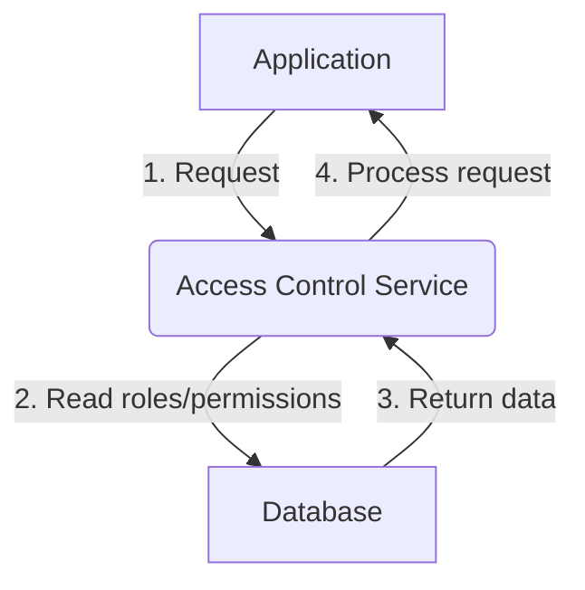
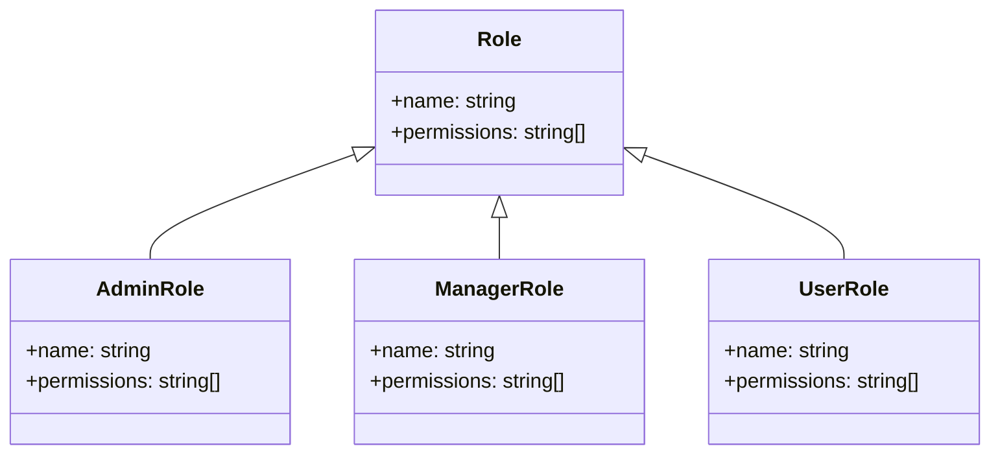
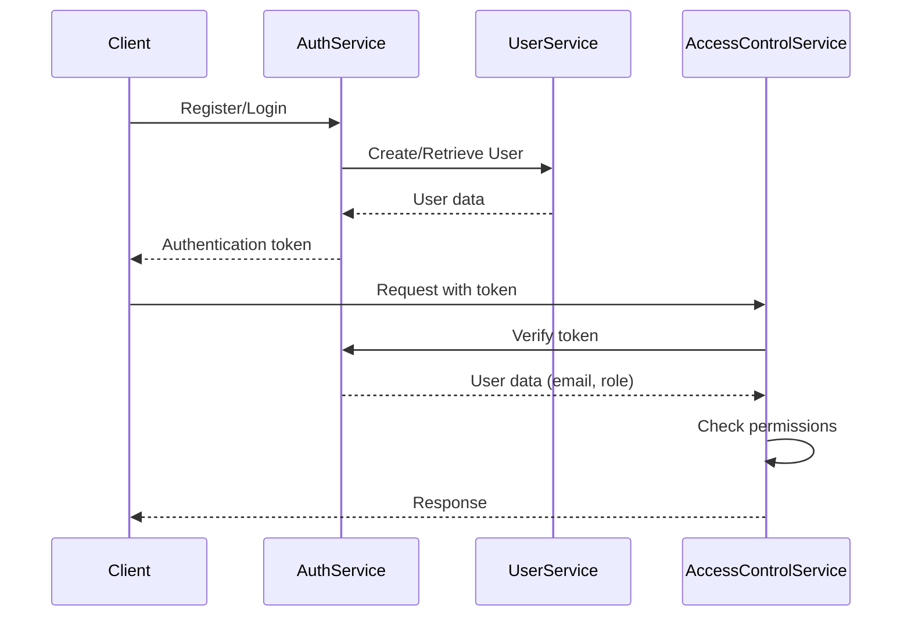
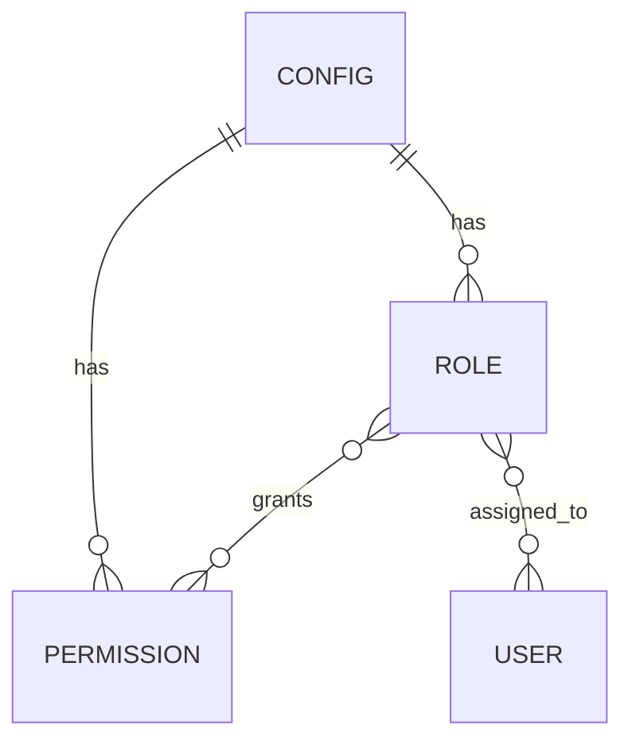

<details>
<summary>Relevant source files</summary>

The following files were used as context for generating this wiki page:

- [src/authMiddleware.js](https://github.com/aanickode/access-control-service/blob/main/src/authMiddleware.js)
- [src/models.js](https://github.com/aanickode/access-control-service/blob/main/src/models.js)

</details>

# Extending and Customizing

## Introduction

The provided source files outline a basic access control system for managing user roles and permissions within an application. The `authMiddleware.js` file contains a middleware function `checkPermission` that validates a user's permissions based on their assigned role. The `models.js` file defines the data structures for `User` and `Role` objects, which store user information and role-based permissions, respectively.

This wiki page aims to provide a comprehensive guide on extending and customizing the existing access control system to accommodate more complex requirements or integrate it with other components of the application.

## Role and Permission Management

The current implementation uses a simple in-memory data structure (`db.roles`) to store role definitions and their associated permissions. To extend this functionality, you may consider the following:

### Persisting Roles and Permissions



Currently, roles and permissions are stored in memory, which means they are lost when the application restarts. To persist this data, you can integrate a database or other persistent storage mechanism. The `db` module can be extended to interact with a database, allowing roles and permissions to be stored, retrieved, and updated dynamically.

Sources: [src/authMiddleware.js:3](), [src/models.js]()

### Role Hierarchy and Inheritance



The current implementation treats roles as flat entities with a list of permissions. You can introduce a role hierarchy where roles can inherit permissions from parent roles. This can be achieved by extending the `Role` model to include a `parentRole` field or by implementing a separate `RoleInheritance` model that defines the inheritance relationships.

Sources: [src/models.js]()

## User Management and Authentication

The provided files do not cover user management or authentication mechanisms. To extend the access control system, you may need to integrate it with your application's user management and authentication components.

### User Registration and Authentication



Implement user registration and authentication mechanisms (e.g., using JSON Web Tokens or sessions) to securely identify users and associate them with their respective roles. The `checkPermission` middleware can be extended to extract user information from the authentication token or session data instead of relying on the `x-user-email` header.

Sources: [src/authMiddleware.js:5-6]()

### User Role Assignment

Introduce a mechanism to assign roles to users during registration or through an administrative interface. This could involve extending the `User` model to include a `role` field or creating a separate `UserRole` model that maps users to their assigned roles.

Sources: [src/models.js]()

## API Integration and Endpoint Protection

The provided files do not include any API endpoints or routes. To integrate the access control system with your application's API, you can apply the `checkPermission` middleware to specific routes or endpoints that require permission validation.

```javascript
import express from 'express';
import { checkPermission } from './authMiddleware.js';

const router = express.Router();

// Protect this route with the 'admin' permission
router.get('/admin', checkPermission('admin'), (req, res) => {
  // Handle admin-only requests
});

// Protect this route with the 'manager' permission
router.post('/reports', checkPermission('manager'), (req, res) => {
  // Handle report generation requests
});
```

You can define the required permissions for each endpoint based on your application's access control requirements. Additionally, you may want to implement a centralized configuration or mapping of permissions to specific routes or resources.

Sources: [src/authMiddleware.js:2-19]()

## Configuration and Extensibility

To make the access control system more configurable and extensible, you can consider the following enhancements:

### Configuration Management



Introduce a configuration management system (e.g., a configuration file or a dedicated configuration service) to store and manage role definitions, permissions, and their mappings. This would allow for easier maintenance and updates without modifying the application code directly.

Sources: [src/models.js]()

### Plugin or Extension System

Develop a plugin or extension system that allows developers to define custom permission checks or integrate with other components of the application. This could involve creating an interface or abstract class that defines the contract for custom permission checks, which can then be registered and invoked by the access control system.

```javascript
class CustomPermissionCheck {
  check(user, resource) {
    // Implement custom permission logic
    // Return true if the user has access, false otherwise
  }
}

// Register the custom permission check
accessControlService.registerPermissionCheck('custom', new CustomPermissionCheck());

// Use the custom permission check
router.get('/protected', checkPermission('custom'), (req, res) => {
  // Handle protected requests
});
```

This approach promotes modularity and allows for more flexible and extensible access control mechanisms tailored to specific application requirements.

Sources: [src/authMiddleware.js]()

## Conclusion

The provided source files offer a basic foundation for an access control system based on user roles and permissions. By extending and customizing this system, you can integrate it with your application's user management, authentication, and API components, as well as introduce more advanced features such as role hierarchies, permission inheritance, and configuration management. Additionally, implementing a plugin or extension system can further enhance the system's flexibility and extensibility, allowing for custom permission checks and integration with other components of the application.