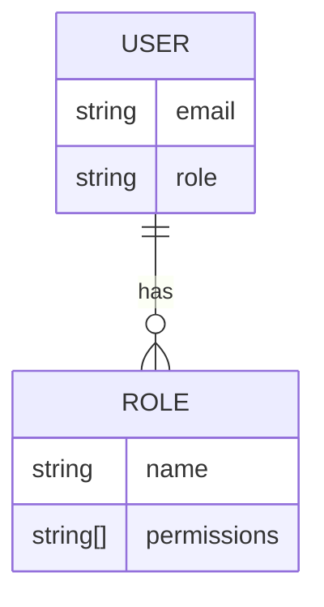
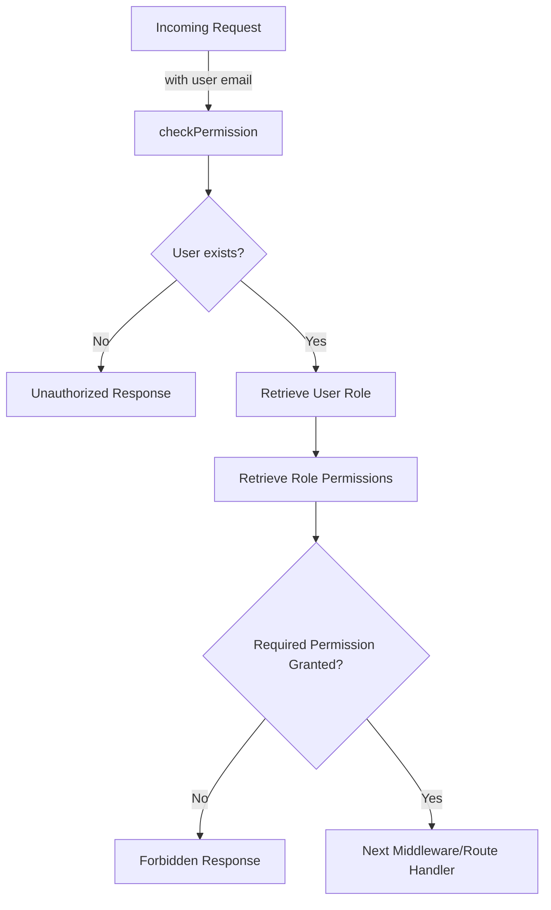

<details>
<summary>Relevant source files</summary>

The following files were used as context for generating this wiki page:

- [src/models.js](https://github.com/aanickode/access-control-service/blob/main/src/models.js)
- [src/authMiddleware.js](https://github.com/aanickode/access-control-service/blob/main/src/authMiddleware.js)
</details>

# Extending and Customizing

## Introduction

The "Extending and Customizing" feature within this project revolves around the ability to define and manage user roles and permissions. This functionality is crucial for implementing access control mechanisms, ensuring that users can only perform authorized actions based on their assigned roles and associated permissions.

The project defines two main data models: `User` and `Role`. The `User` model represents individual users and includes fields for their email and role. The `Role` model defines named roles and their corresponding sets of permissions.

## Role and Permission Management

### Role Model

The `Role` model is defined in the `src/models.js` file and consists of the following fields:

```javascript
export const Role = {
  name: 'string',
  permissions: ['string']
};
```

- `name`: A string representing the name or identifier of the role.
- `permissions`: An array of strings, where each string represents a specific permission associated with the role.

Sources: [src/models.js:4-6]()

### User Model

The `User` model is also defined in the `src/models.js` file and includes the following fields:

```javascript
export const User = {
  email: 'string',
  role: 'string'
};
```

- `email`: A string representing the user's email address, which serves as a unique identifier.
- `role`: A string representing the name or identifier of the role assigned to the user.

Sources: [src/models.js:1-3]()

### Role and Permission Storage

The project uses an in-memory data store (`db`) to store user and role information. The `db` object is assumed to have two properties:

- `db.users`: An object that maps user email addresses to their assigned role names.
- `db.roles`: An object that maps role names to their corresponding arrays of permissions.



Sources: [src/authMiddleware.js:5-7]()

## Access Control Middleware

The `src/authMiddleware.js` file exports a `checkPermission` function, which is likely used as a middleware in the application's routing or request handling pipeline. This middleware checks if the requesting user has the required permission to access a specific resource or perform a particular action.



Sources: [src/authMiddleware.js:3-20]()

### `checkPermission` Function

The `checkPermission` function takes a `requiredPermission` string as an argument and returns a middleware function that can be used in the application's routing or request handling pipeline.

```javascript
export function checkPermission(requiredPermission) {
  return function (req, res, next) {
    // ...
  };
}
```

The middleware function performs the following steps:

1. Retrieves the user's email from the `x-user-email` header in the request.
2. Checks if the user exists in the `db.users` object.
   - If the user does not exist, it returns a 401 Unauthorized response.
3. Retrieves the user's role from the `db.users` object.
4. Retrieves the permissions associated with the user's role from the `db.roles` object.
5. Checks if the `requiredPermission` is included in the user's permissions.
   - If the required permission is not granted, it returns a 403 Forbidden response.
6. If the user has the required permission, it calls the `next` middleware function or route handler.

Sources: [src/authMiddleware.js:3-20]()

## Extending and Customizing

To extend or customize the access control functionality, developers can modify or enhance the existing models, data storage, and middleware implementations based on their specific requirements.

### Potential Enhancements

- **Role Hierarchy**: Introduce a hierarchical structure for roles, where higher-level roles inherit permissions from lower-level roles.
- **Permission Granularity**: Implement more granular permission levels, such as read, write, update, and delete permissions for specific resources or actions.
- **Dynamic Permission Assignment**: Develop mechanisms to dynamically assign or revoke permissions based on user actions, events, or external factors.
- **Persistence**: Replace the in-memory data store with a persistent storage solution, such as a database or a file-based system, to maintain user and role information across application restarts.
- **Authentication Integration**: Integrate with an authentication system or service to retrieve user information and roles during the authentication process.
- **Auditing and Logging**: Implement auditing and logging mechanisms to track user actions, permission changes, and access control events for security and compliance purposes.

## Conclusion

The "Extending and Customizing" feature in this project provides a basic implementation of role-based access control (RBAC) by defining user and role models, storing role-permission mappings, and implementing a middleware function to check user permissions. Developers can build upon this foundation to enhance the access control functionality, introduce more complex permission models, integrate with authentication systems, and implement additional security and auditing features as per their project requirements.