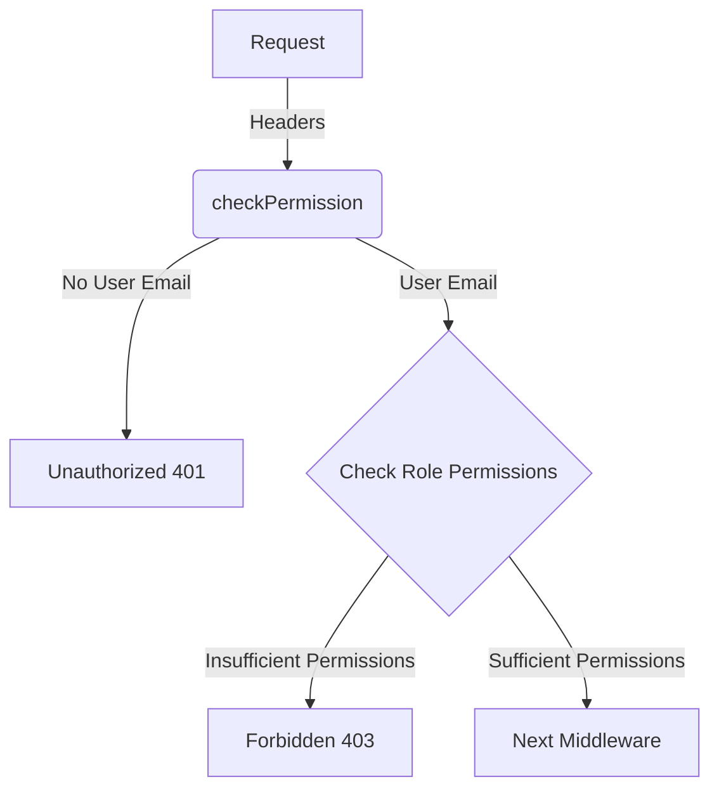

<details>
<summary>Relevant source files</summary>

The following files were used as context for generating this wiki page:

- [src/authMiddleware.js](https://github.com/aanickode/access-control-service/blob/main/src/authMiddleware.js)
- [src/models.js](https://github.com/aanickode/access-control-service/blob/main/src/models.js)
</details>

# Extending and Customizing

## Introduction

The "Extending and Customizing" feature within this project refers to the ability to modify and enhance the access control and authorization mechanisms. This is achieved through the use of a role-based access control (RBAC) system, where users are assigned roles, and roles are associated with specific permissions. By extending the existing roles and permissions, developers can customize the authorization logic to meet the project's evolving requirements.

Sources: [src/authMiddleware.js](), [src/models.js]()

## Role-Based Access Control (RBAC)

The project implements an RBAC system to manage user permissions and access control. The core components of this system are:

### User Model

The `User` model defines the structure of user data, including the user's email and their assigned role.

```javascript
export const User = {
  email: 'string',
  role: 'string'
};
```

Sources: [src/models.js:1-4]()

### Role Model

The `Role` model represents the different roles within the system, each with its own set of associated permissions.

```javascript
export const Role = {
  name: 'string',
  permissions: ['string']
};
```

Sources: [src/models.js:6-8]()

### Authorization Middleware

The `checkPermission` middleware function is responsible for enforcing access control based on the user's role and the required permission.



1. The middleware checks if the `x-user-email` header is present in the request and if the user exists in the `db.users` object.
2. If the user is not found, an "Unauthorized" response (401) is returned.
3. If the user is found, the middleware retrieves the user's role from `db.users` and the associated permissions from `db.roles`.
4. If the required permission is not included in the user's role permissions, a "Forbidden" response (403) is returned.
5. If the user has the required permission, the request is passed to the next middleware.

Sources: [src/authMiddleware.js:3-20]()

## Extending Roles and Permissions

To extend the access control system and introduce new roles or permissions, developers can modify the `db.roles` object and update the `Role` model accordingly.

For example, to add a new role called "manager" with permissions to "create" and "update" resources:

1. Update the `Role` model in `src/models.js`:

```javascript
export const Role = {
  name: 'string',
  permissions: ['string']
};
```

2. Add the new role and its permissions to the `db.roles` object:

```javascript
db.roles = {
  'admin': ['create', 'read', 'update', 'delete'],
  'user': ['read'],
  'manager': ['create', 'update']
};
```

3. Assign the "manager" role to the appropriate users in the `db.users` object:

```javascript
db.users = {
  'john@example.com': 'manager',
  'jane@example.com': 'user'
};
```

With these changes, users with the "manager" role will have access to create and update resources, while users with the "user" role will only have read access.

Sources: [src/models.js:6-8](), [src/authMiddleware.js:12]()

## Customizing Authorization Logic

While the current implementation uses a simple role-based approach, developers can extend the `checkPermission` middleware to incorporate more complex authorization logic if needed. For example, the middleware could be modified to support:

- Hierarchical roles (e.g., an "admin" role inherits all permissions from other roles)
- Resource-based permissions (e.g., different permissions for different resource types)
- Attribute-based access control (ABAC) based on user attributes or resource attributes

These customizations would require modifications to the `checkPermission` function and potentially the data models to accommodate the additional complexity.

Sources: [src/authMiddleware.js:3-20]()

## Conclusion

The "Extending and Customizing" feature in this project revolves around the role-based access control (RBAC) system, which allows developers to define roles, associate permissions with those roles, and assign roles to users. By modifying the `Role` model and updating the `db.roles` object, new roles and permissions can be introduced to extend the access control capabilities. Additionally, the `checkPermission` middleware can be customized to incorporate more advanced authorization logic if needed, such as hierarchical roles, resource-based permissions, or attribute-based access control (ABAC).