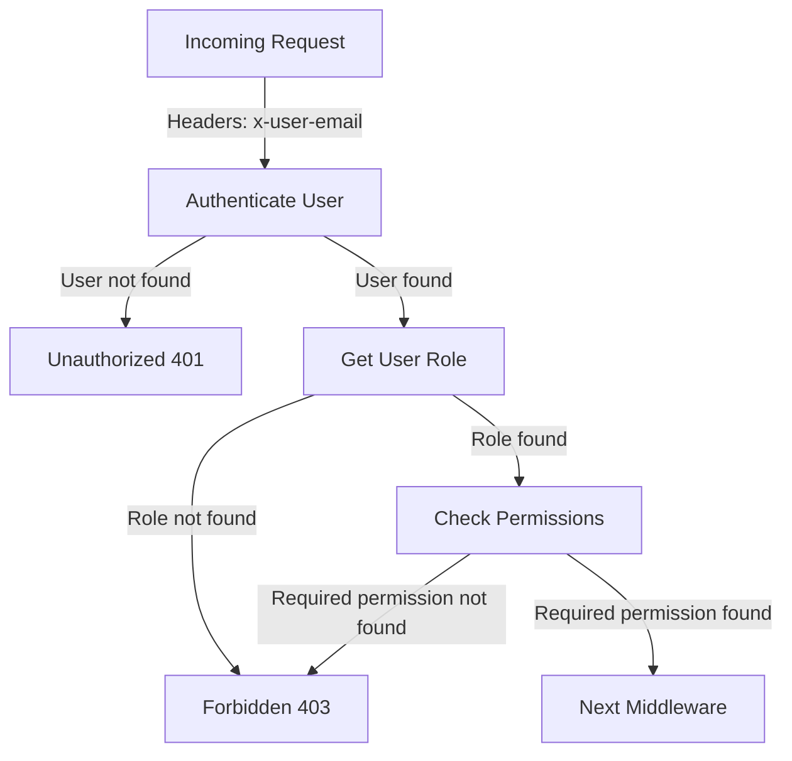
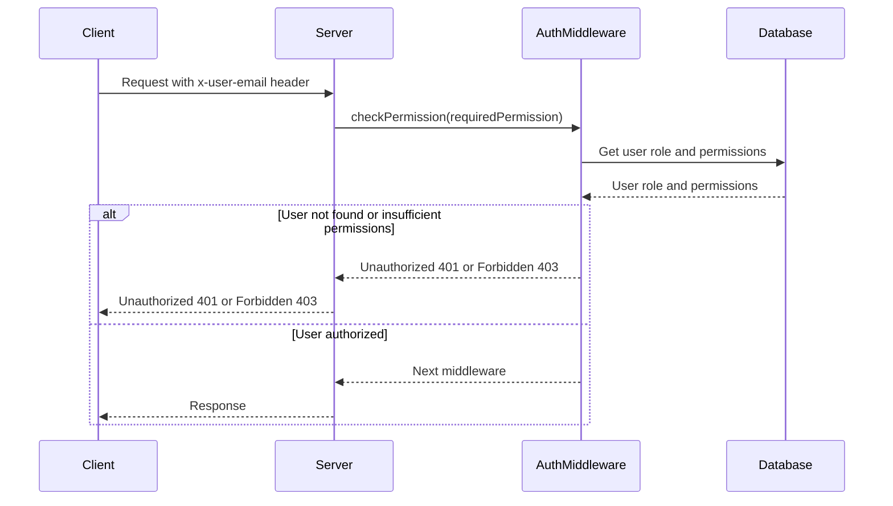

<details>
<summary>Relevant source files</summary>

The following files were used as context for generating this wiki page:

- [src/authMiddleware.js](https://github.com/aanickode/access-control-service/blob/main/src/authMiddleware.js)
- [src/routes.js](https://github.com/aanickode/access-control-service/blob/main/src/routes.js)
</details>

# Extending the Service

## Introduction

The "Extending the Service" feature refers to the ability to add new roles, permissions, and user-role assignments to the access control system. This allows for flexible and granular management of access privileges within the application. The primary purpose is to enable administrators or authorized users to define custom roles with specific sets of permissions, and then assign these roles to individual users as needed.

Sources: [src/routes.js:8-17](), [src/routes.js:22-27](), [src/routes.js:31-37]()

## Role Management

### Creating a New Role

To create a new role, a POST request must be made to the `/roles` endpoint with the required `create_role` permission. The request body should contain the `name` of the new role and an array of `permissions` associated with that role.

```javascript
router.post('/roles', checkPermission('create_role'), (req, res) => {
  const { name, permissions } = req.body;
  if (!name || !Array.isArray(permissions)) {
    return res.status(400).json({ error: 'Invalid role definition' });
  }
  db.roles[name] = permissions;
  res.status(201).json({ role: name, permissions });
});
```

Sources: [src/routes.js:8-17]()

### Viewing Existing Roles and Permissions

The `/permissions` endpoint, accessible with the `view_permissions` permission, allows users to retrieve a list of all existing roles and their associated permissions.

```javascript
router.get('/permissions', checkPermission('view_permissions'), (req, res) => {
  res.json(db.roles);
});
```

Sources: [src/routes.js:22-27]()

## User Management

### Assigning a Role to a User

To assign a role to a user, a POST request must be made to the `/tokens` endpoint. The request body should contain the `user` (email or identifier) and the `role` to be assigned.

```javascript
router.post('/tokens', (req, res) => {
  const { user, role } = req.body;
  if (!user || !role) {
    return res.status(400).json({ error: 'Missing user or role' });
  }
  db.users[user] = role;
  res.status(201).json({ user, role });
});
```

Sources: [src/routes.js:31-37]()

### Viewing User Roles

The `/users` endpoint, accessible with the `view_users` permission, allows users to retrieve a list of all registered users and their assigned roles.

```javascript
router.get('/users', checkPermission('view_users'), (req, res) => {
  res.json(Object.entries(db.users).map(([email, role]) => ({ email, role })));
});
```

Sources: [src/routes.js:3-7]()

## Authentication and Authorization

The `checkPermission` middleware function is responsible for enforcing access control based on the user's assigned role and the required permission for a specific route.



1. The middleware checks the `x-user-email` header in the incoming request to identify the user.
2. If the user is not found in the `db.users` object, an "Unauthorized" response (401) is returned.
3. If the user is found, their assigned role is retrieved from `db.users`.
4. The associated permissions for the user's role are looked up in `db.roles`.
5. If the required permission for the route is not present in the user's role permissions, a "Forbidden" response (403) is returned.
6. If the required permission is found, the request is passed to the next middleware function.

Sources: [src/authMiddleware.js:3-18]()



The sequence diagram illustrates the flow of authentication and authorization using the `checkPermission` middleware:

1. The client sends a request with the `x-user-email` header to the server.
2. The server invokes the `checkPermission` middleware, passing the required permission for the route.
3. The middleware retrieves the user's role and associated permissions from the database.
4. If the user is not found or lacks the required permission, an "Unauthorized" (401) or "Forbidden" (403) response is sent back to the client.
5. If the user is authorized, the middleware passes control to the next middleware function, and the server responds to the client.

Sources: [src/authMiddleware.js:3-18](), [src/routes.js:3-7](), [src/routes.js:8-17](), [src/routes.js:22-27]()

## Conclusion

The "Extending the Service" feature provides a flexible and granular access control system by allowing administrators or authorized users to create new roles, define their associated permissions, and assign these roles to individual users. This functionality is crucial for managing access privileges within the application and ensuring that users can only perform actions they are authorized for based on their assigned roles and permissions.