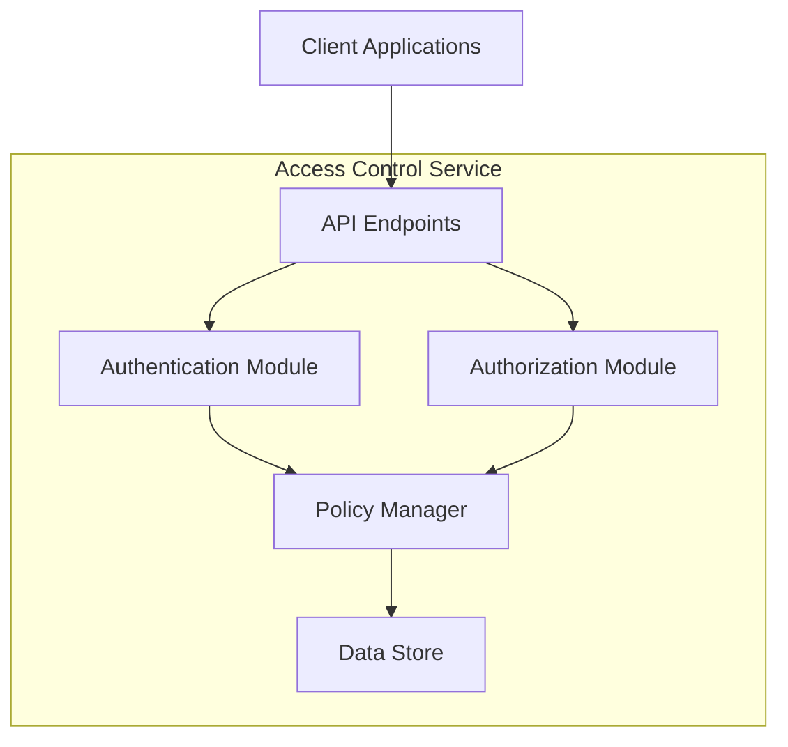
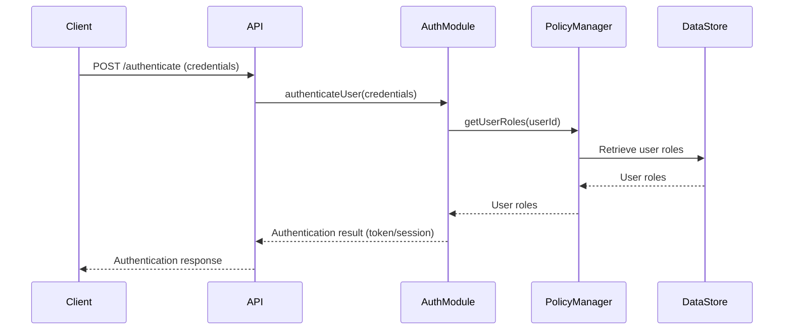
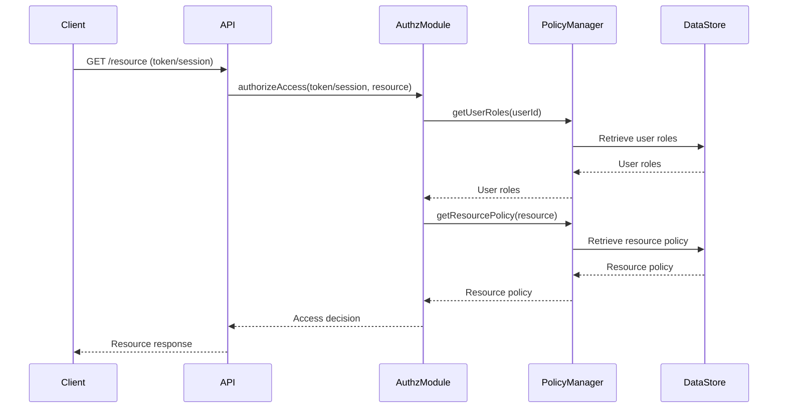

<details>
<summary>Relevant source files</summary>

The following files were used as context for generating this wiki page:

- [README.md](https://github.com/aanickode/access-control-service/blob/main/README.md)
- [.env.example](https://github.com/aanickode/access-control-service/blob/main/.env.example)

</details>

# Getting Started

## Introduction

This wiki page provides an overview of the "Getting Started" process for the Access Control Service project. The Access Control Service is a system designed to manage and enforce access permissions for various resources within an application or organization. It serves as a centralized authority for granting, revoking, and verifying access rights based on defined roles and policies.

Sources: [README.md]()

## Project Setup

### Environment Variables

The Access Control Service relies on environment variables for configuration. The `.env.example` file lists the required variables and their default values.

#### Port Configuration

The service listens on a configurable port specified by the `PORT` environment variable. If not set, it defaults to `8080`.

```
PORT=8080
```

Sources: [.env.example:1]()

## Starting the Service

To start the Access Control Service, follow the steps outlined in the project's README file. This typically involves setting the required environment variables and running the appropriate command to launch the service.

Sources: [README.md]()

## Architecture Overview



The Access Control Service follows a modular architecture with the following key components:

1. **API Endpoints**: Expose a set of RESTful API endpoints for client applications to interact with the service, such as authenticating users, checking permissions, and managing access policies.
2. **Authentication Module**: Handles user authentication by verifying credentials and issuing access tokens or session identifiers.
3. **Authorization Module**: Responsible for evaluating access requests against defined policies and granting or denying access to resources based on the user's roles and permissions.
4. **Policy Manager**: Manages the storage, retrieval, and updates of access control policies, which define the rules for granting or denying access to specific resources.
5. **Data Store**: Persistent storage for access control policies, user roles, and other relevant data.

Client applications interact with the Access Control Service through the API endpoints, which internally communicate with the Authentication and Authorization modules. These modules rely on the Policy Manager to retrieve and evaluate access control policies stored in the Data Store.

Sources: [README.md](), [.env.example]()

## Sequence Diagram: User Authentication



The user authentication process typically follows these steps:

1. The client application sends a POST request to the `/authenticate` endpoint with the user's credentials (e.g., username and password).
2. The API layer forwards the credentials to the Authentication Module.
3. The Authentication Module interacts with the Policy Manager to retrieve the user's roles from the Data Store.
4. The Policy Manager queries the Data Store for the user's roles and returns them to the Authentication Module.
5. Based on the authentication result and user roles, the Authentication Module generates an access token or session identifier.
6. The API layer receives the authentication result from the Authentication Module and sends the appropriate response (e.g., token or session identifier) back to the client application.

Sources: [README.md]()

## Sequence Diagram: Resource Access



The process of accessing a protected resource typically involves the following steps:

1. The client application sends a request (e.g., GET, POST, PUT, DELETE) to the API endpoint for the desired resource, including the user's access token or session identifier.
2. The API layer forwards the request and the user's token/session to the Authorization Module for access evaluation.
3. The Authorization Module interacts with the Policy Manager to retrieve the user's roles from the Data Store.
4. The Policy Manager queries the Data Store for the user's roles and returns them to the Authorization Module.
5. The Authorization Module requests the access policy for the requested resource from the Policy Manager.
6. The Policy Manager retrieves the resource policy from the Data Store and returns it to the Authorization Module.
7. The Authorization Module evaluates the user's roles against the resource policy to determine if access should be granted or denied.
8. The Authorization Module sends the access decision back to the API layer.
9. The API layer responds to the client application with the appropriate response (e.g., the requested resource or an access denied error) based on the access decision.

Sources: [README.md]()

## Conclusion

This wiki page provided an overview of the "Getting Started" process for the Access Control Service project. It covered the project setup, environment variables, starting the service, and the overall architecture. Additionally, it included sequence diagrams illustrating the user authentication and resource access flows, along with explanations of the key components involved in each process.

Sources: [README.md](), [.env.example]()