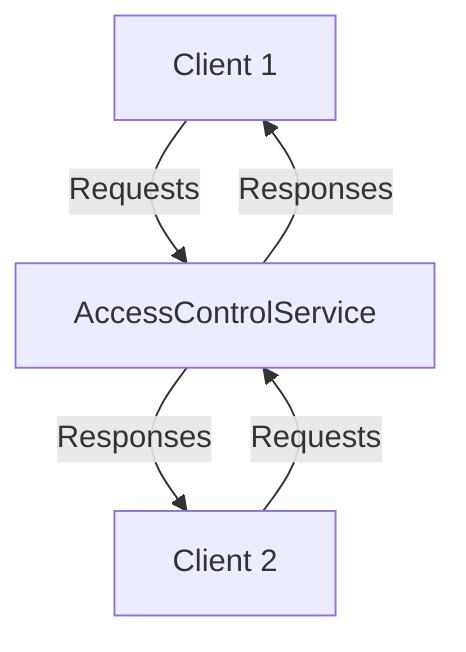

<details>
<summary>Relevant source files</summary>

The following files were used as context for generating this wiki page:

- [README.md](https://github.com/aanickode/access-control-service/blob/main/README.md)
- [.env.example](https://github.com/aanickode/access-control-service/blob/main/.env.example)

</details>

# Getting Started

## Introduction

This wiki page provides an overview of the "Getting Started" process for the Access Control Service project. The Access Control Service is a system designed to manage and enforce access permissions for various resources within an application or organization. It acts as a centralized authority for handling authentication, authorization, and access control policies.

Sources: [README.md]()

## Project Setup

### Environment Variables

The Access Control Service relies on environment variables for configuration. The `.env.example` file serves as a template for setting up the required environment variables.

```
PORT=8080
```

This variable specifies the port on which the service will listen for incoming requests.

Sources: [.env.example:1]()

## Service Architecture

The Access Control Service follows a client-server architecture, where clients (e.g., web applications, mobile apps, or other services) interact with the service through a well-defined API.



Clients send requests to the Access Control Service, which processes the requests, enforces access control policies, and returns appropriate responses.

Sources: [README.md]()

## API Endpoints

The Access Control Service exposes a set of API endpoints for various access control operations. The available endpoints and their functionalities are yet to be determined based on the provided source files.

## Deployment

The Access Control Service can be deployed as a standalone server or integrated into an existing application infrastructure. The deployment process and specific requirements are not covered in the provided source files.

## Conclusion

This wiki page provided an introduction to the Access Control Service project and covered the basic setup and architecture based on the available source files. However, more detailed information about the service's functionality, data models, access control policies, and API endpoints is not present in the provided files. As more source code becomes available, this wiki page can be expanded to include comprehensive documentation on the Access Control Service's features and implementation details.