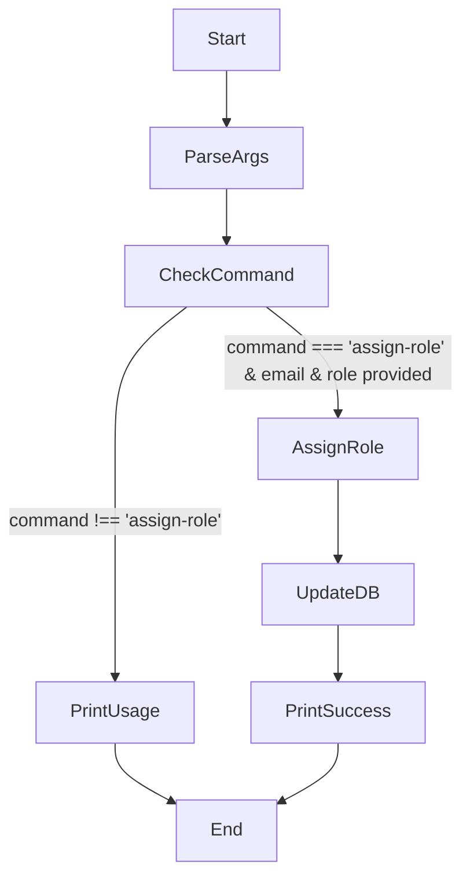

<details>
<summary>Relevant source files</summary>

The following files were used as context for generating this wiki page:

- [README.md](https://github.com/aanickode/access-control-service/blob/main/README.md)
- [.env.example](https://github.com/aanickode/access-control-service/blob/main/.env.example)
- [cli/manage.js](https://github.com/aanickode/access-control-service/blob/main/cli/manage.js)
</details>

# Getting Started

## Introduction

This wiki page provides an overview of the "Getting Started" process for the Access Control Service project. The Access Control Service is a system that manages user roles and permissions within an application or service. It allows administrators to assign roles to users, which can then be used to control access to various features or resources.

Sources: [README.md](), [cli/manage.js]()

## Command-Line Interface (CLI)

The Access Control Service includes a command-line interface (CLI) tool for managing user roles. The CLI is implemented in the `cli/manage.js` file.

### CLI Usage

The CLI can be invoked using the following command:

```
node manage.js assign-role <email> <role>
```

This command assigns the specified `<role>` to the user with the given `<email>` address.

Sources: [cli/manage.js:3-7]()

### CLI Implementation

The CLI implementation follows this flow:



1. The script parses the command-line arguments using `process.argv`.
2. It checks if the command is `'assign-role'` and if both `email` and `role` arguments are provided.
3. If the command is not `'assign-role'` or the required arguments are missing, it prints the usage instructions.
4. If the command and arguments are valid, it assigns the specified `role` to the user with the given `email` in the `db.users` object.
5. Finally, it prints a success message.

Sources: [cli/manage.js:1-11]()

## Database

The Access Control Service uses an in-memory object `db.users` to store user roles. This object is likely a simplified representation of a more robust database implementation in a production environment.

```javascript
import db from '../src/db.js';
// ...
db.users[email] = role;
```

Sources: [cli/manage.js:1, 7]()

## Configuration

The Access Control Service appears to have a configuration file named `.env.example`. This file contains a single environment variable `PORT` with a default value of `8080`.

```
PORT=8080
```

This configuration file is likely used as a template or example for creating a `.env` file with actual configuration values during deployment or runtime.

Sources: [.env.example]()

## Summary

The Access Control Service provides a command-line interface for assigning roles to users. The assigned roles are stored in an in-memory object, which would typically be replaced by a more robust database implementation in a production environment. The service also includes a configuration file for setting environment variables, such as the port number for the service to listen on.

While the provided source files offer a basic understanding of the Access Control Service's "Getting Started" process, more comprehensive documentation and implementation details would be required for a complete understanding of the project.