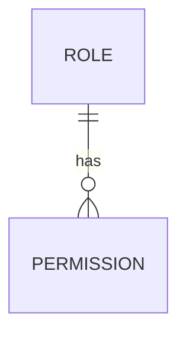

<details>
<summary>Relevant source files</summary>

The following files were used as context for generating this wiki page:

- [README.md](https://github.com/aanickode/access-control-service/blob/main/README.md)
- [docs/one-pager.md](https://github.com/aanickode/access-control-service/blob/main/docs/one-pager.md)
</details>

# Introduction

The Access Control Service is an internal Role-Based Access Control (RBAC) microservice responsible for centralized permission enforcement across internal tools, APIs, and services within the organization. It manages user-role assignments, role-permission mappings, and enforces access controls at runtime, ensuring consistent and auditable permission handling while decoupling role logic from application code.

Sources: [docs/one-pager.md:1-3](https://github.com/aanickode/access-control-service/blob/main/docs/one-pager.md#L1-L3), [README.md:1-2](https://github.com/aanickode/access-control-service/blob/main/README.md#L1-L2)

## Architecture Overview

The Access Control Service follows a flat RBAC model without hierarchies or scopes. It employs a middleware-based approach to enforce permissions, where requests to protected routes (`/api/*`) are intercepted by an authentication middleware. This middleware resolves the user's role from the `db.users` map, loads the associated permissions from the `config/roles.json` configuration file, and allows or denies access based on the required permissions annotated on the routes.

```mermaid
graph TD
    subgraph Access Control Service
        API[/api/* Routes] -->|Request| AuthMiddleware
        AuthMiddleware -->|Resolve Role| UsersMap[db.users]
        AuthMiddleware -->|Load Permissions| RolesConfig[config/roles.json]
        AuthMiddleware -->|Check Permissions| API
        AuthMiddleware -->|Allow/Deny| API
    end
```

The service relies on the `x-user-email` HTTP header to identify the user making the request.

Sources: [docs/one-pager.md:7-11](https://github.com/aanickode/access-control-service/blob/main/docs/one-pager.md#L7-L11), [docs/one-pager.md:18](https://github.com/aanickode/access-control-service/blob/main/docs/one-pager.md#L18)

## Role and Permission Management

The Access Control Service provides a declarative approach to defining role-permission mappings through a JSON configuration file (`config/roles.json`). This file specifies the permissions associated with each role within the system.



The service also includes CLI tools for bootstrapping and assigning roles to users. The `manage.js` script allows administrators to assign roles to users, as shown in the following example:

```bash
node cli/manage.js assign-role alice@company.com engineer
```

Sources: [docs/one-pager.md:5](https://github.com/aanickode/access-control-service/blob/main/docs/one-pager.md#L5), [docs/one-pager.md:14-15](https://github.com/aanickode/access-control-service/blob/main/docs/one-pager.md#L14-L15)

## API Overview

The Access Control Service exposes a REST API for managing users, roles, and permissions. The following table summarizes the available endpoints and their respective permissions:

| Method | Endpoint         | Description                   | Permission         |
|--------|------------------|-------------------------------|--------------------|
| GET    | /api/users       | List all users and roles      | `view_users`       |
| POST   | /api/roles       | Create a new role             | `create_role`      |
| GET    | /api/permissions | View all role definitions     | `view_permissions` |
| POST   | /api/tokens      | Assign user to a role         | *None (bootstrap)* |

All API requests must include the `x-user-email` HTTP header to identify the user making the request.

Sources: [docs/one-pager.md:20-27](https://github.com/aanickode/access-control-service/blob/main/docs/one-pager.md#L20-L27)

## Deployment and Persistence

The Access Control Service is designed to be stateless, with configuration stored in memory. This makes it suitable for internal-only usage behind an API gateway. However, for persistent configuration, the service can be integrated with an external configuration store like etcd or Consul.

Sources: [docs/one-pager.md:30-31](https://github.com/aanickode/access-control-service/blob/main/docs/one-pager.md#L30-L31)

## Summary

The Access Control Service provides a centralized and consistent approach to managing user roles and permissions across internal systems. By decoupling permission logic from application code and enforcing access controls through a middleware, the service ensures auditable and maintainable access control management. It offers a declarative configuration model, CLI tools for role assignment, and a REST API for user and role management.

Sources: [docs/one-pager.md:1-3](https://github.com/aanickode/access-control-service/blob/main/docs/one-pager.md#L1-L3), [README.md:1-2](https://github.com/aanickode/access-control-service/blob/main/README.md#L1-L2)