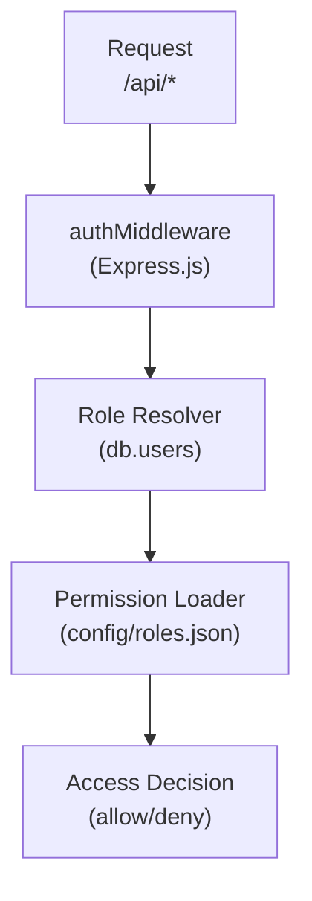
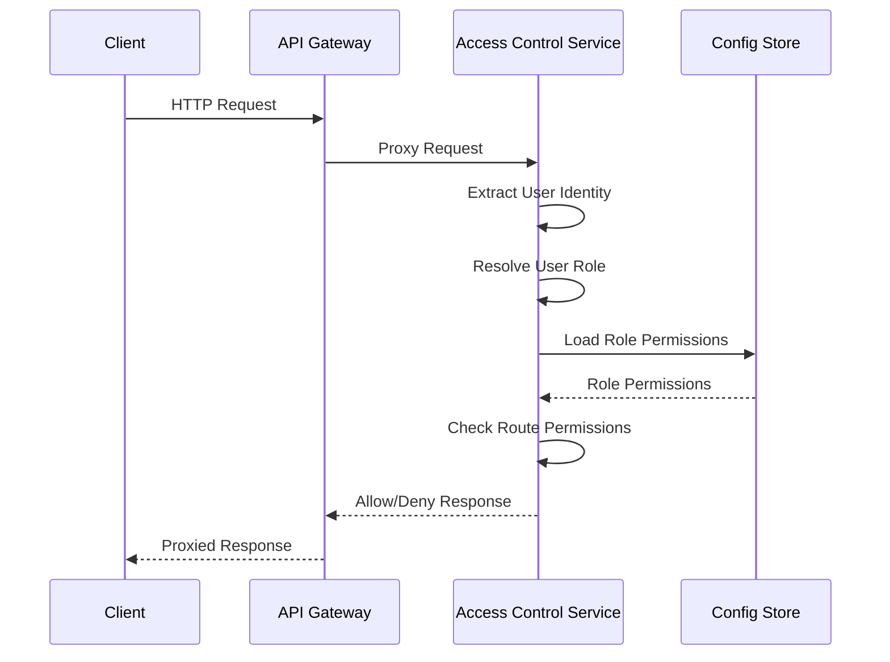

<details>
<summary>Relevant source files</summary>

The following files were used as context for generating this wiki page:

- [README.md](https://github.com/aanickode/access-control-service/blob/main/README.md)
- [docs/one-pager.md](https://github.com/aanickode/access-control-service/blob/main/docs/one-pager.md)
</details>

# Introduction

The Access Control Service is an internal Role-Based Access Control (RBAC) microservice that provides centralized permission enforcement for internal tools, APIs, and services within the organization. Its primary purpose is to manage user-role assignments, role-permission mappings, and enforce access controls at runtime, ensuring consistent and auditable permission handling across various systems.

By centralizing access control decisions, this service eliminates the need for hardcoded permission logic within individual applications, promoting code decoupling and maintainability. It serves as a single source of truth for role-based permissions, enabling consistent enforcement across the organization's internal ecosystem.

## Features

- Flat RBAC model without hierarchies or scopes for simplicity.
- Declarative role-to-permission mappings defined in a JSON configuration file.
- Middleware-based permission enforcement for seamless integration with existing applications.
- Command-line interface (CLI) tools for bootstrapping and assigning roles to users.
- RESTful API for managing roles, users, and permissions.

Sources: [docs/one-pager.md:3-18]()

## Architecture Overview

The Access Control Service follows a straightforward architecture, as illustrated by the following flow diagram:



1. Incoming requests to the `/api/*` endpoints are intercepted by the `authMiddleware` component.
2. The middleware extracts the user's identity from the `x-user-email` HTTP header.
3. The user's role is resolved by looking up the `db.users` in-memory map.
4. The role's associated permissions are loaded from the `config/roles.json` configuration file.
5. Based on the required permissions annotated on the requested route, an access decision (allow or deny) is made.

Sources: [docs/one-pager.md:21-26]()

## Request Handling

The Access Control Service handles incoming requests through the following sequence:



1. The client sends an HTTP request to the API Gateway.
2. The API Gateway proxies the request to the Access Control Service.
3. The service extracts the user's identity from the `x-user-email` header.
4. The user's role is resolved from the in-memory `db.users` map.
5. The service loads the role's permissions from the `config/roles.json` configuration file (or an external config store, if integrated).
6. The required permissions for the requested route are checked against the loaded permissions.
7. An allow/deny response is sent back to the API Gateway.
8. The API Gateway proxies the response back to the client.

Note: For simplicity, the service currently uses an in-memory configuration store. For persistence, it is recommended to integrate with an external configuration store like etcd or Consul.

Sources: [docs/one-pager.md:21-26, 37-40]()

## Role and Permission Management

The Access Control Service provides a RESTful API and a command-line interface (CLI) for managing roles, permissions, and user-role assignments.

### API Endpoints

| Method | Endpoint         | Description                   | Permission         |
|--------|------------------|-------------------------------|--------------------|
| GET    | /api/users       | List all users and roles      | `view_users`       |
| POST   | /api/roles       | Create a new role             | `create_role`      |
| GET    | /api/permissions | View all role definitions     | `view_permissions` |
| POST   | /api/tokens      | Assign user to a role         | *None (bootstrap)* |

All API requests must include the `x-user-email` header to identify the user making the request.

Sources: [docs/one-pager.md:29-36]()

### CLI Usage

The Access Control Service provides a CLI tool for assigning roles to users. For example:

```bash
node cli/manage.js assign-role alice@company.com engineer
```

This command assigns the `engineer` role to the user with the email `alice@company.com`.

Sources: [docs/one-pager.md:27-28]()

## Setup and Deployment

To set up the Access Control Service, follow these steps:

1. Copy the environment configuration file:
   ```bash
   cp .env.example .env
   ```
2. Install dependencies:
   ```bash
   npm install
   ```
3. Start the service:
   ```bash
   npm run start
   ```

The service is designed to be stateless and suitable for internal-only usage behind an API Gateway. For persistence, it is recommended to integrate with an external configuration store like etcd or Consul.

Sources: [docs/one-pager.md:19-20, 37-40]()

## Conclusion

The Access Control Service provides a centralized and consistent approach to managing role-based access controls within the organization's internal ecosystem. By decoupling permission logic from individual applications, it promotes code maintainability and ensures auditable, consistent enforcement of access controls across various systems.

With its flat RBAC model, declarative role-permission mappings, middleware-based enforcement, and management tools (API and CLI), the Access Control Service simplifies the management of user roles and permissions, enabling efficient access control management at scale.