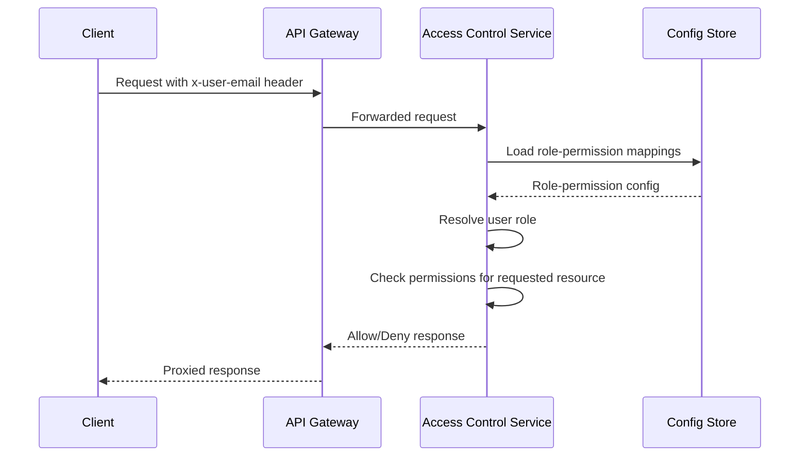
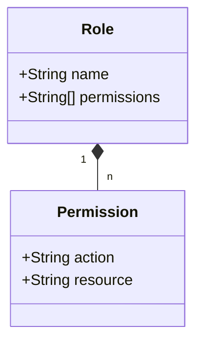
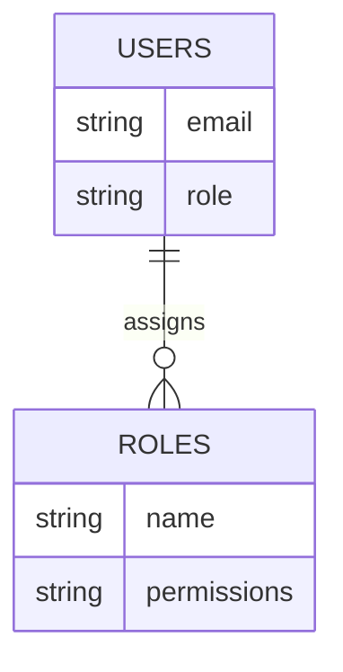
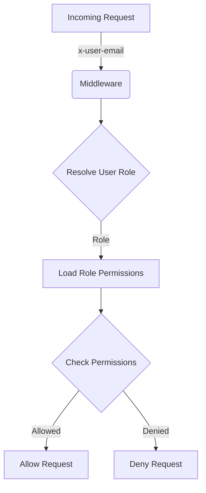

<details>
<summary>Relevant source files</summary>

The following files were used as context for generating this wiki page:

- [README.md](https://github.com/aanickode/access-control-service/blob/main/README.md)
- [docs/one-pager.md](https://github.com/aanickode/access-control-service/blob/main/docs/one-pager.md)
</details>

# Introduction

The Access Control Service is an internal Role-Based Access Control (RBAC) microservice that provides centralized permission enforcement for internal tools, APIs, and services within the organization. It manages user-role assignments, role-permission mappings, and enforces access controls at runtime, eliminating the need for hardcoded permission logic across various internal systems.

The service follows a flat RBAC model without hierarchies or scopes, and it utilizes declarative role-to-permission mappings defined in a JSON configuration file. It offers middleware-based permission enforcement, CLI tools for bootstrapping and role assignment, and a REST API for role and user management.

## Architecture Overview

The high-level architecture of the Access Control Service can be represented by the following sequence diagram:



The service follows the following high-level flow:

1. A client sends a request to an internal API, including the `x-user-email` header for authentication.
2. The request is forwarded to the Access Control Service by an API Gateway.
3. The service loads the role-permission mappings from a configuration store (e.g., JSON file, etcd, Consul).
4. The user's role is resolved based on the provided email address.
5. The required permissions for the requested resource are checked against the user's assigned role.
6. The service responds with an allow or deny decision to the API Gateway.
7. The API Gateway proxies the response back to the client.

Sources: [docs/one-pager.md:18-20](https://github.com/aanickode/access-control-service/blob/main/docs/one-pager.md#L18-L20), [docs/one-pager.md:24-25](https://github.com/aanickode/access-control-service/blob/main/docs/one-pager.md#L24-L25)

## Role and Permission Management

The Access Control Service provides a declarative way to define roles and their associated permissions through a JSON configuration file (`config/roles.json`). This file maps roles to an array of permitted actions or resources.



Roles are defined as objects with a `name` property and an array of `permissions`. Each permission is a string representing an action and a resource, typically in the format `"action:resource"`.

Sources: [docs/one-pager.md:14](https://github.com/aanickode/access-control-service/blob/main/docs/one-pager.md#L14)

## User Management

The service maintains a mapping of user email addresses to their assigned roles in a data structure (e.g., an in-memory map or a database table). This mapping is used to resolve a user's role during runtime permission checks.



Users are associated with a single role, and roles are defined with their respective permissions in the `config/roles.json` file.

Sources: [docs/one-pager.md:24-25](https://github.com/aanickode/access-control-service/blob/main/docs/one-pager.md#L24-L25)

## Permission Enforcement

The Access Control Service provides middleware-based permission enforcement for internal APIs and services. This middleware intercepts incoming requests, extracts the user's identity from the `x-user-email` header, resolves the user's role, and checks if the requested resource or action is permitted based on the role's assigned permissions.



The middleware acts as a gatekeeper, allowing or denying requests based on the user's role and the required permissions for the requested resource or action.

Sources: [docs/one-pager.md:18-20](https://github.com/aanickode/access-control-service/blob/main/docs/one-pager.md#L18-L20)

## API and CLI Tools

The Access Control Service provides a REST API and CLI tools for managing users, roles, and permissions.

### API Endpoints

| Method | Endpoint         | Description                   | Permission         |
|--------|------------------|-------------------------------|--------------------|
| GET    | /api/users       | List all users and roles      | `view_users`       |
| POST   | /api/roles       | Create a new role             | `create_role`      |
| GET    | /api/permissions | View all role definitions     | `view_permissions` |
| POST   | /api/tokens      | Assign user to a role         | *None (bootstrap)* |

All API requests must include the `x-user-email` header for authentication.

Sources: [docs/one-pager.md:30-37](https://github.com/aanickode/access-control-service/blob/main/docs/one-pager.md#L30-L37)

### CLI Tools

The service provides a CLI tool (`cli/manage.js`) for assigning roles to users. For example:

```bash
node cli/manage.js assign-role alice@company.com engineer
```

This command assigns the `engineer` role to the user with the email `alice@company.com`.

Sources: [docs/one-pager.md:26-28](https://github.com/aanickode/access-control-service/blob/main/docs/one-pager.md#L26-L28)

## Deployment and Persistence

The Access Control Service is designed to be stateless, with the configuration stored in memory. This makes it suitable for internal-only usage behind an API Gateway. However, for persistence and scalability, the service can be integrated with an external configuration store like etcd or Consul to store and retrieve the role-permission mappings and user-role assignments.

Sources: [docs/one-pager.md:39-41](https://github.com/aanickode/access-control-service/blob/main/docs/one-pager.md#L39-L41)

## Summary

The Access Control Service provides a centralized and consistent way to manage and enforce permissions across internal tools, APIs, and services within the organization. It follows a flat RBAC model, with roles and permissions defined declaratively in a configuration file. The service offers middleware-based permission enforcement, a REST API, and CLI tools for managing users, roles, and permissions. By centralizing access control logic, the service decouples permission management from application code and ensures consistent, auditable permission enforcement across the organization's internal systems.