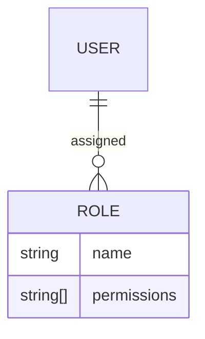

<details>
<summary>Relevant source files</summary>

The following files were used as context for generating this wiki page:

- [README.md](https://github.com/aanickode/access-control-service/blob/main/README.md)
- [docs/one-pager.md](https://github.com/aanickode/access-control-service/blob/main/docs/one-pager.md)
</details>

# Introduction

The Access Control Service is an internal Role-Based Access Control (RBAC) microservice that provides centralized permission enforcement for internal tools, APIs, and services within the organization. It manages user-role assignments, role-permission mappings, and enforces access controls at runtime, ensuring consistent and auditable permission enforcement across various systems.

The service aims to eliminate hardcoded permission logic across internal systems by decoupling role logic from application code. It follows a flat RBAC model without hierarchies or scopes, allowing for declarative role-to-permission mappings defined in a JSON configuration file.

## Architecture Overview

The Access Control Service follows a middleware-based architecture for permission enforcement. The high-level flow is as follows:

```mermaid
graph TD
    A[Request] -->|/api/*| B[authMiddleware]
    B --> C[Role Resolution]
    C --> D[Load Permissions]
    D -->|permissions[]| E[Allow/Deny]
```

1. Incoming requests to `/api/*` endpoints are intercepted by the `authMiddleware`.
2. The user's identity is extracted from the `x-user-email` HTTP header.
3. The user's role is resolved by looking up the `db.users` map.
4. The permissions associated with the user's role are loaded from the `config/roles.json` configuration file.
5. Based on the required permissions annotated on the route, access is either allowed or denied.

Sources: [docs/one-pager.md:18-23]()

## Role and Permission Management

The Access Control Service provides a declarative approach to managing roles and their associated permissions through a JSON configuration file (`config/roles.json`). This file defines the role-to-permission mappings, allowing for easy maintenance and updates without modifying the application code.



- Each role has a unique name and an array of associated permissions.
- Users are assigned to one or more roles, inheriting the permissions of those roles.

Sources: [docs/one-pager.md:10-11](), [docs/one-pager.md:18-23]()

## API and CLI

The Access Control Service exposes a REST API for managing users, roles, and permissions. Additionally, it provides a Command-Line Interface (CLI) for assigning roles to users.

### API Endpoints

| Method | Endpoint         | Description                   | Permission         |
|--------|------------------|-------------------------------|--------------------|
| GET    | /api/users       | List all users and roles      | `view_users`       |
| POST   | /api/roles       | Create a new role             | `create_role`      |
| GET    | /api/permissions | View all role definitions     | `view_permissions` |
| POST   | /api/tokens      | Assign user to a role         | *None (bootstrap)* |

All API requests must include the `x-user-email` header with the user's email address for authentication.

Sources: [docs/one-pager.md:28-35]()

### CLI Usage

The CLI tool `cli/manage.js` provides a command for assigning roles to users:

```bash
node cli/manage.js assign-role alice@company.com engineer
```

This command assigns the `engineer` role to the user with the email `alice@company.com`.

Sources: [docs/one-pager.md:24-26]()

## Deployment and Persistence

The Access Control Service is designed to be stateless, with the configuration stored in memory. This makes it suitable for internal-only usage behind an API gateway. However, for persistent storage of the configuration, the service can be integrated with an external configuration store like etcd or Consul.

Sources: [docs/one-pager.md:38-40]()

## Related Documentation

- [`docs/permissions.md`](docs/permissions.md): Detailed documentation on role definitions and structure.
- [`docs/api.md`](docs/api.md): Complete API contract and endpoint specifications.

Sources: [docs/one-pager.md:42-44]()