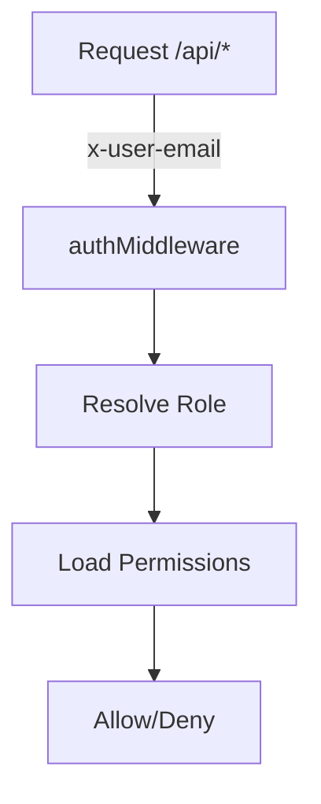

<details>
<summary>Relevant source files</summary>

The following files were used as context for generating this wiki page:

- [README.md](https://github.com/aanickode/access-control-service/blob/main/README.md)
- [docs/one-pager.md](https://github.com/aanickode/access-control-service/blob/main/docs/one-pager.md)
</details>

# Introduction

The Access Control Service is an internal Role-Based Access Control (RBAC) microservice that provides centralized permission enforcement for internal tools, APIs, and services within the organization. Its primary purpose is to manage user-role assignments, role-permission mappings, and enforce access controls at runtime, eliminating the need for hardcoded permission logic across various internal systems.

By centralizing access control decisions, this service ensures consistent and auditable permission enforcement while decoupling role logic from application code. It follows a flat RBAC model without hierarchies or scopes, relying on declarative role-to-permission mappings defined in a JSON configuration file.

## Architecture Overview

The Access Control Service follows a middleware-based architecture for permission enforcement. The high-level flow is as follows:



1. Incoming API requests include the `x-user-email` HTTP header for identity.
2. The `authMiddleware` component resolves the user's role from the `db.users` map.
3. Based on the role, the corresponding permissions are loaded from the `config/roles.json` configuration file.
4. The requested route is checked against the required permissions, and access is either allowed or denied.

Sources: [docs/one-pager.md:17-21]()

## Key Components

### Role-Permission Mapping

The role-permission mappings are defined in a JSON configuration file (`config/roles.json`). This file declaratively maps roles to their associated permissions, enabling easy management and updates without modifying the application code.

```json
{
  "engineer": ["create_resource", "update_resource"],
  "manager": ["view_users", "create_role", "view_permissions"],
  "admin": ["*"]
}
```

Sources: [docs/one-pager.md:9]()

### Authentication Middleware

The `authMiddleware` component is responsible for resolving the user's role based on the provided `x-user-email` HTTP header. It retrieves the role information from the `db.users` map, which likely represents an in-memory data structure or an external data source.

Sources: [docs/one-pager.md:19]()

### Permission Enforcement

Once the user's role and associated permissions are determined, the requested API route is checked against the required permissions. If the user's role has the necessary permissions, access is granted; otherwise, access is denied.

Sources: [docs/one-pager.md:20-21]()

## API Overview

The Access Control Service exposes a REST API for managing users, roles, and permissions. Here's a summary of the available endpoints:

| Method | Endpoint         | Description                   | Permission         |
|--------|------------------|-------------------------------|--------------------|
| GET    | /api/users       | List all users and roles      | `view_users`       |
| POST   | /api/roles       | Create a new role             | `create_role`      |
| GET    | /api/permissions | View all role definitions     | `view_permissions` |
| POST   | /api/tokens      | Assign user to a role         | *None (bootstrap)* |

All API requests must include the `x-user-email` HTTP header to provide the user's identity.

Sources: [docs/one-pager.md:28-35]()

## CLI and Setup

The Access Control Service includes a command-line interface (CLI) tool for managing user-role assignments. The `manage.js` script allows assigning roles to users:

```bash
node cli/manage.js assign-role alice@company.com engineer
```

To set up the service, you need to copy the `.env.example` file, install dependencies, and start the application:

```bash
cp .env.example .env
npm install
npm run start
```

Sources: [docs/one-pager.md:23-26, 38-42]()

## Deployment Considerations

The Access Control Service is designed to be stateless, with the configuration stored in memory. This makes it suitable for internal-only usage behind an API gateway. However, for persistent configuration storage, the service can be integrated with an external configuration store like etcd or Consul.

Sources: [docs/one-pager.md:45-47]()

In summary, the Access Control Service provides a centralized and consistent approach to managing user roles, permissions, and enforcing access controls across internal systems. By decoupling permission logic from application code, it promotes maintainability, auditability, and scalability for access control management within the organization.