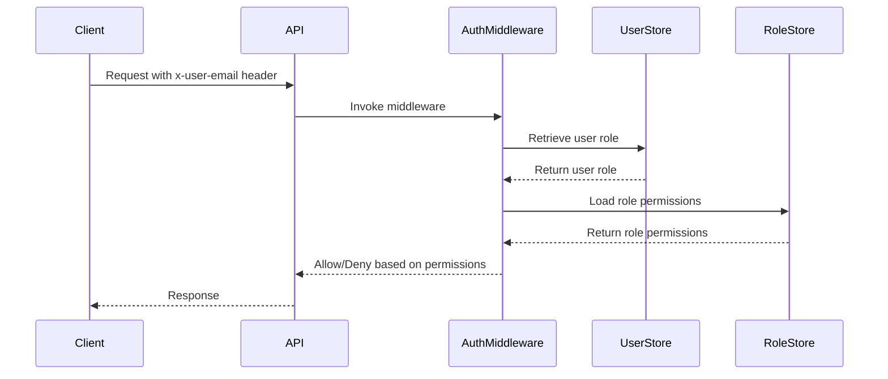

<details>
<summary>Relevant source files</summary>

The following files were used as context for generating this wiki page:

- [README.md](https://github.com/aanickode/access-control-service/blob/main/README.md)
- [docs/one-pager.md](https://github.com/aanickode/access-control-service/blob/main/docs/one-pager.md)

</details>

# Introduction

The Access Control Service is an internal Role-Based Access Control (RBAC) microservice that provides centralized permission enforcement for internal tools, APIs, and services within the organization. Its primary purpose is to manage user-role assignments, role-permission mappings, and enforce access controls at runtime, ensuring consistent and auditable permission enforcement across various systems.

Sources: [docs/one-pager.md:1-3](https://github.com/aanickode/access-control-service/blob/main/docs/one-pager.md#L1-L3), [README.md:1-2](https://github.com/aanickode/access-control-service/blob/main/README.md#L1-L2)

## Architecture Overview

The Access Control Service follows a flat RBAC model, where permissions are directly mapped to roles without any hierarchies or scopes. The service employs a middleware-based approach for permission enforcement, intercepting incoming requests and validating the user's role and associated permissions before allowing or denying access.

```mermaid
graph TD
    Request --> API[/api/*]
    API --> AuthMiddleware[authMiddleware]
    AuthMiddleware --> UserRole[role]
    UserRole --> PermissionsArray[permissions[]]
    PermissionsArray --> AllowDeny[allow/deny]
```

The high-level request flow is as follows:

1. The user's identity is provided via the `x-user-email` HTTP header.
2. The user's role is resolved from the `db.users` map.
3. The permissions associated with the user's role are loaded from the `config/roles.json` configuration file.
4. The requested API route is checked against the required permissions, and access is either allowed or denied based on the user's role and permissions.

Sources: [docs/one-pager.md:12-16](https://github.com/aanickode/access-control-service/blob/main/docs/one-pager.md#L12-L16)

## Key Components

### Authentication Middleware

The authentication middleware (`authMiddleware`) is a crucial component responsible for intercepting incoming requests and validating the user's role and permissions. It acts as a gatekeeper, ensuring that only authorized users with the appropriate permissions can access the requested resources.



The middleware follows these steps:

1. Extract the user's email from the `x-user-email` HTTP header.
2. Retrieve the user's role from the `db.users` map (e.g., `UserStore`).
3. Load the permissions associated with the user's role from the `config/roles.json` configuration file (e.g., `RoleStore`).
4. Check if the requested API route is annotated with the required permissions.
5. Allow or deny the request based on the user's role and permissions.

Sources: [docs/one-pager.md:12-16](https://github.com/aanickode/access-control-service/blob/main/docs/one-pager.md#L12-L16)

### Role Configuration

The Access Control Service relies on a declarative role-to-permission mapping defined in the `config/roles.json` configuration file. This file specifies the permissions associated with each role, allowing for flexible and centralized management of access controls.

```json
{
  "engineer": [
    "view_users",
    "create_role"
  ],
  "admin": [
    "view_users",
    "create_role",
    "view_permissions"
  ]
}
```

In the example above, the `engineer` role has permissions to `view_users` and `create_role`, while the `admin` role has additional permissions to `view_permissions`.

Sources: [docs/one-pager.md:7](https://github.com/aanickode/access-control-service/blob/main/docs/one-pager.md#L7)

### User Management

The Access Control Service provides a set of CLI tools and a REST API for managing users and their role assignments. The `manage.js` CLI script allows administrators to assign roles to users, while the API exposes endpoints for listing users, creating roles, and assigning roles to users.

| Method | Endpoint         | Description                   | Permission         |
|--------|------------------|-------------------------------|--------------------|
| GET    | /api/users       | List all users and roles      | `view_users`       |
| POST   | /api/roles       | Create a new role             | `create_role`      |
| GET    | /api/permissions | View all role definitions     | `view_permissions` |
| POST   | /api/tokens      | Assign user to a role         | *None (bootstrap)* |

Example CLI usage:

```bash
node cli/manage.js assign-role alice@company.com engineer
```

This command assigns the `engineer` role to the user with the email `alice@company.com`.

Sources: [docs/one-pager.md:18-24](https://github.com/aanickode/access-control-service/blob/main/docs/one-pager.md#L18-L24), [docs/one-pager.md:28-32](https://github.com/aanickode/access-control-service/blob/main/docs/one-pager.md#L28-L32)

## Deployment and Integration

The Access Control Service is designed to be stateless, with no persistent database. The configuration is loaded and stored in memory, making it suitable for internal-only usage behind an API gateway. However, for persistent storage and integration with external systems, the service can be extended to interact with a centralized configuration store like etcd or Consul.

Sources: [docs/one-pager.md:35-37](https://github.com/aanickode/access-control-service/blob/main/docs/one-pager.md#L35-L37)

## Conclusion

The Access Control Service provides a centralized and consistent approach to managing access controls and enforcing permissions across various internal tools, APIs, and services within the organization. By decoupling permission logic from application code and employing a middleware-based architecture, the service ensures auditable and flexible access control management, promoting better security and maintainability of internal systems.

Sources: [docs/one-pager.md:1-3](https://github.com/aanickode/access-control-service/blob/main/docs/one-pager.md#L1-L3), [README.md:1-2](https://github.com/aanickode/access-control-service/blob/main/README.md#L1-L2)