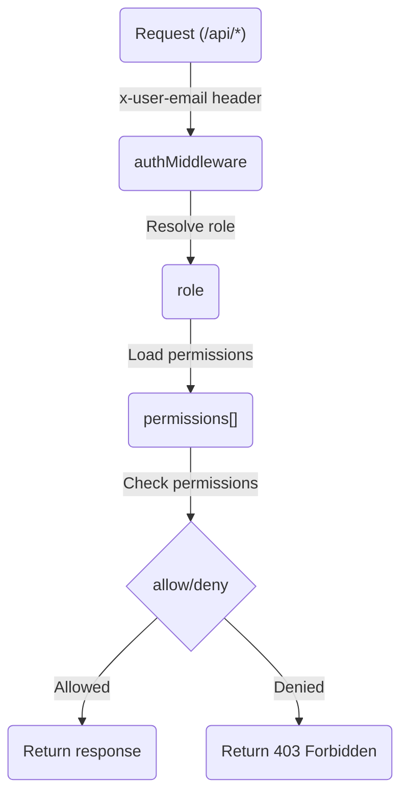

<details>
<summary>Relevant source files</summary>

The following files were used as context for generating this wiki page:

- [README.md](https://github.com/aanickode/access-control-service/blob/main/README.md)
- [docs/one-pager.md](https://github.com/aanickode/access-control-service/blob/main/docs/one-pager.md)
</details>

# Introduction

The Access Control Service is an internal Role-Based Access Control (RBAC) microservice that provides centralized permission enforcement for internal tools, APIs, and services within the organization. Its primary purpose is to eliminate hardcoded permission logic across various internal systems by centralizing access control decisions, ensuring consistent and auditable permission enforcement, and decoupling role logic from application code.

Sources: [docs/one-pager.md:3-5](), [docs/one-pager.md:9-11]()

## Features

The Access Control Service offers the following key features:

- **Flat RBAC Model**: It implements a flat Role-Based Access Control model without support for scopes or hierarchies.
- **Declarative Role-to-Permission Mappings**: Role-to-permission mappings are defined declaratively in a JSON configuration file.
- **Middleware-based Permission Enforcement**: Permission enforcement is implemented as middleware, allowing seamless integration with other services and APIs.
- **CLI Tools**: Command-line interface (CLI) tools are provided for bootstrapping and assigning roles to users.
- **REST API**: A RESTful API is available for managing roles and user assignments.

Sources: [docs/one-pager.md:14-18]()

## Architecture Overview

The Access Control Service follows a simple architecture for handling requests and enforcing permissions:



1. The request includes the `x-user-email` HTTP header for identifying the user.
2. The `authMiddleware` resolves the user's role from the `db.users` map.
3. The user's permissions are loaded from the `config/roles.json` configuration file based on their role.
4. The requested route is checked against the required permissions defined in the code annotations.
5. If the user has the necessary permissions, the request is allowed; otherwise, a 403 Forbidden response is returned.

Sources: [docs/one-pager.md:21-27]()

## Setup and Usage

### Setup

To set up the Access Control Service, follow these steps:

1. Copy the example environment file: `cp .env.example .env`
2. Install dependencies: `npm install`
3. Start the service: `npm run start`

Sources: [docs/one-pager.md:30-33]()

### CLI Usage

The Access Control Service provides a command-line interface (CLI) tool for managing user-role assignments. For example, to assign the `engineer` role to the user `alice@company.com`, run:

```bash
node cli/manage.js assign-role alice@company.com engineer
```

Sources: [docs/one-pager.md:36-38]()

## API Overview

The Access Control Service exposes a RESTful API for managing users, roles, and permissions. The following table summarizes the available endpoints and their required permissions:

| Method | Endpoint         | Description                   | Permission         |
|--------|------------------|-------------------------------|--------------------|
| GET    | /api/users       | List all users and roles      | `view_users`       |
| POST   | /api/roles       | Create a new role             | `create_role`      |
| GET    | /api/permissions | View all role definitions     | `view_permissions` |
| POST   | /api/tokens      | Assign user to a role         | *None (bootstrap)* |

All API requests must include the `x-user-email` header with the user's email address.

Sources: [docs/one-pager.md:41-49]()

## Deployment Notes

The Access Control Service is designed to be stateless, with no persistent database. The configuration is stored in memory. This makes it suitable for internal-only usage behind an API gateway. For persistent configuration storage, the service can be integrated with an external configuration store like etcd or Consul.

Sources: [docs/one-pager.md:52-54]()

## Related Documentation

- [`docs/permissions.md`](docs/permissions.md): Provides details on the role definitions and structure.
- [`docs/api.md`](docs/api.md): Describes the complete API contract for the Access Control Service.

Sources: [docs/one-pager.md:57-59]()