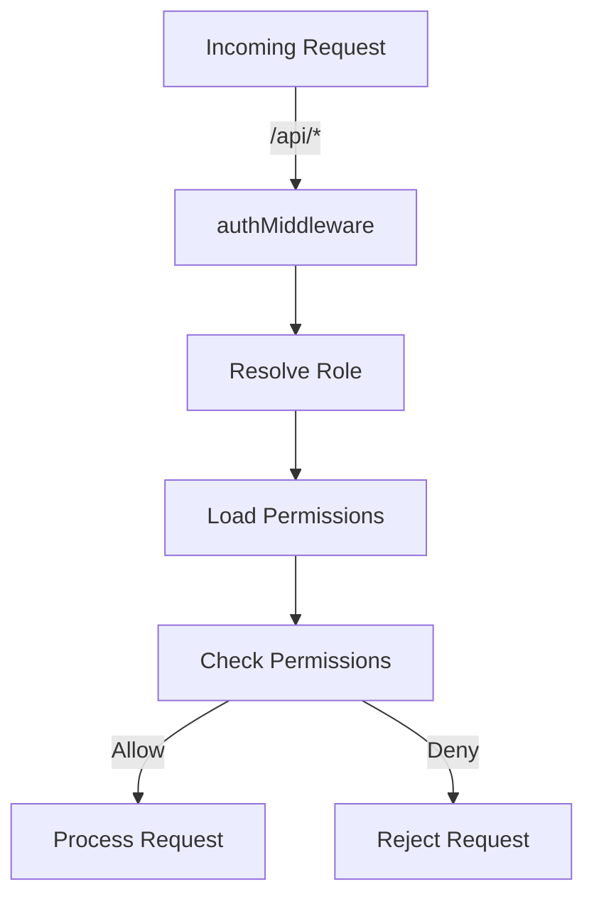
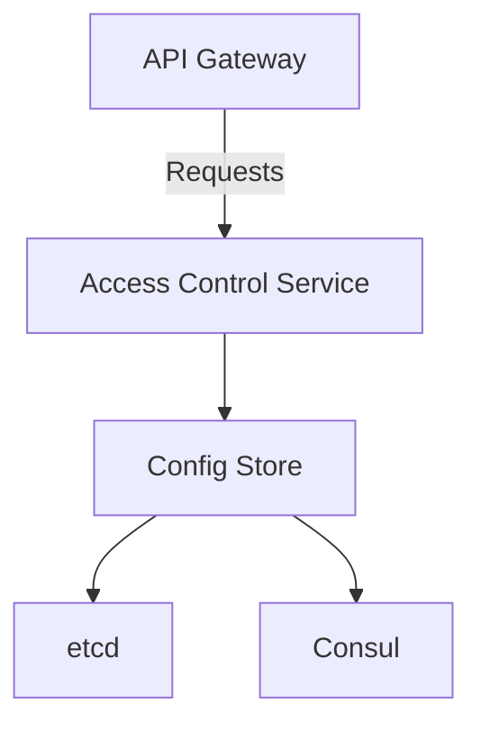

<details>
<summary>Relevant source files</summary>

The following files were used as context for generating this wiki page:

- [README.md](https://github.com/aanickode/access-control-service/blob/main/README.md)
- [docs/one-pager.md](https://github.com/aanickode/access-control-service/blob/main/docs/one-pager.md)
</details>

# Introduction

The Access Control Service is an internal Role-Based Access Control (RBAC) microservice that provides centralized permission enforcement for internal tools, APIs, and services within the organization. It manages user-role assignments, role-permission mappings, and enforces access controls at runtime, ensuring consistent and auditable permission enforcement across various systems.

The service eliminates the need for hardcoded permission logic in individual applications by decoupling role logic from application code. It serves as a single source of truth for access control decisions, promoting consistency and maintainability.

## Purpose and Overview

The primary purpose of the Access Control Service is to centralize and streamline access control management within the organization. By providing a dedicated service for handling user roles, permissions, and access control enforcement, it simplifies the development and maintenance of internal tools, APIs, and services.

The service follows a flat RBAC model, where roles are directly mapped to permissions without hierarchies or scopes. It allows for declarative role-to-permission mappings through a JSON configuration file, making it easy to define and manage access control rules.

The service integrates with internal systems through middleware-based permission enforcement. Requests to protected resources are intercepted by the middleware, which verifies the user's role and associated permissions before granting or denying access.

Sources: [docs/one-pager.md:3-8](), [docs/one-pager.md:15-18]()

## Key Components

### Role Management

The Access Control Service provides a centralized mechanism for managing user roles and their associated permissions. Roles are defined in a JSON configuration file, which maps each role to a set of permissions.

Sources: [docs/one-pager.md:15-16]()

### User Management

The service maintains a mapping of users to their assigned roles. This mapping is stored in an in-memory database (`db.users`) and can be managed through a command-line interface (CLI) or a REST API.

Sources: [docs/one-pager.md:17](), [docs/one-pager.md:25-28]()

### Permission Enforcement

The core functionality of the Access Control Service is permission enforcement. It achieves this through an authentication middleware that intercepts incoming requests to protected resources. The middleware verifies the user's identity, resolves their assigned role, and checks if the role has the required permissions to access the requested resource.



Sources: [docs/one-pager.md:19-22]()

## API and CLI

The Access Control Service provides both a REST API and a command-line interface (CLI) for managing users, roles, and permissions.

### API Endpoints

The following table summarizes the available API endpoints and their respective permissions:

| Method | Endpoint         | Description                   | Permission         |
|--------|------------------|-------------------------------|--------------------|
| GET    | /api/users       | List all users and roles      | `view_users`       |
| POST   | /api/roles       | Create a new role             | `create_role`      |
| GET    | /api/permissions | View all role definitions     | `view_permissions` |
| POST   | /api/tokens      | Assign user to a role         | *None (bootstrap)* |

All API requests must include the `x-user-email` header to identify the authenticated user.

Sources: [docs/one-pager.md:25-31]()

### CLI Usage

The CLI provides a convenient way to manage user-role assignments. For example, to assign the `engineer` role to the user `alice@company.com`, you can run the following command:

```bash
node cli/manage.js assign-role alice@company.com engineer
```

Sources: [docs/one-pager.md:23-24]()

## Deployment and Architecture

The Access Control Service is designed to be stateless, with configuration stored in memory. This makes it suitable for internal-only usage behind an API gateway. However, for persistence and scalability, the service can be integrated with an external configuration store like etcd or Consul.



Sources: [docs/one-pager.md:33-36]()

## Conclusion

The Access Control Service provides a centralized and consistent approach to managing access control within the organization. By decoupling permission logic from individual applications and providing a dedicated service for role management and enforcement, it simplifies the development and maintenance of internal systems while ensuring proper access control and auditing capabilities.

Sources: [docs/one-pager.md:3-8]()