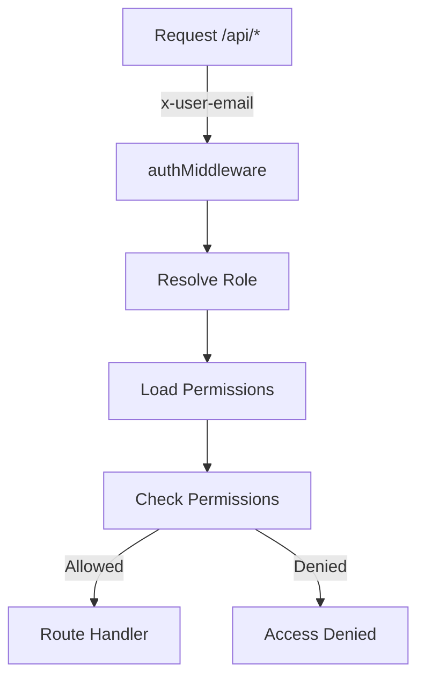
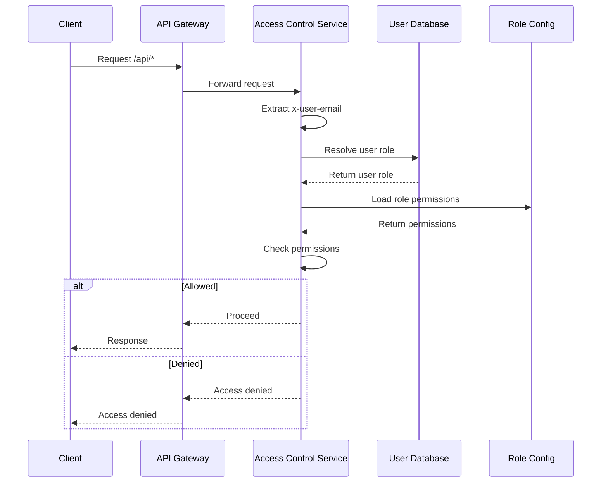

Relevant source files

The following files were used as context for generating this wiki page:

- [README.md](https://github.com/aanickode/access-control-service/blob/main/README.md)
- [docs/one-pager.md](https://github.com/aanickode/access-control-service/blob/main/docs/one-pager.md)

# Introduction

The Access Control Service is an internal Role-Based Access Control (RBAC) microservice that provides centralized permission enforcement for internal tools, APIs, and services within a company or organization. Its primary purpose is to manage user-role assignments, role-permission mappings, and enforce access controls at runtime, eliminating the need for hardcoded permission logic across various internal systems.

By centralizing access control decisions, this service ensures consistent and auditable permission enforcement while decoupling role logic from application code. It follows a flat RBAC model without hierarchies or scopes, allowing for declarative role-to-permission mappings defined in a JSON configuration file.

## Architecture Overview

The Access Control Service follows a middleware-based architecture, where requests to protected API endpoints are intercepted by an authentication middleware. This middleware resolves the user's role based on their identity (provided via an `x-user-email` HTTP header), retrieves the associated permissions from the `config/roles.json` file, and allows or denies access based on the required permissions annotated on the routes.

The high-level flow can be represented as follows:

Sources: [docs/one-pager.md:18-20](https://github.com/aanickode/access-control-service/blob/main/docs/one-pager.md#L18-L20)

## Data Flow

The sequence of events for handling a request can be illustrated as follows:

Sources: [docs/one-pager.md:18-20](https://github.com/aanickode/access-control-service/blob/main/docs/one-pager.md#L18-L20)

## Key Components

### Authentication Middleware

The authentication middleware is responsible for intercepting requests to protected API endpoints, extracting the user's identity from the `x-user-email` HTTP header, resolving the user's role, and loading the associated permissions from the role configuration file.

### User Database

The user database is a simple in-memory map that associates user email addresses with their assigned roles. This map is likely initialized from a configuration file or an external data source during startup.

### Role Configuration

The role configuration is a JSON file (`config/roles.json`) that defines the mapping between roles and their associated permissions. This file is loaded into memory and used by the authentication middleware to determine the permissions granted to a user based on their assigned role.

### API Endpoints

The API endpoints are annotated with the required permissions for access. The authentication middleware checks if the user's role has the necessary permissions before allowing the request to proceed to the route handler.

## Key Features

- **Flat RBAC Model**: The Access Control Service follows a flat Role-Based Access Control (RBAC) model, without support for hierarchies or scopes.
- **Declarative Role-Permission Mappings**: Role-to-permission mappings are defined declaratively in a JSON configuration file (`config/roles.json`), allowing for easy management and updates.
- **Middleware-based Permission Enforcement**: Permission enforcement is handled by an authentication middleware, decoupling access control logic from application code.
- **CLI Tools**: The service provides command-line interface (CLI) tools for bootstrapping and assigning roles to users.
- **REST API**: A REST API is available for managing users, roles, and permissions.

Sources: [docs/one-pager.md:4-5](https://github.com/aanickode/access-control-service/blob/main/docs/one-pager.md#L4-L5), [docs/one-pager.md:8-12](https://github.com/aanickode/access-control-service/blob/main/docs/one-pager.md#L8-L12), [docs/one-pager.md:27-31](https://github.com/aanickode/access-control-service/blob/main/docs/one-pager.md#L27-L31)

## Deployment Considerations

- **Stateless Design**: The Access Control Service is designed to be stateless, with no persistent database. The configuration is loaded into memory during runtime.
- **Internal-only Usage**: The service is intended for internal usage behind an API gateway, as it does not provide external authentication or authorization mechanisms.
- **External Configuration Store**: For persistent configuration, the service can be integrated with an external configuration store like etcd or Consul.

Sources: [docs/one-pager.md:35-37](https://github.com/aanickode/access-control-service/blob/main/docs/one-pager.md#L35-L37)

In summary, the Access Control Service provides a centralized and consistent approach to managing and enforcing permissions across internal tools, APIs, and services within an organization. By decoupling access control logic from application code and following a declarative RBAC model, it simplifies permission management and ensures auditable and consistent access control decisions.