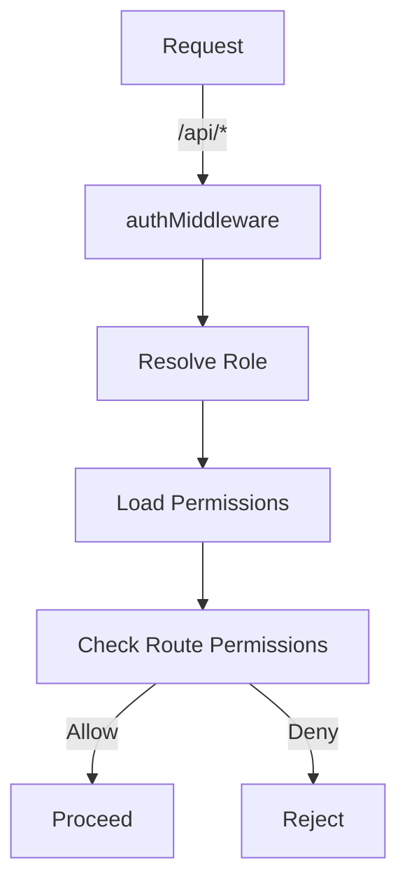

<details>
<summary>Relevant source files</summary>

The following files were used as context for generating this wiki page:

- [README.md](https://github.com/aanickode/access-control-service/blob/main/README.md)
- [docs/one-pager.md](https://github.com/aanickode/access-control-service/blob/main/docs/one-pager.md)
</details>

# Introduction

The Access Control Service is an internal Role-Based Access Control (RBAC) microservice that provides centralized permission enforcement for internal tools, APIs, and services within the project. It manages user-role assignments, role-permission mappings, and enforces access controls at runtime, eliminating the need for hardcoded permission logic across various internal systems.

Sources: [docs/one-pager.md:1-3](), [docs/one-pager.md:6-8]()

## Purpose

The primary purpose of the Access Control Service is to ensure consistent and auditable permission enforcement across internal systems, while decoupling role logic from application code. By centralizing access control decisions, the service promotes a standardized approach to managing user roles and permissions, enhancing security and maintainability.

Sources: [docs/one-pager.md:11-13]()

## Architecture Overview

The Access Control Service follows a middleware-based architecture, where requests to the `/api/*` endpoints are intercepted by an authentication middleware (`authMiddleware`). This middleware resolves the user's role from the `db.users` map based on the provided `x-user-email` HTTP header. The corresponding permissions for the user's role are then loaded from the `config/roles.json` configuration file. Finally, the requested route is checked against the required permissions, and access is either allowed or denied accordingly.



Sources: [docs/one-pager.md:18-22]()

## Role Management

The Access Control Service follows a flat RBAC model, without support for scopes or hierarchies. Role-to-permission mappings are defined declaratively in a JSON configuration file (`config/roles.json`).

Sources: [docs/one-pager.md:15-16]()

### Role Assignment

Users can be assigned roles using a CLI tool (`cli/manage.js`). For example, to assign the `engineer` role to the user `alice@company.com`, the following command can be executed:

```bash
node cli/manage.js assign-role alice@company.com engineer
```

Sources: [docs/one-pager.md:26-28]()

## API Overview

The Access Control Service exposes a REST API for managing users, roles, and permissions. The following table summarizes the available endpoints and their corresponding permissions:

| Method | Endpoint         | Description                   | Permission         |
|--------|------------------|-------------------------------|--------------------|
| GET    | /api/users       | List all users and roles      | `view_users`       |
| POST   | /api/roles       | Create a new role             | `create_role`      |
| GET    | /api/permissions | View all role definitions     | `view_permissions` |
| POST   | /api/tokens      | Assign user to a role         | *None (bootstrap)* |

All API requests must include the `x-user-email` header to identify the authenticated user.

Sources: [docs/one-pager.md:31-39]()

## Deployment Considerations

The Access Control Service is designed to be stateless, with no persistent database. Instead, the configuration is stored in memory. This makes it suitable for internal-only usage behind an API gateway. However, for persistent configuration storage, the service can be integrated with an external configuration store like etcd or Consul.

Sources: [docs/one-pager.md:42-44]()

## Related Documentation

- [`docs/permissions.md`](docs/permissions.md): Detailed documentation on role definitions and structure.
- [`docs/api.md`](docs/api.md): Complete API contract and endpoint specifications.

Sources: [docs/one-pager.md:47-48]()