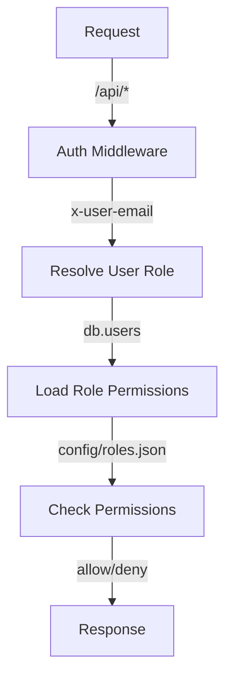

Relevant source files

The following files were used as context for generating this wiki page:

- [README.md](https://github.com/aanickode/access-control-service/blob/main/README.md)
- [docs/one-pager.md](https://github.com/aanickode/access-control-service/blob/main/docs/one-pager.md)

# Introduction

The Access Control Service is an internal Role-Based Access Control (RBAC) microservice that provides centralized permission enforcement for internal tools, APIs, and services within the organization. It manages user-role assignments, role-permission mappings, and enforces access controls at runtime, ensuring consistent and auditable permission enforcement across various systems.

The service eliminates the need for hardcoded permission logic across internal systems by decoupling role logic from application code. It serves as a single source of truth for access control decisions, promoting code reusability and maintainability.

## Purpose and Overview

The primary purpose of the Access Control Service is to centralize access control decisions and ensure consistent, auditable permission enforcement across internal systems. It achieves this by providing a declarative role-to-permission mapping configuration and middleware-based permission enforcement.

The service follows a flat RBAC model, without support for scopes or hierarchies. It maps users to roles, and roles to permissions, allowing fine-grained control over access to various resources and functionalities within the organization's internal systems.

Sources: [docs/one-pager.md:3-6](), [docs/one-pager.md:11-13]()

## Architecture and Data Flow

The Access Control Service follows a straightforward architecture and data flow:

1. Incoming requests to the `/api/*` endpoints are intercepted by the authentication middleware.
2. The middleware extracts the user's identity from the `x-user-email` HTTP header.
3. The user's role is resolved by looking up the user in the `db.users` map.
4. The permissions associated with the user's role are loaded from the `config/roles.json` configuration file.
5. The requested route is checked against the user's permissions, and access is either allowed or denied based on the result.

Sources: [docs/one-pager.md:19-23]()

## Key Components

### Authentication Middleware

The authentication middleware is responsible for extracting the user's identity from the `x-user-email` HTTP header and initiating the permission enforcement process.

Sources: [docs/one-pager.md:20]()

### User-Role Mapping

The service maintains a mapping of users to roles in the `db.users` data structure. This mapping is used to resolve a user's role based on their identity.

Sources: [docs/one-pager.md:21]()

### Role-Permission Configuration

The role-permission mappings are defined in a JSON configuration file (`config/roles.json`). This file declaratively specifies the permissions associated with each role within the system.

Sources: [docs/one-pager.md:22]()

### Route Annotations

Routes within the internal systems are annotated with the required permissions, allowing the Access Control Service to enforce access controls based on the user's role and associated permissions.

Sources: [docs/one-pager.md:23]()

## Key Features

- **Flat RBAC Model**: The service implements a flat RBAC model without support for scopes or hierarchies.
- **Declarative Role-Permission Mapping**: Role-to-permission mappings are defined declaratively in a JSON configuration file (`config/roles.json`), promoting maintainability and flexibility.
- **Middleware-based Permission Enforcement**: Permission enforcement is implemented as a middleware layer, decoupling access control logic from application code.
- **CLI Tools**: The service provides command-line interface (CLI) tools for bootstrapping and assigning roles to users.
- **REST API**: A REST API is available for managing users, roles, and permissions.

Sources: [docs/one-pager.md:11-17]()

## API Overview

The Access Control Service exposes a REST API for managing users, roles, and permissions. Here's an overview of the available endpoints:

| Method | Endpoint         | Description                   | Permission         |
|--------|------------------|-------------------------------|--------------------|
| GET    | /api/users       | List all users and roles      | `view_users`       |
| POST   | /api/roles       | Create a new role             | `create_role`      |
| GET    | /api/permissions | View all role definitions     | `view_permissions` |
| POST   | /api/tokens      | Assign user to a role         | *None (bootstrap)* |

All API requests must include the `x-user-email` HTTP header to provide the user's identity.

Sources: [docs/one-pager.md:28-35]()

## Deployment and Persistence

The Access Control Service is designed to be stateless, with configuration stored in memory. This makes it suitable for internal-only usage behind an API gateway.

For persistence and scalability, the service can be integrated with an external configuration store, such as etcd or Consul, to store and manage the role-permission mappings and user-role assignments.

Sources: [docs/one-pager.md:38-40]()

## Related Documentation

- [`docs/permissions.md`](docs/permissions.md): Provides detailed information about the role definitions and structure used by the Access Control Service.
- [`docs/api.md`](docs/api.md): Describes the complete API contract, including request/response formats and error handling.

Sources: [docs/one-pager.md:42-43]()