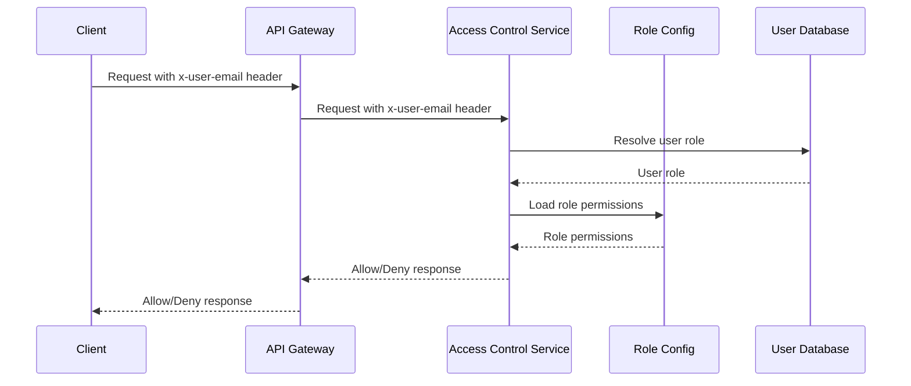

<details>
<summary>Relevant source files</summary>

The following files were used as context for generating this wiki page:

- [README.md](https://github.com/aanickode/access-control-service/blob/main/README.md)
- [docs/one-pager.md](https://github.com/aanickode/access-control-service/blob/main/docs/one-pager.md)
</details>

# Introduction

The Access Control Service is an internal Role-Based Access Control (RBAC) microservice that provides centralized permission enforcement for internal tools, APIs, and services within the organization. Its primary purpose is to eliminate hardcoded permission logic across various systems by centralizing access control decisions, ensuring consistent and auditable permission enforcement, and decoupling role logic from application code.

Sources: [docs/one-pager.md:3-5](), [docs/one-pager.md:9-11]()

## Features

The Access Control Service offers the following key features:

- **Flat RBAC Model**: It implements a flat Role-Based Access Control model without support for hierarchies or scopes.
- **Declarative Role-Permission Mappings**: Role-to-permission mappings are defined declaratively in a JSON configuration file.
- **Middleware-based Permission Enforcement**: The service provides middleware components for enforcing permissions at runtime.
- **CLI Tools**: Command-line interface (CLI) tools are available for bootstrapping and assigning roles to users.
- **REST API**: A RESTful API is provided for managing roles and users.

Sources: [docs/one-pager.md:13-18]()

## Architecture Overview

The Access Control Service follows a straightforward architecture for handling permission enforcement:

```mermaid
graph TD
    A[Request] -->|/api/*| B[authMiddleware]
    B --> C[Role Resolution]
    C --> D[Load Permissions]
    D -->|permissions[]| E[Allow/Deny]
```

1. Incoming requests to the `/api/*` endpoints are intercepted by the `authMiddleware`.
2. The user's role is resolved based on the `x-user-email` HTTP header and the `db.users` map.
3. The permissions associated with the user's role are loaded from the `config/roles.json` configuration file.
4. Based on the required permissions annotated on the routes, access is either allowed or denied.

Sources: [docs/one-pager.md:22-26]()

## Permission Enforcement Flow

The permission enforcement flow within the Access Control Service can be illustrated using a sequence diagram:



1. The client sends a request with the `x-user-email` header to the API Gateway.
2. The API Gateway forwards the request to the Access Control Service, preserving the `x-user-email` header.
3. The Access Control Service resolves the user's role by querying the User Database.
4. The Access Control Service loads the permissions associated with the user's role from the Role Config.
5. Based on the required permissions for the requested endpoint, the Access Control Service responds with an Allow/Deny decision.
6. The API Gateway relays the Allow/Deny response back to the client.

Sources: [docs/one-pager.md:22-26]()

## API Overview

The Access Control Service exposes a RESTful API for managing users, roles, and permissions. The following table summarizes the available endpoints and their corresponding permissions:

| Method | Endpoint         | Description                   | Permission         |
|--------|------------------|-------------------------------|--------------------|
| GET    | /api/users       | List all users and roles      | `view_users`       |
| POST   | /api/roles       | Create a new role             | `create_role`      |
| GET    | /api/permissions | View all role definitions     | `view_permissions` |
| POST   | /api/tokens      | Assign user to a role         | *None (bootstrap)* |

All API requests must include the `x-user-email` header to identify the user making the request.

Sources: [docs/one-pager.md:30-37]()

## Setup and Usage

To set up and run the Access Control Service, follow these steps:

1. Copy the environment configuration file:
   ```bash
   cp .env.example .env
   ```
2. Install dependencies:
   ```bash
   npm install
   ```
3. Start the service:
   ```bash
   npm run start
   ```

The service also provides a CLI tool for assigning roles to users:

```bash
node cli/manage.js assign-role alice@company.com engineer
```

This command assigns the `engineer` role to the user with the email `alice@company.com`.

Sources: [docs/one-pager.md:40-47](), [docs/one-pager.md:50-51]()

## Deployment Considerations

The Access Control Service is designed to be stateless, with no persistent database. The role definitions and configurations are stored in memory. This makes the service suitable for internal-only usage behind an API gateway.

For persistent storage of configurations, the service can be integrated with an external configuration store like etcd or Consul.

Sources: [docs/one-pager.md:54-56]()

## Related Documentation

- [`docs/permissions.md`](docs/permissions.md): Detailed documentation on role definitions and structure.
- [`docs/api.md`](docs/api.md): Complete API contract and endpoint specifications.

Sources: [docs/one-pager.md:59-61]()