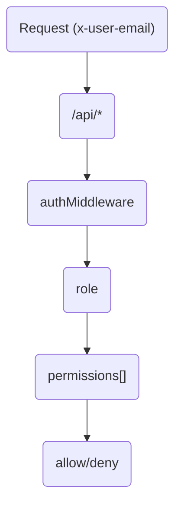
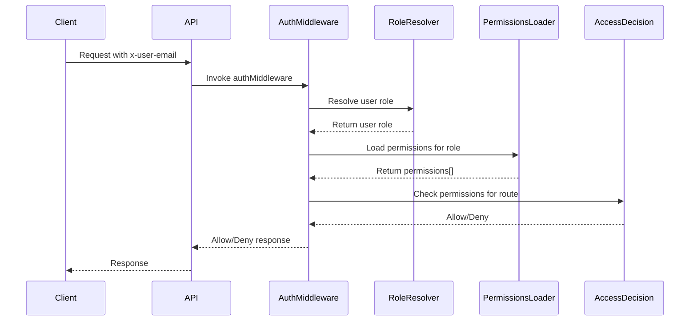

<details>
<summary>Relevant source files</summary>

The following files were used as context for generating this wiki page:

- [README.md](https://github.com/aanickode/access-control-service/blob/main/README.md)
- [docs/one-pager.md](https://github.com/aanickode/access-control-service/blob/main/docs/one-pager.md)
</details>

# Introduction

The Access Control Service is an internal Role-Based Access Control (RBAC) microservice that provides centralized permission enforcement for internal tools, APIs, and services within the organization. Its primary purpose is to manage user-role assignments, role-permission mappings, and enforce access controls at runtime, ensuring consistent and auditable permission enforcement across various systems.

By centralizing access control decisions, this service eliminates the need for hardcoded permission logic within individual applications, promoting a decoupled and maintainable architecture. It follows a flat RBAC model without hierarchies or scopes, allowing for declarative role-to-permission mappings defined in a JSON configuration file.

## Features

- Flat RBAC model (no scopes or hierarchies)
- Declarative role-to-permission mappings (via JSON config)
- Middleware-based permission enforcement
- CLI tools for bootstrapping and role assignment
- REST API for role and user management

Sources: [docs/one-pager.md](https://github.com/aanickode/access-control-service/blob/main/docs/one-pager.md)

## Architecture Overview

The Access Control Service follows a straightforward architecture, as illustrated by the following flow:



1. Incoming requests to the `/api/*` endpoints include the `x-user-email` HTTP header for identity.
2. The `authMiddleware` component resolves the user's role from the `db.users` map.
3. The user's role is used to load the associated permissions from the `config/roles.json` configuration file.
4. Routes are annotated with required permissions, and access is granted or denied based on the user's role permissions.

Sources: [docs/one-pager.md](https://github.com/aanickode/access-control-service/blob/main/docs/one-pager.md)

## Request Flow

The following sequence diagram illustrates the detailed request flow and permission enforcement process:



1. The client sends a request to the API, including the `x-user-email` header for authentication.
2. The API invokes the `authMiddleware` component.
3. The `authMiddleware` calls the `RoleResolver` to resolve the user's role based on the provided email.
4. The `RoleResolver` returns the user's role to the `authMiddleware`.
5. The `authMiddleware` calls the `PermissionsLoader` to load the permissions associated with the user's role from the `config/roles.json` configuration file.
6. The `PermissionsLoader` returns the list of permissions to the `authMiddleware`.
7. The `authMiddleware` checks if the user's permissions satisfy the requirements for the requested route.
8. The `authMiddleware` returns an allow or deny decision to the API.
9. The API responds to the client accordingly.

Sources: [docs/one-pager.md](https://github.com/aanickode/access-control-service/blob/main/docs/one-pager.md)

## API Overview

The Access Control Service exposes a REST API for managing users, roles, and permissions. The following table summarizes the available endpoints and their respective permissions:

| Method | Endpoint         | Description                   | Permission         |
|--------|------------------|-------------------------------|--------------------|
| GET    | /api/users       | List all users and roles      | `view_users`       |
| POST   | /api/roles       | Create a new role             | `create_role`      |
| GET    | /api/permissions | View all role definitions     | `view_permissions` |
| POST   | /api/tokens      | Assign user to a role         | *None (bootstrap)* |

All API requests must include the `x-user-email` header for authentication.

Sources: [docs/one-pager.md](https://github.com/aanickode/access-control-service/blob/main/docs/one-pager.md)

## CLI Usage

The Access Control Service provides a command-line interface (CLI) tool for managing user-role assignments. The following example demonstrates how to assign the `engineer` role to the user `alice@company.com`:

```bash
node cli/manage.js assign-role alice@company.com engineer
```

Sources: [docs/one-pager.md](https://github.com/aanickode/access-control-service/blob/main/docs/one-pager.md)

## Deployment Considerations

- The Access Control Service is designed to be stateless, with no persistent database. The configuration is stored in memory.
- It is suitable for internal-only usage behind an API gateway, as it is not intended for public-facing deployments.
- For persistent configuration storage, the service can be integrated with an external configuration store like etcd or Consul.

Sources: [docs/one-pager.md](https://github.com/aanickode/access-control-service/blob/main/docs/one-pager.md)

## Related Documentation

- [`docs/permissions.md`](docs/permissions.md): Detailed documentation on role definitions and structure.
- [`docs/api.md`](docs/api.md): Complete API contract and specification.

Sources: [docs/one-pager.md](https://github.com/aanickode/access-control-service/blob/main/docs/one-pager.md)

In summary, the Access Control Service provides a centralized and consistent approach to managing user roles, permissions, and enforcing access controls across internal systems. Its flat RBAC model, declarative configuration, and middleware-based enforcement promote a decoupled and maintainable architecture for permission management within the organization.