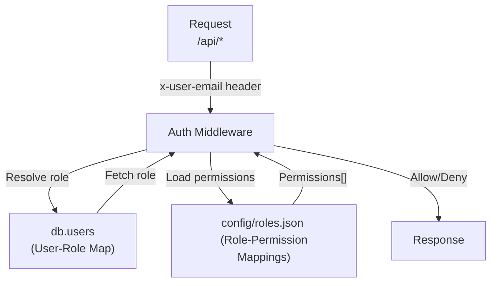

<details>
<summary>Relevant source files</summary>

The following files were used as context for generating this wiki page:

- [README.md](https://github.com/aanickode/access-control-service/blob/main/README.md)
- [docs/one-pager.md](https://github.com/aanickode/access-control-service/blob/main/docs/one-pager.md)
</details>

# Introduction

The Access Control Service is an internal Role-Based Access Control (RBAC) microservice that provides centralized permission enforcement for internal tools, APIs, and services within the organization. It manages user-role assignments, role-permission mappings, and enforces access controls at runtime, ensuring consistent and auditable permission enforcement across various systems.

The service eliminates the need for hardcoded permission logic within individual applications by decoupling role logic from application code. This approach promotes code reusability, maintainability, and a consistent access control mechanism across the organization's internal systems.

## Purpose and Overview

The primary purpose of the Access Control Service is to centralize access control decisions and ensure consistent, auditable permission enforcement across internal systems. It achieves this by providing a declarative role-to-permission mapping mechanism and a middleware-based permission enforcement approach.

The service follows a flat RBAC model, where roles are directly mapped to permissions without the need for hierarchies or scopes. This simplifies the access control logic and makes it easier to manage and reason about permissions.

Sources: [docs/one-pager.md:3-6](), [docs/one-pager.md:11-13]()

## Architecture and Data Flow

The Access Control Service follows a straightforward architecture and data flow:



1. An incoming request to the `/api/*` endpoint includes the `x-user-email` HTTP header for authentication.
2. The authentication middleware resolves the user's role from the `db.users` map, which stores user-role assignments.
3. The middleware then loads the permissions associated with the user's role from the `config/roles.json` file, which defines the role-to-permission mappings.
4. Based on the required permissions annotated on the requested route, the middleware either allows or denies the request.

Sources: [docs/one-pager.md:19-22]()

## Key Components

### Authentication Middleware

The authentication middleware is a crucial component responsible for enforcing access control. It performs the following tasks:

1. Extracts the user's identity from the `x-user-email` HTTP header.
2. Resolves the user's role from the `db.users` map.
3. Loads the permissions associated with the user's role from the `config/roles.json` file.
4. Checks if the user's role has the required permissions for the requested route.
5. Allows or denies the request based on the permission check.

Sources: [docs/one-pager.md:19-22]()

### User-Role Map (`db.users`)

The `db.users` map is an in-memory data structure that stores user-role assignments. It is used by the authentication middleware to resolve a user's role based on their email address.

Sources: [docs/one-pager.md:20]()

### Role-Permission Mappings (`config/roles.json`)

The `config/roles.json` file is a configuration file that defines the role-to-permission mappings. It maps each role to a list of permissions that users with that role are granted. This file is loaded by the authentication middleware to determine the permissions associated with a user's role.

Sources: [docs/one-pager.md:21]()

## API and CLI

The Access Control Service provides both a REST API and a Command-Line Interface (CLI) for managing users, roles, and permissions.

### API Endpoints

The following table summarizes the available API endpoints and their respective permissions:

| Method | Endpoint         | Description                   | Permission         |
|--------|------------------|-------------------------------|--------------------|
| GET    | /api/users       | List all users and roles      | `view_users`       |
| POST   | /api/roles       | Create a new role             | `create_role`      |
| GET    | /api/permissions | View all role definitions     | `view_permissions` |
| POST   | /api/tokens      | Assign user to a role         | *None (bootstrap)* |

All API requests must include the `x-user-email` HTTP header to provide the user's identity.

Sources: [docs/one-pager.md:28-33]()

### CLI Usage

The CLI provides a tool for managing user-role assignments. For example, to assign the `engineer` role to the user `alice@company.com`, you can run the following command:

```bash
node cli/manage.js assign-role alice@company.com engineer
```

Sources: [docs/one-pager.md:25-27]()

## Deployment and Persistence

The Access Control Service is designed to be stateless, with no persistent database. Instead, it relies on in-memory configurations and data structures. This makes it suitable for internal-only usage behind an API gateway.

However, for persistent storage of configurations and user-role assignments, the service can be integrated with an external configuration store, such as etcd or Consul.

Sources: [docs/one-pager.md:36-38]()

## Related Documentation

- [`docs/permissions.md`](docs/permissions.md): Provides detailed information about the role definitions and structure.
- [`docs/api.md`](docs/api.md): Describes the complete API contract for the Access Control Service.

Sources: [docs/one-pager.md:40-41]()

In summary, the Access Control Service is a crucial component that provides centralized permission enforcement and role-based access control for internal systems within the organization. It simplifies access control management, promotes consistency, and decouples permission logic from application code, making it easier to maintain and reason about access control across various internal tools, APIs, and services.