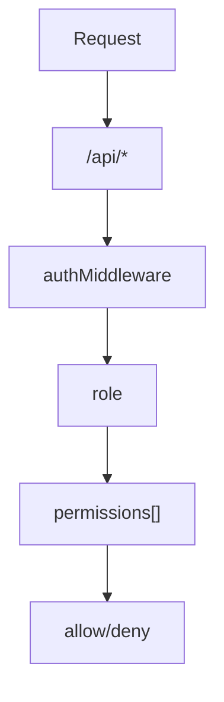

<details>
<summary>Relevant source files</summary>

The following files were used as context for generating this wiki page:

- [README.md](https://github.com/aanickode/access-control-service/blob/main/README.md)
- [docs/one-pager.md](https://github.com/aanickode/access-control-service/blob/main/docs/one-pager.md)

</details>

# Introduction

The Access Control Service is an internal Role-Based Access Control (RBAC) microservice that provides centralized permission enforcement for internal tools, APIs, and services within the organization. Its primary purpose is to manage user-role assignments, role-permission mappings, and enforce access controls at runtime, eliminating the need for hardcoded permission logic across various internal systems. By centralizing access control decisions, the service ensures consistent, auditable permission enforcement and decouples role logic from application code.

Sources: [docs/one-pager.md:1-4](), [docs/one-pager.md:8-10]()

## Features

The Access Control Service offers the following key features:

- **Flat RBAC model**: It implements a flat Role-Based Access Control model without support for scopes or hierarchies.
- **Declarative role-to-permission mappings**: Role-to-permission mappings are defined declaratively in a JSON configuration file.
- **Middleware-based permission enforcement**: The service provides middleware components for enforcing permissions at runtime.
- **CLI tools**: Command-line interface (CLI) tools are available for bootstrapping and assigning roles to users.
- **REST API**: A RESTful API is provided for managing roles and users.

Sources: [docs/one-pager.md:13-18]()

## Architecture Overview

The Access Control Service follows a simple architecture for handling requests and enforcing permissions:



1. Requests are made to the `/api/*` endpoints.
2. The `authMiddleware` component is responsible for authenticating the user based on the `x-user-email` HTTP header.
3. The user's role is resolved by looking up the user in the `db.users` map.
4. The permissions associated with the user's role are loaded from the `config/roles.json` configuration file.
5. Routes are annotated with the required permissions, and access is either allowed or denied based on the user's permissions.

Sources: [docs/one-pager.md:22-27]()

## User Management

The Access Control Service provides a CLI tool (`cli/manage.js`) for assigning roles to users. For example, to assign the `engineer` role to the user `alice@company.com`, the following command can be used:

```bash
node cli/manage.js assign-role alice@company.com engineer
```

Sources: [docs/one-pager.md:31-33]()

## API Overview

The Access Control Service exposes a RESTful API for managing users, roles, and permissions. The following table summarizes the available API endpoints and their corresponding permissions:

| Method | Endpoint         | Description                   | Permission         |
|--------|------------------|-------------------------------|--------------------|
| GET    | /api/users       | List all users and roles      | `view_users`       |
| POST   | /api/roles       | Create a new role             | `create_role`      |
| GET    | /api/permissions | View all role definitions     | `view_permissions` |
| POST   | /api/tokens      | Assign user to a role         | *None (bootstrap)* |

All API requests must include the `x-user-email` HTTP header to identify the user making the request.

Sources: [docs/one-pager.md:36-43]()

## Deployment Considerations

The Access Control Service is designed to be stateless, with no persistent database. Instead, the configuration is stored in memory. This makes it suitable for internal-only usage behind an API gateway. However, for persistent configuration storage, the service can be integrated with an external configuration store like etcd or Consul.

Sources: [docs/one-pager.md:46-48]()

## Related Documentation

- [`docs/permissions.md`](docs/permissions.md): Provides details on the role definitions and structure used by the Access Control Service.
- [`docs/api.md`](docs/api.md): Contains the complete API contract and documentation for the Access Control Service.

Sources: [docs/one-pager.md:51-53]()