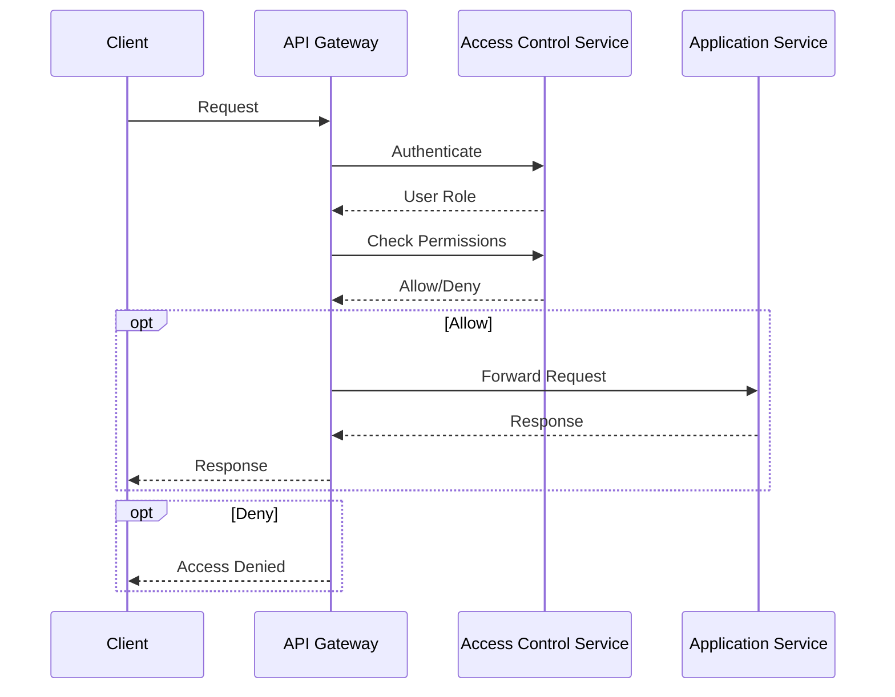

<details>
<summary>Relevant source files</summary>

The following files were used as context for generating this wiki page:

- [README.md](https://github.com/aanickode/access-control-service/blob/main/README.md)
- [docs/one-pager.md](https://github.com/aanickode/access-control-service/blob/main/docs/one-pager.md)
</details>

# Introduction

The Access Control Service is an internal Role-Based Access Control (RBAC) microservice that provides centralized permission enforcement for internal tools, APIs, and services within the organization. It manages user-role assignments, role-permission mappings, and enforces access controls at runtime, ensuring consistent and auditable permission enforcement across various systems.

The service aims to eliminate hardcoded permission logic across internal systems by decoupling role logic from application code. It follows a flat RBAC model without hierarchies or scopes, and utilizes declarative role-to-permission mappings defined in a JSON configuration file.

## Architecture Overview

The Access Control Service follows a middleware-based architecture for permission enforcement. The high-level flow is as follows:

```mermaid
graph TD
    Request[Request] -->|/api/*| authMiddleware[Auth Middleware]
    authMiddleware -->|x-user-email| resolveRole[Resolve Role]
    resolveRole -->|role| loadPermissions[Load Permissions]
    loadPermissions -->|permissions[]| enforceAccess[Enforce Access]
    enforceAccess -->|allow/deny| Response[Response]
```

1. Incoming requests to the `/api/*` routes are intercepted by the authentication middleware.
2. The middleware extracts the user's identity from the `x-user-email` HTTP header.
3. The user's role is resolved by looking up the `db.users` map.
4. The permissions associated with the user's role are loaded from the `config/roles.json` configuration file.
5. The requested route is checked against the user's permissions, and access is either allowed or denied.

Sources: [docs/one-pager.md:19-23]()

## Role Management

The Access Control Service provides a CLI tool and a REST API for managing roles and user-role assignments.

### CLI Tool

The `cli/manage.js` script allows administrators to assign roles to users. For example:

```bash
node cli/manage.js assign-role alice@company.com engineer
```

This command assigns the `engineer` role to the user with the email `alice@company.com`.

Sources: [docs/one-pager.md:28-30]()

### REST API

The service exposes a REST API for managing users, roles, and permissions. The available endpoints are:

| Method | Endpoint         | Description                   | Permission         |
|--------|------------------|-------------------------------|--------------------|
| GET    | /api/users       | List all users and roles      | `view_users`       |
| POST   | /api/roles       | Create a new role             | `create_role`      |
| GET    | /api/permissions | View all role definitions     | `view_permissions` |
| POST   | /api/tokens      | Assign user to a role         | *None (bootstrap)* |

All API requests must include the `x-user-email` header to identify the user making the request.

Sources: [docs/one-pager.md:34-42]()

## Permission Enforcement

The Access Control Service enforces permissions at runtime by checking the user's role against the required permissions for each route. Routes are annotated with the required permissions, and the service's middleware checks if the user's role has the necessary permissions before allowing access.



1. The client sends a request to the API Gateway.
2. The API Gateway authenticates the user with the Access Control Service.
3. The Access Control Service returns the user's role.
4. The API Gateway checks with the Access Control Service if the user's role has the required permissions for the requested route.
5. The Access Control Service responds with an allow or deny decision.
6. If allowed, the API Gateway forwards the request to the Application Service and returns the response to the client.
7. If denied, the API Gateway returns an "Access Denied" response to the client.

Sources: [docs/one-pager.md:19-23]()

## Deployment and Configuration

The Access Control Service is designed to be stateless, with the configuration stored in memory. This makes it suitable for internal-only usage behind an API gateway. However, for persistence and scalability, the service can be integrated with an external configuration store like etcd or Consul.

To set up the service, follow these steps:

```bash
cp .env.example .env
npm install
npm run start
```

The `config/roles.json` file defines the role-to-permission mappings, which can be modified as needed.

Sources: [docs/one-pager.md:25-27, 45-48]()

## Related Documentation

- [`docs/permissions.md`](docs/permissions.md): Detailed documentation on the role definitions and structure.
- [`docs/api.md`](docs/api.md): Complete API contract and endpoint specifications.

Sources: [docs/one-pager.md:51-52]()