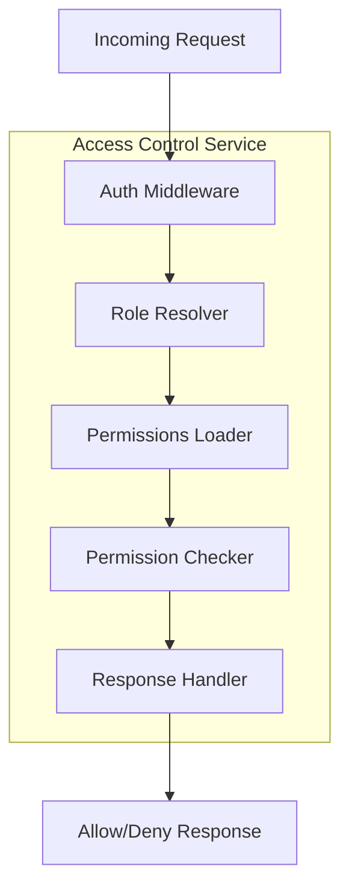
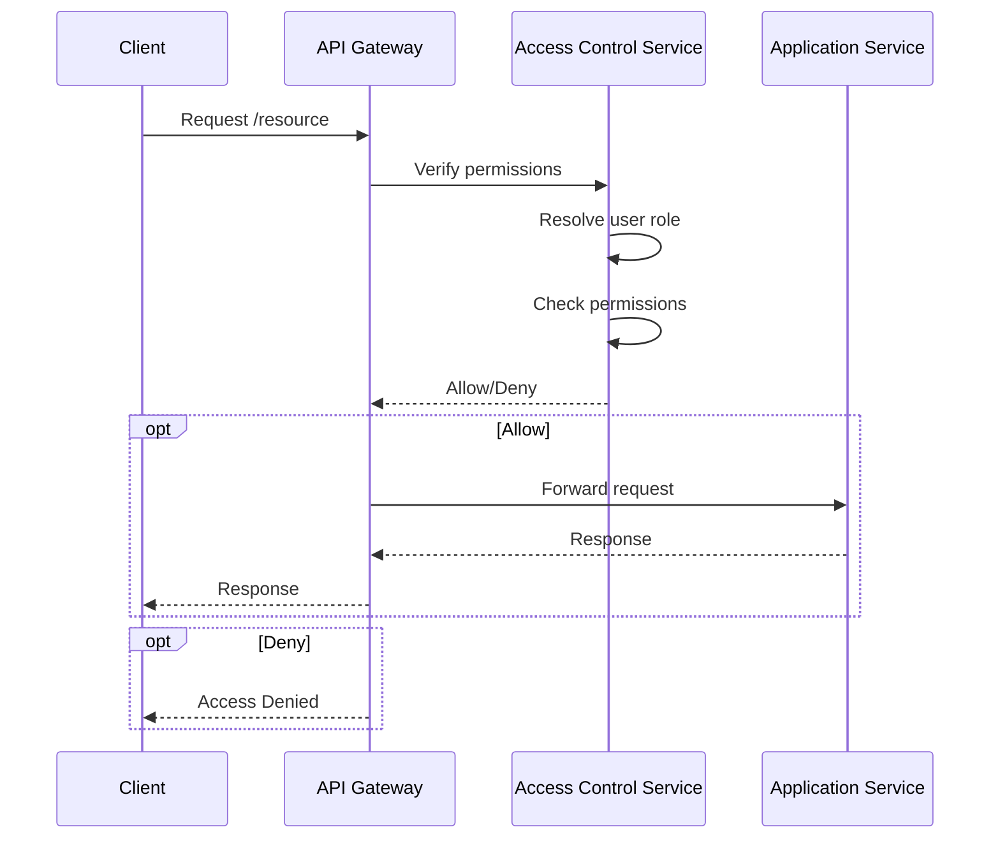

<details>
<summary>Relevant source files</summary>

The following files were used as context for generating this wiki page:

- [README.md](https://github.com/aanickode/access-control-service/blob/main/README.md)
- [docs/one-pager.md](https://github.com/aanickode/access-control-service/blob/main/docs/one-pager.md)
</details>

# Introduction

The Access Control Service is an internal Role-Based Access Control (RBAC) microservice that provides centralized permission enforcement for internal tools, APIs, and services within the organization. It manages user-role assignments, role-permission mappings, and enforces access controls at runtime, ensuring consistent and auditable permission enforcement across various systems.

The service aims to eliminate the need for hardcoded permission logic across internal systems by centralizing access control decisions. It decouples role logic from application code, promoting a modular and maintainable architecture.

## Purpose and Overview

The primary purpose of the Access Control Service is to act as a centralized authority for managing user roles, permissions, and enforcing access controls within the organization's internal systems. By consolidating access control logic into a dedicated service, it promotes consistency, auditability, and separation of concerns across different applications and services.

The service follows a flat RBAC model, where roles are directly mapped to permissions without hierarchies or scopes. Role-to-permission mappings are defined declaratively in a JSON configuration file, allowing for easy management and updates.

At runtime, the service enforces access controls by intercepting incoming requests, resolving the user's role based on their identity, and checking if the requested operation is permitted for that role. This process is facilitated by middleware components and annotated routes within the service's API.

Sources: [docs/one-pager.md:1-26](), [README.md:1-7]()

## Architecture and Data Flow

The Access Control Service follows a straightforward architecture and data flow:



1. An incoming request is intercepted by the Authentication Middleware, which extracts the user's identity from the `x-user-email` HTTP header.
2. The Role Resolver component looks up the user's assigned role from an in-memory database (`db.users` map).
3. The Permissions Loader retrieves the permissions associated with the user's role from the `config/roles.json` configuration file.
4. The Permission Checker component verifies if the requested operation (API endpoint or route) is permitted for the user's role based on the loaded permissions.
5. The Response Handler either allows or denies the request based on the permission check result.

Sources: [docs/one-pager.md:16-19]()

## Role and Permission Management

The Access Control Service provides various mechanisms for managing roles, permissions, and user-role assignments:

### Role Definitions

Role-to-permission mappings are defined declaratively in a JSON configuration file (`config/roles.json`). This file specifies the permissions granted to each role within the system.

```json
{
  "engineer": ["create_resource", "update_resource", "view_metrics"],
  "manager": ["view_users", "create_role", "view_permissions"],
  "admin": ["*"]
}
```

Sources: [docs/one-pager.md:10]()

### User-Role Assignment

The service includes a Command-Line Interface (CLI) tool for assigning roles to users. This tool interacts with the in-memory database (`db.users` map) to associate a user's email address with a specific role.

```bash
node cli/manage.js assign-role alice@company.com engineer
```

Sources: [docs/one-pager.md:22-23]()

### API Endpoints

The Access Control Service exposes a RESTful API for managing users, roles, and permissions. The following table summarizes the key API endpoints and their required permissions:

| Method | Endpoint         | Description                   | Permission         |
|--------|------------------|-------------------------------|--------------------|
| GET    | /api/users       | List all users and roles      | `view_users`       |
| POST   | /api/roles       | Create a new role             | `create_role`      |
| GET    | /api/permissions | View all role definitions     | `view_permissions` |
| POST   | /api/tokens      | Assign user to a role         | *None (bootstrap)* |

All API requests must include the `x-user-email` HTTP header to provide the user's identity.

Sources: [docs/one-pager.md:25-33]()

## Permission Enforcement

The Access Control Service enforces permissions at runtime by annotating API routes or endpoints with the required permissions. When a request is received, the service checks if the user's role has the necessary permissions to access the requested resource or perform the requested operation.



The permission enforcement process involves the following steps:

1. The client sends a request to access a resource or perform an operation.
2. The API Gateway intercepts the request and forwards it to the Access Control Service for permission verification.
3. The Access Control Service resolves the user's role based on their identity (e.g., email address).
4. The service checks if the requested operation is permitted for the user's role by consulting the role-permission mappings.
5. The Access Control Service responds to the API Gateway with an "Allow" or "Deny" decision.
6. If allowed, the API Gateway forwards the request to the appropriate Application Service for processing and returns the response to the client.
7. If denied, the API Gateway returns an "Access Denied" response to the client.

Sources: [docs/one-pager.md:16-19](), [README.md:4-5]()

## Deployment and Persistence

The Access Control Service is designed to be stateless, with role-permission mappings and user-role assignments stored in memory. This architecture makes it suitable for internal-only usage behind an API Gateway, as it does not require a persistent database.

However, for scenarios where persistence is required, the service can be integrated with an external configuration store, such as etcd or Consul. This would allow role definitions and user-role assignments to be stored and retrieved from a centralized location, enabling better scalability and high availability.

Sources: [docs/one-pager.md:35-37]()

In summary, the Access Control Service provides a centralized and consistent approach to managing user roles, permissions, and enforcing access controls across internal systems within the organization. By consolidating access control logic into a dedicated service, it promotes modularity, maintainability, and auditability of permission-related concerns.