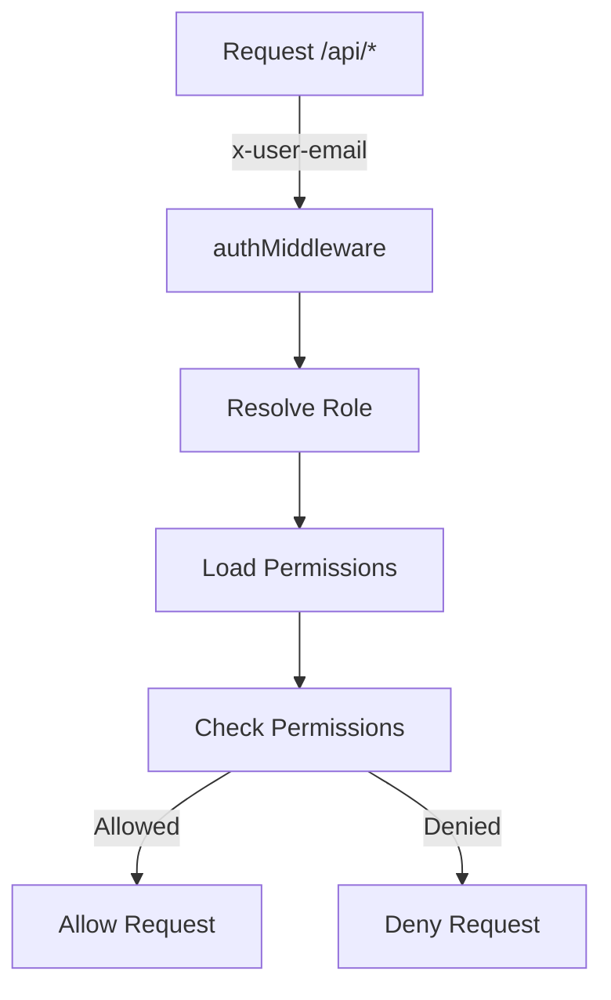
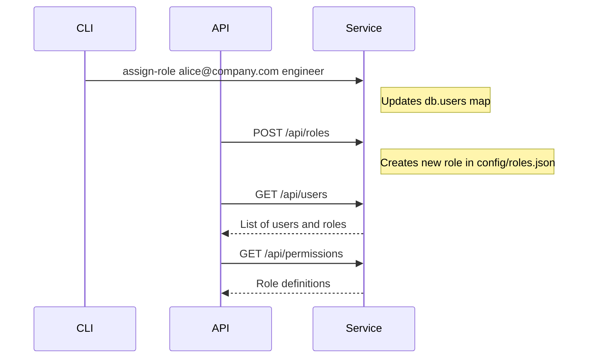
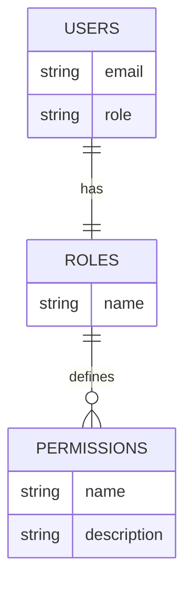

<details>
<summary>Relevant source files</summary>

The following files were used as context for generating this wiki page:

- [README.md](https://github.com/aanickode/access-control-service/blob/main/README.md)
- [docs/one-pager.md](https://github.com/aanickode/access-control-service/blob/main/docs/one-pager.md)
</details>

# Introduction

The Access Control Service is an internal Role-Based Access Control (RBAC) microservice that provides centralized permission enforcement for internal tools, APIs, and services within the organization. It manages user-role assignments, role-permission mappings, and enforces access controls at runtime, eliminating the need for hardcoded permission logic across various internal systems.

The service follows a flat RBAC model, without hierarchies or scopes, and utilizes declarative role-to-permission mappings defined in a JSON configuration file. It offers a middleware-based permission enforcement mechanism, CLI tools for bootstrapping and role assignment, and a REST API for role and user management.

## Purpose and Overview

The primary purpose of the Access Control Service is to ensure consistent, auditable permission enforcement across internal systems while decoupling role logic from application code. By centralizing access control decisions, it simplifies the management of user permissions and roles, reducing the complexity and potential inconsistencies that can arise from distributed permission handling.

Sources: [docs/one-pager.md:3-6](https://github.com/aanickode/access-control-service/blob/main/docs/one-pager.md#L3-L6), [docs/one-pager.md:9-11](https://github.com/aanickode/access-control-service/blob/main/docs/one-pager.md#L9-L11)

## Request Flow and Permission Enforcement

The Access Control Service follows a straightforward request flow for permission enforcement:



1. An incoming request to the `/api/*` endpoints includes the `x-user-email` HTTP header for user identification.
2. The `authMiddleware` component resolves the user's role by looking up the user in the `db.users` map.
3. The user's role permissions are loaded from the `config/roles.json` configuration file.
4. The requested route is checked against the user's permissions.
5. If the user has the required permissions, the request is allowed; otherwise, it is denied.

Sources: [docs/one-pager.md:17-21](https://github.com/aanickode/access-control-service/blob/main/docs/one-pager.md#L17-L21)

## Key Components

### Role Management

The Access Control Service provides a CLI tool (`cli/manage.js`) and a REST API for managing user roles. The CLI tool allows assigning roles to users, while the API provides endpoints for creating new roles, listing users and their roles, and viewing role definitions.



Sources: [docs/one-pager.md:25-27](https://github.com/aanickode/access-control-service/blob/main/docs/one-pager.md#L25-L27), [docs/one-pager.md:30-34](https://github.com/aanickode/access-control-service/blob/main/docs/one-pager.md#L30-L34)

### Configuration and Data Storage

The Access Control Service is designed to be stateless, with no persistent database. Instead, it relies on in-memory configuration and data structures:

- `db.users`: An in-memory map that stores user-to-role mappings.
- `config/roles.json`: A JSON configuration file that defines the role-to-permission mappings.



While this approach simplifies deployment and scalability, it also means that user and role data is not persisted across restarts. For persistent storage, the service would need to integrate with an external configuration store, such as etcd or Consul.

Sources: [docs/one-pager.md:17](https://github.com/aanickode/access-control-service/blob/main/docs/one-pager.md#L17), [docs/one-pager.md:19](https://github.com/aanickode/access-control-service/blob/main/docs/one-pager.md#L19), [docs/one-pager.md:41-42](https://github.com/aanickode/access-control-service/blob/main/docs/one-pager.md#L41-L42)

## Deployment and Usage

The Access Control Service is designed for internal usage within the organization, typically deployed behind an API gateway. It can be set up by copying the `.env.example` file, installing dependencies, and running the `npm run start` command.

```bash
cp .env.example .env
npm install
npm run start
```

All API requests must include the `x-user-email` header to identify the user making the request.

Sources: [docs/one-pager.md:14-16](https://github.com/aanickode/access-control-service/blob/main/docs/one-pager.md#L14-L16), [docs/one-pager.md:36](https://github.com/aanickode/access-control-service/blob/main/docs/one-pager.md#L36)

## Summary

The Access Control Service provides a centralized solution for managing user roles and permissions within the organization. By decoupling permission logic from application code and enforcing consistent access controls, it simplifies the development and maintenance of internal tools, APIs, and services. The service offers a flat RBAC model, declarative role-permission mappings, middleware-based enforcement, and CLI and API tools for role management.

Sources: [docs/one-pager.md:3-6](https://github.com/aanickode/access-control-service/blob/main/docs/one-pager.md#L3-L6), [docs/one-pager.md:9-11](https://github.com/aanickode/access-control-service/blob/main/docs/one-pager.md#L9-L11)