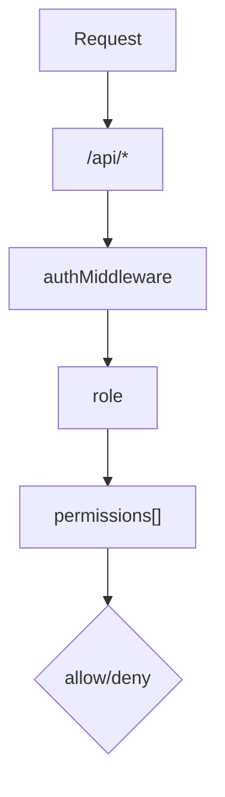

<details>
<summary>Relevant source files</summary>

The following files were used as context for generating this wiki page:

- [README.md](https://github.com/aanickode/access-control-service/blob/main/README.md)
- [docs/one-pager.md](https://github.com/aanickode/access-control-service/blob/main/docs/one-pager.md)
</details>

# Introduction

The Access Control Service is an internal Role-Based Access Control (RBAC) microservice responsible for centralized permission enforcement across various internal tools, APIs, and services within the organization. Its primary purpose is to eliminate the need for hardcoded permission logic scattered throughout different applications, ensuring consistent and auditable access control decisions. By decoupling role logic from application code, this service promotes modularity and maintainability.

Sources: [docs/one-pager.md:1-5](), [docs/one-pager.md:9-11]()

## Features

The Access Control Service provides the following key features:

- **Flat RBAC Model**: It implements a flat Role-Based Access Control model without hierarchies or scopes, simplifying the permission structure.
- **Declarative Role-Permission Mappings**: Role-to-permission mappings are defined declaratively in a JSON configuration file, allowing for easy management and updates.
- **Middleware-based Permission Enforcement**: The service integrates with applications through a middleware component, which enforces access control decisions at runtime based on the user's assigned role and the required permissions for a given route or resource.
- **CLI Tools**: Command-line interface (CLI) tools are provided for bootstrapping the service and assigning roles to users.
- **REST API**: A RESTful API is available for managing roles, users, and permissions programmatically.

Sources: [docs/one-pager.md:13-21]()

## Architecture Overview

The Access Control Service follows a simple architecture, as illustrated by the following flow:



1. Incoming requests to the `/api/*` routes are intercepted by the `authMiddleware`.
2. The user's identity is extracted from the `x-user-email` HTTP header.
3. The user's assigned role is resolved by looking up the `db.users` map.
4. The permissions associated with the user's role are loaded from the `config/roles.json` configuration file.
5. The requested route or resource is checked against the user's permissions, and access is either allowed or denied based on the decision.

Sources: [docs/one-pager.md:24-29]()

## Setup and Usage

### Setup

To set up the Access Control Service, follow these steps:

1. Copy the example environment file: `cp .env.example .env`
2. Install dependencies: `npm install`
3. Start the service: `npm run start`

Sources: [docs/one-pager.md:32-35]()

### CLI Usage

The service provides a command-line interface (CLI) tool for assigning roles to users. Here's an example usage:

```bash
node cli/manage.js assign-role alice@company.com engineer
```

This command assigns the `engineer` role to the user with the email `alice@company.com`.

Sources: [docs/one-pager.md:38-40]()

## API Overview

The Access Control Service exposes a RESTful API for managing users, roles, and permissions. Here's an overview of the available endpoints:

| Method | Endpoint         | Description                   | Required Permission |
|--------|------------------|-------------------------------|----------------------|
| GET    | `/api/users`     | List all users and roles      | `view_users`        |
| POST   | `/api/roles`     | Create a new role             | `create_role`       |
| GET    | `/api/permissions` | View all role definitions     | `view_permissions`  |
| POST   | `/api/tokens`    | Assign a user to a role       | *None (bootstrap)*  |

> **Note:** All API requests must include the `x-user-email` HTTP header with the user's email address.

Sources: [docs/one-pager.md:43-51]()

## Deployment Considerations

The Access Control Service is designed to be stateless, with no persistent database. Instead, the configuration is stored in memory. This makes it suitable for internal-only usage behind an API gateway.

For persistent configuration storage, the service can be integrated with an external configuration store, such as etcd or Consul.

Sources: [docs/one-pager.md:54-57]()

## Related Documentation

- [`docs/permissions.md`](docs/permissions.md): Detailed documentation on role definitions and structure.
- [`docs/api.md`](docs/api.md): Complete API contract and specification.

Sources: [docs/one-pager.md:60-62]()