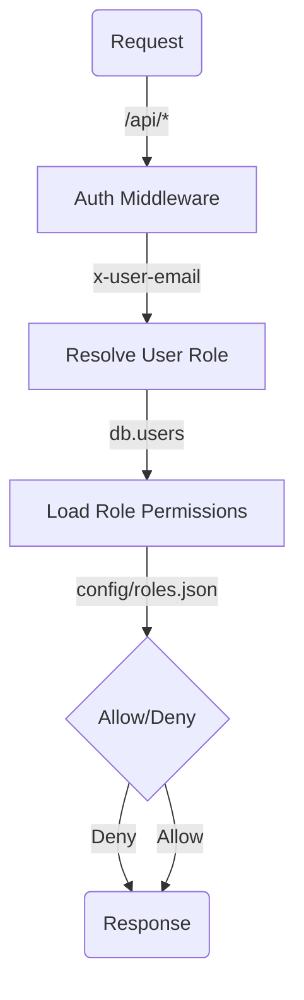

<details>
<summary>Relevant source files</summary>

The following files were used as context for generating this wiki page:

- [README.md](https://github.com/aanickode/access-control-service/blob/main/README.md)
- [docs/one-pager.md](https://github.com/aanickode/access-control-service/blob/main/docs/one-pager.md)
</details>

# Introduction

The Access Control Service is an internal Role-Based Access Control (RBAC) microservice that provides centralized permission enforcement for internal tools, APIs, and services within the organization. It manages user-role assignments, role-permission mappings, and enforces access controls at runtime, eliminating the need for hardcoded permission logic across various internal systems.

The service follows a flat RBAC model without hierarchies or scopes, allowing for declarative role-to-permission mappings defined in a JSON configuration file. It provides middleware-based permission enforcement, CLI tools for bootstrapping and role assignment, and a REST API for role and user management.

## Purpose and Overview

The primary purpose of the Access Control Service is to ensure consistent, auditable permission enforcement across internal systems while decoupling role logic from application code. By centralizing access control decisions, it simplifies the management of user roles and permissions, reducing the complexity and potential inconsistencies that can arise from scattered permission logic.

Sources: [docs/one-pager.md:3-6](), [docs/one-pager.md:11-13]()

## Architecture and Data Flow

The Access Control Service follows a straightforward architecture and data flow:



1. Incoming requests to the `/api/*` endpoints are intercepted by the `authMiddleware`.
2. The middleware extracts the user's identity from the `x-user-email` HTTP header.
3. The user's role is resolved by looking up the user in the `db.users` map.
4. The permissions associated with the user's role are loaded from the `config/roles.json` configuration file.
5. Based on the required permissions annotated on the requested route, the decision is made to allow or deny the request.
6. The appropriate response is sent back to the client.

Sources: [docs/one-pager.md:21-24]()

## Key Components

### Authentication Middleware

The authentication middleware is responsible for extracting the user's identity from the `x-user-email` HTTP header and resolving the user's role based on the `db.users` map. It acts as the entry point for enforcing access controls on incoming requests.

Sources: [docs/one-pager.md:22]()

### Role-Permission Mapping

The role-permission mappings are defined in the `config/roles.json` configuration file. This file declaratively associates roles with their respective permissions, allowing for easy management and updates without modifying the application code.

Sources: [docs/one-pager.md:23]()

### Route Annotation

Routes within the application are annotated with the required permissions for access. The Access Control Service checks these annotations against the user's role permissions to make the allow/deny decision.

Sources: [docs/one-pager.md:24]()

## Key Features

### Flat RBAC Model

The Access Control Service follows a flat RBAC model, meaning there are no hierarchies or scopes involved in the role-permission assignments. This simplifies the access control logic and management.

Sources: [docs/one-pager.md:15]()

### Declarative Role-Permission Mappings

Role-permission mappings are defined declaratively in a JSON configuration file (`config/roles.json`), allowing for easy management and updates without modifying the application code.

Sources: [docs/one-pager.md:16]()

### Middleware-based Permission Enforcement

The Access Control Service employs a middleware-based approach to enforce permissions on incoming requests. This allows for seamless integration with existing applications and APIs.

Sources: [docs/one-pager.md:17]()

### CLI Tools

The service provides CLI tools for bootstrapping and assigning roles to users, simplifying the management of user-role assignments.

Sources: [docs/one-pager.md:18]()

### REST API

A REST API is available for managing roles and users, allowing for programmatic interaction with the Access Control Service.

Sources: [docs/one-pager.md:19]()

## API Overview

The Access Control Service exposes the following API endpoints:

| Method | Endpoint         | Description                   | Permission         |
|--------|------------------|-------------------------------|--------------------|
| GET    | /api/users       | List all users and roles      | `view_users`       |
| POST   | /api/roles       | Create a new role             | `create_role`      |
| GET    | /api/permissions | View all role definitions     | `view_permissions` |
| POST   | /api/tokens      | Assign user to a role         | *None (bootstrap)* |

All API requests must include the `x-user-email` HTTP header to provide the user's identity.

Sources: [docs/one-pager.md:28-34]()

## Deployment and Persistence

The Access Control Service is designed to be stateless, with the configuration stored in memory. This makes it suitable for internal-only usage behind an API gateway. However, for persistence and scalability, the service can be integrated with an external configuration store like etcd or Consul.

Sources: [docs/one-pager.md:37-39]()

## CLI Usage Example

To assign a role to a user using the CLI tool, run the following command:

```bash
node cli/manage.js assign-role alice@company.com engineer
```

This command assigns the `engineer` role to the user with the email `alice@company.com`.

Sources: [docs/one-pager.md:26]()

## Setup and Installation

To set up and run the Access Control Service, follow these steps:

1. Copy the example environment file: `cp .env.example .env`
2. Install dependencies: `npm install`
3. Start the service: `npm run start`

Sources: [docs/one-pager.md:25]()

## Related Documentation

- [`docs/permissions.md`](docs/permissions.md): Role definitions and structure
- [`docs/api.md`](docs/api.md): Complete API contract

Sources: [docs/one-pager.md:41-42]()

In summary, the Access Control Service provides a centralized and consistent approach to managing user roles and permissions across internal systems. By leveraging a flat RBAC model, declarative role-permission mappings, and middleware-based enforcement, it simplifies access control logic and ensures auditable, decoupled permission management.