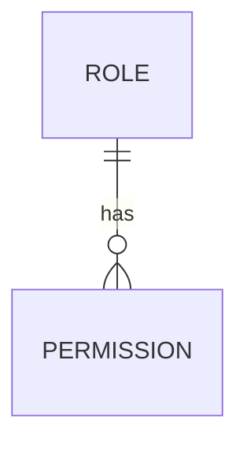
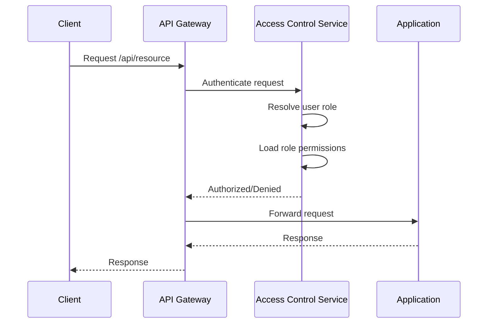

<details>
<summary>Relevant source files</summary>

The following files were used as context for generating this wiki page:

- [README.md](https://github.com/aanickode/access-control-service/blob/main/README.md)
- [docs/one-pager.md](https://github.com/aanickode/access-control-service/blob/main/docs/one-pager.md)
</details>

# Introduction

The Access Control Service is an internal Role-Based Access Control (RBAC) microservice responsible for centralized permission enforcement across various internal tools, APIs, and services within the organization. Its primary purpose is to eliminate the need for hardcoded permission logic throughout the codebase, ensuring consistent and auditable access control decisions while decoupling role management from application code.

The service follows a flat RBAC model, where roles are mapped to specific permissions in a declarative manner. It provides middleware-based permission enforcement, allowing applications to delegate access control decisions to this centralized service. Additionally, the Access Control Service offers a REST API and CLI tools for managing roles, user assignments, and permissions.

Sources: [docs/one-pager.md](https://github.com/aanickode/access-control-service/blob/main/docs/one-pager.md)

## Architecture Overview

The Access Control Service follows a straightforward architecture, as illustrated by the following flow diagram:

```mermaid
graph TD
    Request[Request] -->|/api/*| authMiddleware[Auth Middleware]
    authMiddleware -->|x-user-email| userRole[Resolve User Role]
    userRole -->|role| loadPermissions[Load Role Permissions]
    loadPermissions -->|permissions[]| enforceAccess[Enforce Access]
    enforceAccess -->|allow/deny| Response[Response]
```

1. Incoming requests to the `/api/*` routes are intercepted by the authentication middleware.
2. The middleware extracts the user's identity from the `x-user-email` HTTP header.
3. The user's role is resolved by looking up the `db.users` map.
4. The permissions associated with the user's role are loaded from the `config/roles.json` configuration file.
5. The requested route is checked against the loaded permissions, and access is either granted or denied accordingly.

Sources: [docs/one-pager.md](https://github.com/aanickode/access-control-service/blob/main/docs/one-pager.md)

## Role and Permission Management

The Access Control Service provides a declarative approach to defining role-to-permission mappings. This is achieved through a JSON configuration file (`config/roles.json`), which allows administrators to specify the permissions granted to each role.



Roles and their associated permissions are managed through the following mechanisms:

- **CLI Tools**: The service includes a command-line interface (CLI) tool (`cli/manage.js`) that allows administrators to assign roles to users. For example, `node cli/manage.js assign-role alice@company.com engineer` would assign the `engineer` role to the user with the email `alice@company.com`.

- **REST API**: The service exposes a REST API for managing roles and permissions. The available endpoints are:

  | Method | Endpoint         | Description                   | Permission         |
  |--------|------------------|-------------------------------|--------------------|
  | GET    | /api/users       | List all users and roles      | `view_users`       |
  | POST   | /api/roles       | Create a new role             | `create_role`      |
  | GET    | /api/permissions | View all role definitions     | `view_permissions` |
  | POST   | /api/tokens      | Assign user to a role         | *None (bootstrap)* |

  All API requests must include the `x-user-email` header to identify the requesting user.

Sources: [docs/one-pager.md](https://github.com/aanickode/access-control-service/blob/main/docs/one-pager.md)

## Permission Enforcement

The Access Control Service enforces permissions at runtime by annotating routes with the required permissions. The authentication middleware intercepts incoming requests and checks if the user's role grants the necessary permissions for the requested route.



1. The client sends a request to the API Gateway.
2. The API Gateway forwards the request to the Access Control Service for authentication.
3. The Access Control Service resolves the user's role and loads the associated permissions.
4. The Access Control Service checks if the requested route is permitted for the user's role and responds with an authorization decision.
5. If authorized, the API Gateway forwards the request to the appropriate application.
6. The application processes the request and returns a response.
7. The response is sent back to the client through the API Gateway.

Sources: [docs/one-pager.md](https://github.com/aanickode/access-control-service/blob/main/docs/one-pager.md)

## Deployment and Integration

The Access Control Service is designed to be stateless, with configuration stored in memory. This makes it suitable for internal-only usage behind an API Gateway. However, for persistent configuration storage, the service can be integrated with an external configuration store like etcd or Consul.

Sources: [docs/one-pager.md](https://github.com/aanickode/access-control-service/blob/main/docs/one-pager.md)

## Conclusion

The Access Control Service provides a centralized and consistent approach to managing and enforcing permissions across internal systems. By decoupling role logic from application code, it promotes code reusability, maintainability, and audibility. The service's flat RBAC model, declarative configuration, and middleware-based enforcement make it a valuable component in the organization's internal infrastructure.

Sources: [docs/one-pager.md](https://github.com/aanickode/access-control-service/blob/main/docs/one-pager.md)