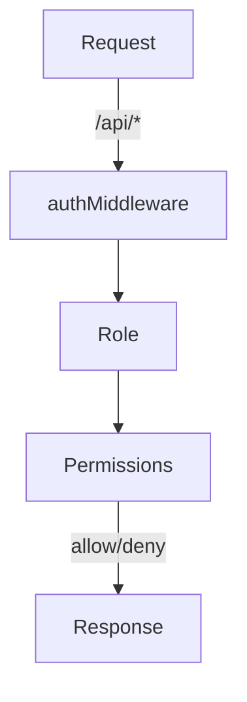
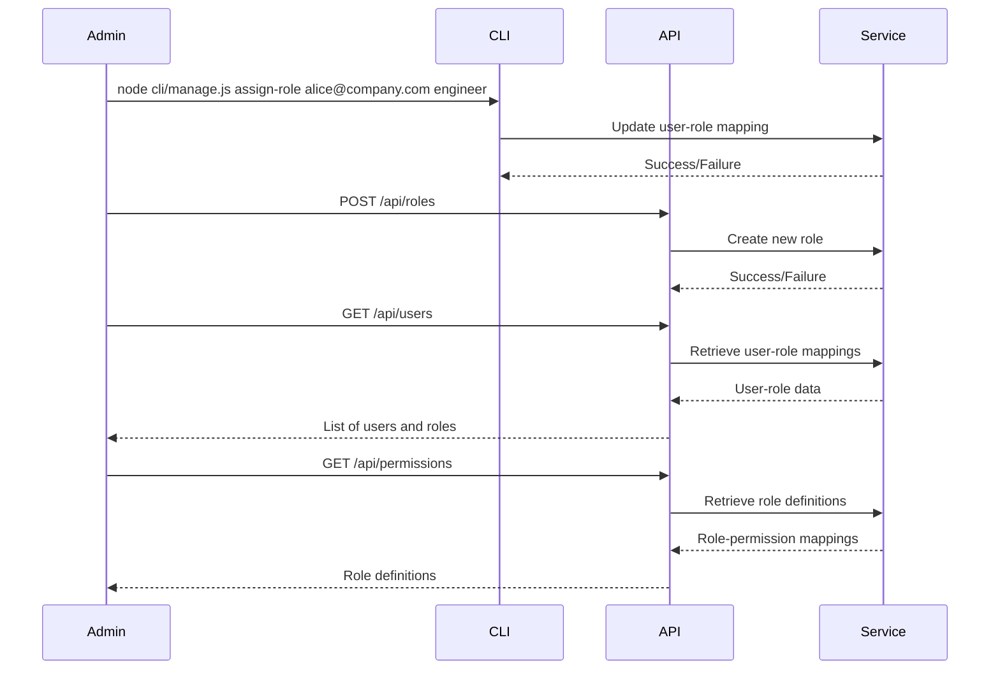
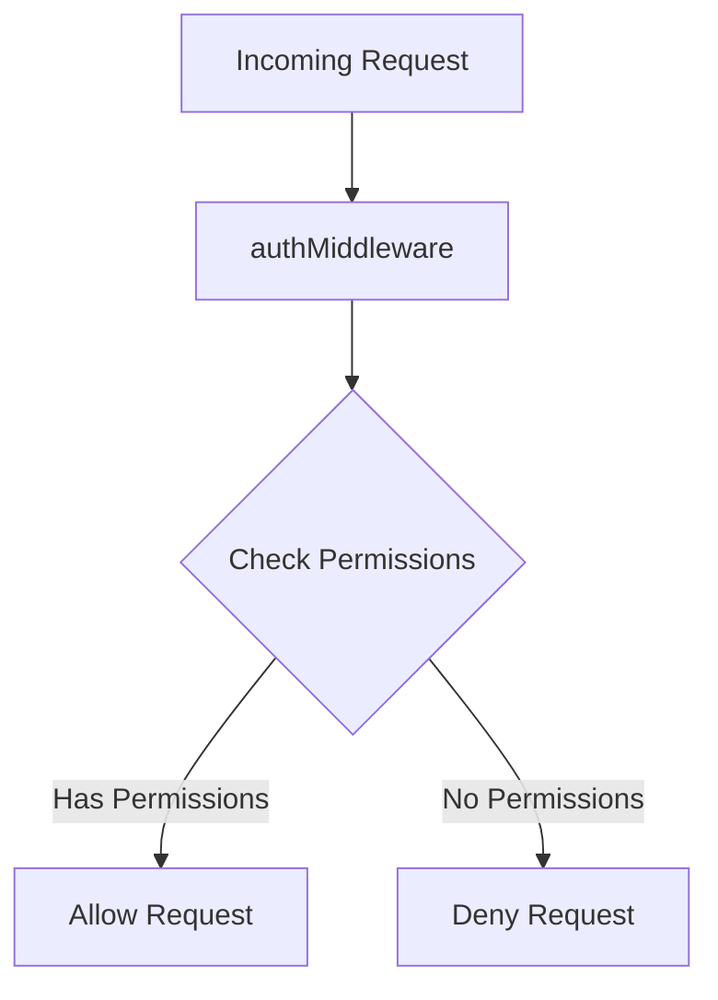
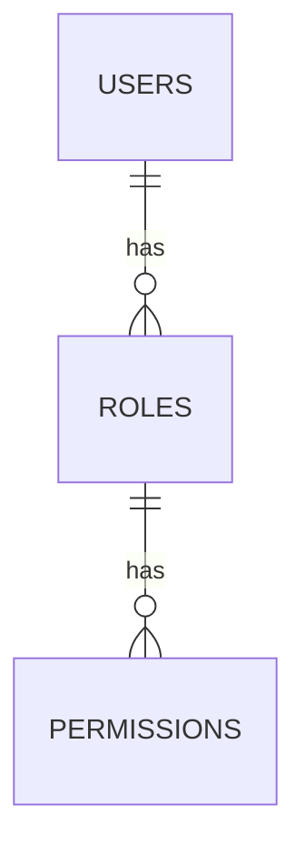

Relevant source files

The following files were used as context for generating this wiki page:

- [README.md](https://github.com/aanickode/access-control-service/blob/main/README.md)
- [docs/one-pager.md](https://github.com/aanickode/access-control-service/blob/main/docs/one-pager.md)

# Introduction

The Access Control Service is an internal Role-Based Access Control (RBAC) microservice responsible for centralized permission enforcement across various internal tools, APIs, and services within the organization. Its primary purpose is to eliminate the need for hardcoded permission logic across different systems by providing a centralized and consistent approach to managing user roles, role-permission mappings, and enforcing access controls at runtime.

Sources: [docs/one-pager.md:1-3](https://github.com/aanickode/access-control-service/blob/main/docs/one-pager.md#L1-L3), [README.md:1-2](https://github.com/aanickode/access-control-service/blob/main/README.md#L1-L2)

## Architecture Overview

The Access Control Service follows a flat RBAC model, where user identities are mapped to roles, and roles are associated with a set of permissions. The service employs a middleware-based approach to enforce permissions, intercepting incoming requests and checking if the user's role has the required permissions to access the requested resource or perform the desired action.

The high-level request flow is as follows:

1. An incoming request to the `/api/*` endpoint is intercepted by the `authMiddleware`.
2. The user's identity is extracted from the `x-user-email` HTTP header.
3. The user's role is resolved by looking up the `db.users` map.
4. The permissions associated with the user's role are loaded from the `config/roles.json` configuration file.
5. The requested resource or action is checked against the user's permissions, and the request is either allowed or denied based on the outcome.

Sources: [docs/one-pager.md:13-17](https://github.com/aanickode/access-control-service/blob/main/docs/one-pager.md#L13-L17)

## Role Management

The Access Control Service provides a CLI tool (`cli/manage.js`) and a REST API for managing user roles and permissions. The CLI tool allows administrators to assign roles to users, while the API provides endpoints for creating new roles, listing users and their roles, and viewing the role definitions and associated permissions.

Sources: [docs/one-pager.md:21-28](https://github.com/aanickode/access-control-service/blob/main/docs/one-pager.md#L21-L28), [README.md:9-12](https://github.com/aanickode/access-control-service/blob/main/README.md#L9-L12)

## Permission Enforcement

The Access Control Service enforces permissions by annotating routes or resources with the required permissions. The `authMiddleware` checks if the user's role has the necessary permissions before allowing access to the requested resource or action.

The permission enforcement flow is as follows:

1. An incoming request is intercepted by the `authMiddleware`.
2. The middleware checks if the user's role has the required permissions for the requested resource or action.
3. If the user has the necessary permissions, the request is allowed to proceed.
4. If the user does not have the required permissions, the request is denied.

Sources: [docs/one-pager.md:13-17](https://github.com/aanickode/access-control-service/blob/main/docs/one-pager.md#L13-L17)

## Configuration and Deployment

The Access Control Service is designed to be stateless, with no persistent database. The role-permission mappings and user-role assignments are stored in memory, loaded from the `config/roles.json` configuration file and the `db.users` map, respectively.

The service is suitable for internal-only usage behind an API gateway. For persistent storage and configuration management, the service can be integrated with an external configuration store like etcd or Consul.

Sources: [docs/one-pager.md:29-31](https://github.com/aanickode/access-control-service/blob/main/docs/one-pager.md#L29-L31), [README.md:3-6](https://github.com/aanickode/access-control-service/blob/main/README.md#L3-L6)

## Summary

The Access Control Service provides a centralized and consistent approach to managing user roles, role-permission mappings, and enforcing access controls across various internal systems within the organization. It follows a flat RBAC model, employing a middleware-based approach to enforce permissions at runtime. The service offers CLI tools and a REST API for managing roles and permissions, and it is designed to be stateless and suitable for internal-only usage behind an API gateway.

Sources: [docs/one-pager.md:1-3](https://github.com/aanickode/access-control-service/blob/main/docs/one-pager.md#L1-L3), [README.md:1-2](https://github.com/aanickode/access-control-service/blob/main/README.md#L1-L2)