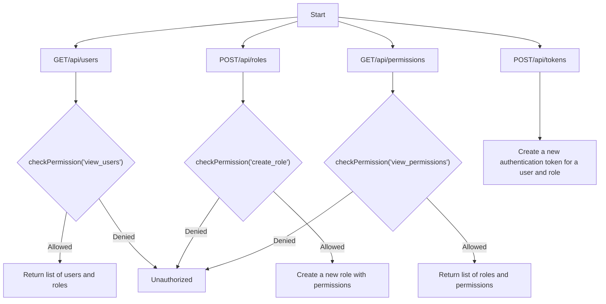
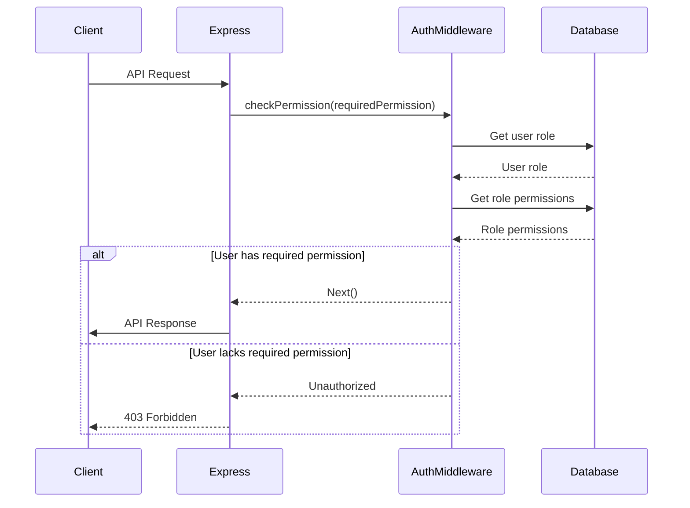

<details>
<summary>Relevant source files</summary>

The following files were used as context for generating this wiki page:

- [src/index.js](https://github.com/aanickode/access-control-service/blob/main/src/index.js)
- [src/routes.js](https://github.com/aanickode/access-control-service/blob/main/src/routes.js)
- [src/authMiddleware.js](https://github.com/aanickode/access-control-service/blob/main/src/authMiddleware.js)
- [src/db.js](https://github.com/aanickode/access-control-service/blob/main/src/db.js)
- [package.json](https://github.com/aanickode/access-control-service/blob/main/package.json)
</details>

# Architecture Overview

The Access Control Service is a Node.js application built with Express.js that provides a RESTful API for managing user roles, permissions, and authentication tokens. It serves as a centralized access control system for other services or applications within a larger project.

Sources: [src/index.js](), [src/routes.js](), [package.json]()

## Application Structure

The application follows a modular structure with separate files for different concerns:

- `index.js`: The entry point that sets up the Express server and starts listening on a specified port.
- `routes.js`: Defines the API routes and their corresponding handlers.
- `authMiddleware.js`: Contains a middleware function for checking user permissions.
- `db.js`: Provides an in-memory data store for users, roles, and permissions.

Sources: [src/index.js](), [src/routes.js](), [src/authMiddleware.js](), [src/db.js]()

## API Endpoints

The Access Control Service exposes the following API endpoints:



Sources: [src/routes.js]()

### GET /api/users

- **Description**: Retrieves a list of users and their associated roles.
- **Permission Required**: `view_users`
- **Response**: JSON array of user objects with `email` and `role` properties.

Sources: [src/routes.js:5-8]()

### POST /api/roles

- **Description**: Creates a new role with a set of permissions.
- **Permission Required**: `create_role`
- **Request Body**:
  - `name` (string): The name of the new role.
  - `permissions` (array): An array of permission strings for the new role.
- **Response**: JSON object with the new role's `name` and `permissions`.

Sources: [src/routes.js:10-16]()

### GET /api/permissions

- **Description**: Retrieves a list of all roles and their associated permissions.
- **Permission Required**: `view_permissions`
- **Response**: JSON object where keys are role names, and values are arrays of permission strings.

Sources: [src/routes.js:18-21]()

### POST /api/tokens

- **Description**: Creates a new authentication token for a user and associates it with a role.
- **Permission Required**: None
- **Request Body**:
  - `user` (string): The user's identifier (e.g., email).
  - `role` (string): The name of the role to associate with the user.
- **Response**: JSON object with the `user` and `role` properties.

Sources: [src/routes.js:23-30]()

## Authentication and Authorization

The Access Control Service uses a custom middleware function `checkPermission` to enforce role-based access control (RBAC) on certain API endpoints.



The `checkPermission` middleware function:

1. Extracts the user's role from the request context (e.g., JWT token).
2. Retrieves the permissions associated with the user's role from the in-memory database.
3. Checks if the required permission is present in the user's role permissions.
4. If the user has the required permission, the request is allowed to proceed to the next middleware or route handler.
5. If the user lacks the required permission, a 403 Forbidden response is sent.

Sources: [src/authMiddleware.js](), [src/routes.js:5,10,18]()

## Data Storage

The Access Control Service uses an in-memory data store implemented in `db.js` to store user information, roles, and permissions. This data store is a simple JavaScript object with the following structure:

```javascript
const db = {
  users: {
    // 'user@example.com': 'admin',
    // 'another@example.com': 'viewer',
  },
  roles: {
    // 'admin': ['view_users', 'create_role', 'view_permissions'],
    // 'viewer': ['view_users', 'view_permissions'],
  },
};
```

- `users`: An object where keys are user identifiers (e.g., email addresses), and values are the corresponding role names.
- `roles`: An object where keys are role names, and values are arrays of permission strings associated with each role.

While this in-memory data store is suitable for demonstration purposes, a production-ready implementation would likely use a more robust and persistent data storage solution, such as a relational database or a NoSQL database.

Sources: [src/db.js]()

## Dependencies

The Access Control Service relies on the following external dependencies:

| Dependency | Version | Description |
| ---------- | ------- | ----------- |
| express    | ^4.18.2 | Fast, unopinionated, minimalist web framework for Node.js |
| dotenv     | ^16.0.3 | Loads environment variables from a `.env` file |

These dependencies are specified in the `package.json` file and can be installed using a package manager like npm or yarn.

Sources: [package.json]()

## Conclusion

The Access Control Service provides a centralized solution for managing user roles, permissions, and authentication tokens within a larger project. It follows a modular architecture with separate concerns handled by different components. The service exposes a RESTful API for creating and retrieving roles, permissions, and authentication tokens, with role-based access control enforced through a custom middleware function. While the current implementation uses an in-memory data store, a production-ready system would likely integrate with a more robust and persistent data storage solution.

Sources: [src/index.js](), [src/routes.js](), [src/authMiddleware.js](), [src/db.js](), [package.json]()