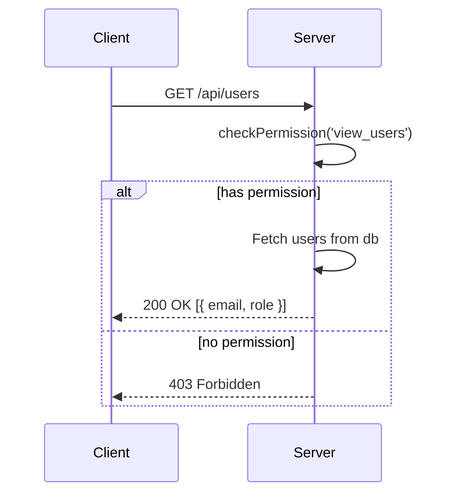
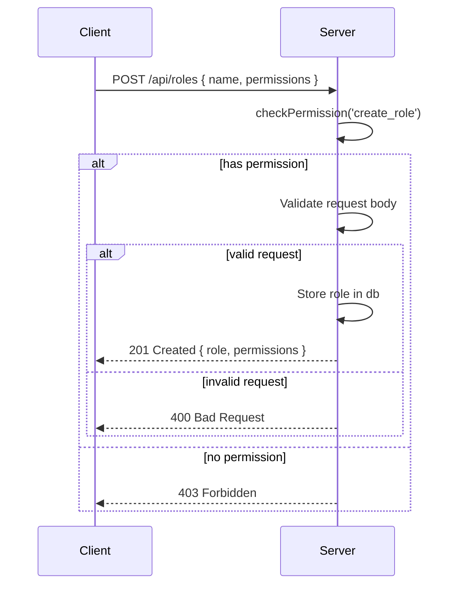
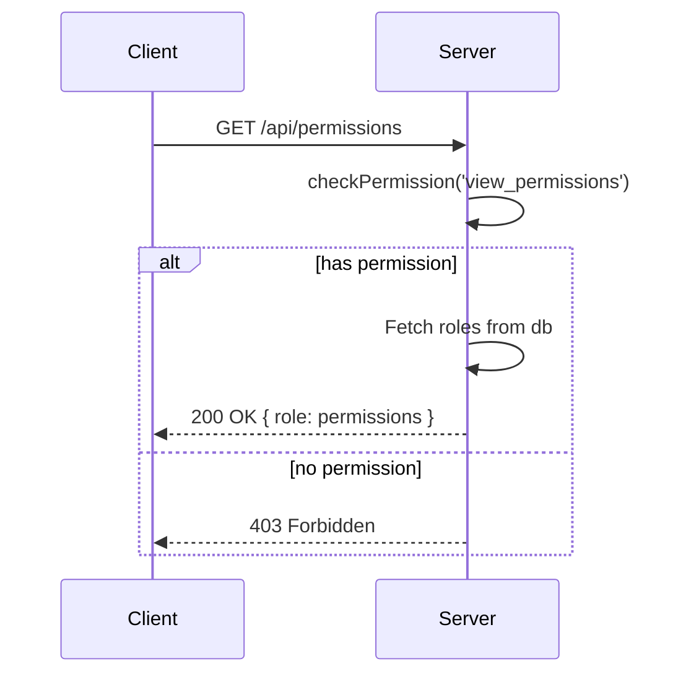
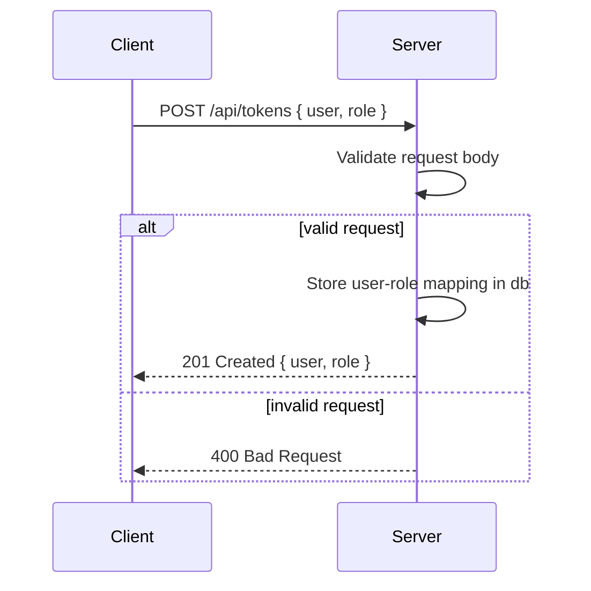
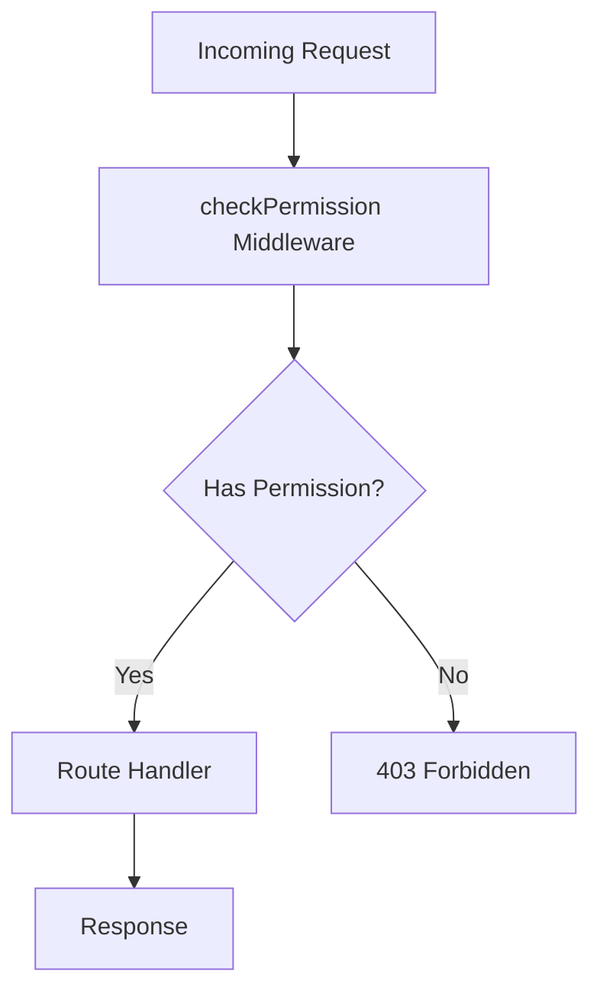

<details>
<summary>Relevant source files</summary>

The following files were used as context for generating this wiki page:

- [src/index.js](https://github.com/aanickode/access-control-service/blob/main/src/index.js)
- [src/routes.js](https://github.com/aanickode/access-control-service/blob/main/src/routes.js)
- [src/authMiddleware.js](https://github.com/aanickode/access-control-service/blob/main/src/authMiddleware.js)
- [src/db.js](https://github.com/aanickode/access-control-service/blob/main/src/db.js)
- [package.json](https://github.com/aanickode/access-control-service/blob/main/package.json)
</details>

# Architecture Overview

## Introduction

This wiki page provides an overview of the architecture and components of the Access Control Service, a Node.js application built with Express.js. The service manages user roles, permissions, and authentication tokens within an organization. It exposes a RESTful API for creating roles, assigning permissions, viewing users and their roles, and generating authentication tokens.

Sources: [src/index.js](), [src/routes.js](), [package.json]()

## Application Structure

The application follows a modular structure, with separate files for different concerns:

- `index.js`: The entry point that sets up the Express server and configures middleware.
- `routes.js`: Defines the API routes and their handlers.
- `authMiddleware.js`: Contains the `checkPermission` middleware function for role-based access control.
- `db.js`: Provides an in-memory data store for users, roles, and permissions.

Sources: [src/index.js](), [src/routes.js](), [src/authMiddleware.js](), [src/db.js]()

## API Endpoints

The service exposes the following API endpoints:

### `GET /api/users`

Retrieves a list of all users and their assigned roles.



Requires the `view_users` permission.

Sources: [src/routes.js:5-8]()

### `POST /api/roles`

Creates a new role with the specified name and permissions.



Requires the `create_role` permission.

Sources: [src/routes.js:10-18]()

### `GET /api/permissions`

Retrieves a list of all roles and their associated permissions.



Requires the `view_permissions` permission.

Sources: [src/routes.js:20-23]()

### `POST /api/tokens`

Generates an authentication token for a user by assigning them a role.



This endpoint does not require any specific permission.

Sources: [src/routes.js:25-33]()

## Role-Based Access Control (RBAC)

The Access Control Service implements role-based access control (RBAC) using the `checkPermission` middleware function. This middleware checks if the authenticated user has the required permission to access a specific route.



The `checkPermission` middleware function retrieves the user's role from the request context (e.g., JWT token) and checks if the role has the required permission in the `db.roles` object.

Sources: [src/authMiddleware.js](), [src/routes.js:5,10,20]()

## Data Storage

The service uses an in-memory data store (`db.js`) to store user-role mappings, roles, and their associated permissions. This data store is a simple JavaScript object with the following structure:

```javascript
const db = {
  users: {
    'user1@example.com': 'admin',
    'user2@example.com': 'viewer',
    // ...
  },
  roles: {
    'admin': ['view_users', 'create_role', 'view_permissions'],
    'viewer': ['view_users', 'view_permissions'],
    // ...
  }
}
```

In a production environment, this data store should be replaced with a persistent storage solution, such as a database or a key-value store.

Sources: [src/db.js]()

## Dependencies

The Access Control Service relies on the following key dependencies:

| Dependency | Description                                                  |
|------------|--------------------------------------------------------------|
| express    | Fast, unopinionated, minimalist web framework for Node.js    |
| dotenv     | Loads environment variables from a `.env` file               |

Sources: [package.json]()

## Conclusion

The Access Control Service provides a RESTful API for managing user roles, permissions, and authentication tokens within an organization. It follows a modular architecture with separate concerns handled by different files. The service implements role-based access control (RBAC) using a middleware function and stores data in an in-memory data store. In a production environment, the data store should be replaced with a persistent storage solution, and additional security measures, such as authentication and authorization mechanisms, should be implemented.