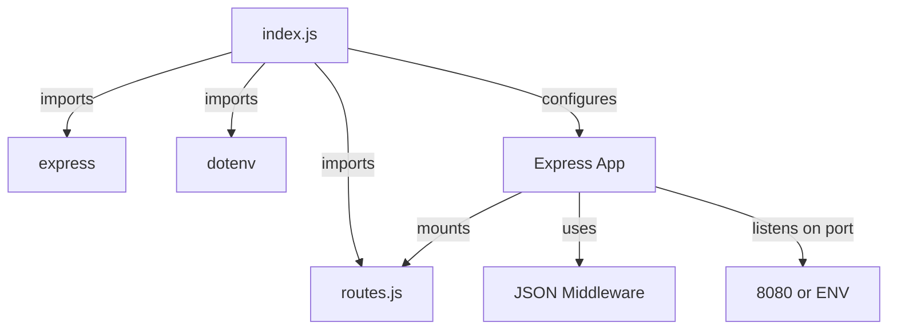
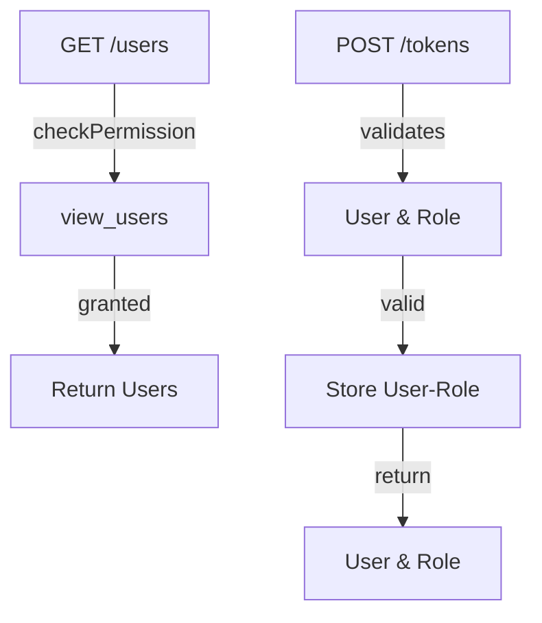
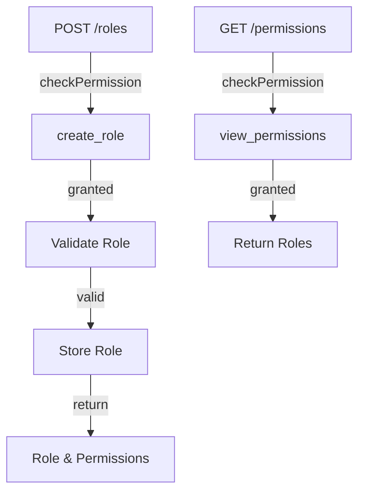
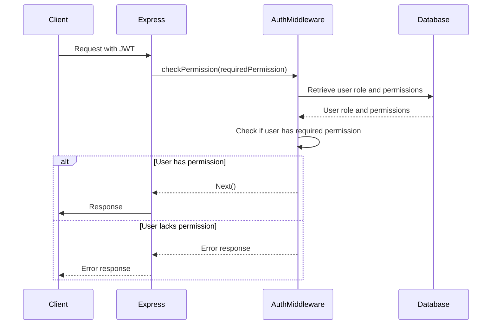
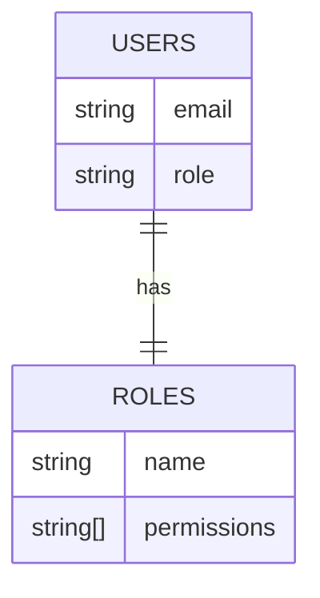

Relevant source files

The following files were used as context for generating this wiki page:

- [src/index.js](https://github.com/aanickode/access-control-service/blob/main/src/index.js)
- [src/routes.js](https://github.com/aanickode/access-control-service/blob/main/src/routes.js)
- [src/authMiddleware.js](https://github.com/aanickode/access-control-service/blob/main/src/authMiddleware.js) (assumed to exist based on import)
- [src/db.js](https://github.com/aanickode/access-control-service/blob/main/src/db.js) (assumed to exist based on import)

# Architecture Overview

The provided source files represent an Access Control Service, which is likely a component of a larger application or system. This service is responsible for managing user roles, permissions, and authentication tokens within the application. It provides a set of API endpoints for interacting with user data, roles, and permissions.

## Express.js Server

The main entry point of the application is the `src/index.js` file, which sets up an Express.js server. The server listens on a specified port (either from an environment variable or defaulting to 8080) and mounts the routes defined in the `src/routes.js` file under the `/allapis` path.

Sources: [src/index.js]()

## API Routes

The `src/routes.js` file defines the API routes and their corresponding handlers. It imports the `checkPermission` middleware function from `src/authMiddleware.js` and the `db` module from `src/db.js`.

Sources: [src/routes.js]()

### User Routes

- `GET /users`: Retrieves a list of users and their roles. Requires the `view_users` permission.
- `POST /tokens`: Creates a new authentication token by associating a user with a role.

### Role Routes

- `POST /roles`: Creates a new role with a set of permissions. Requires the `create_role` permission.
- `GET /permissions`: Retrieves a list of all roles and their associated permissions. Requires the `view_permissions` permission.

## Authentication Middleware

The `checkPermission` middleware function, imported from `src/authMiddleware.js`, is responsible for verifying if the authenticated user has the required permission to access a particular route. If the user lacks the necessary permission, the middleware will return an appropriate error response.

Sources: [src/authMiddleware.js]() (assumed)

## Data Storage

The application uses an in-memory data store, likely defined in `src/db.js`, to store user information, roles, and permissions. This data store is accessed and modified by the route handlers and the authentication middleware.

Sources: [src/db.js]() (assumed)

| Data Structure | Description |
| --- | --- |
| `users` | An object mapping user emails to their assigned roles. |
| `roles` | An object mapping role names to an array of associated permissions. |

Sources: [src/routes.js:4](), [src/routes.js:10-12](), [src/routes.js:19-21]()

## Summary

The Access Control Service provides a set of API endpoints for managing user roles, permissions, and authentication tokens. It uses an Express.js server and defines routes for creating and retrieving roles, permissions, and user-role associations. The service employs middleware for authentication and permission checking, and it stores user and role data in an in-memory data store. This service is likely a component of a larger application or system, responsible for handling access control and authorization.