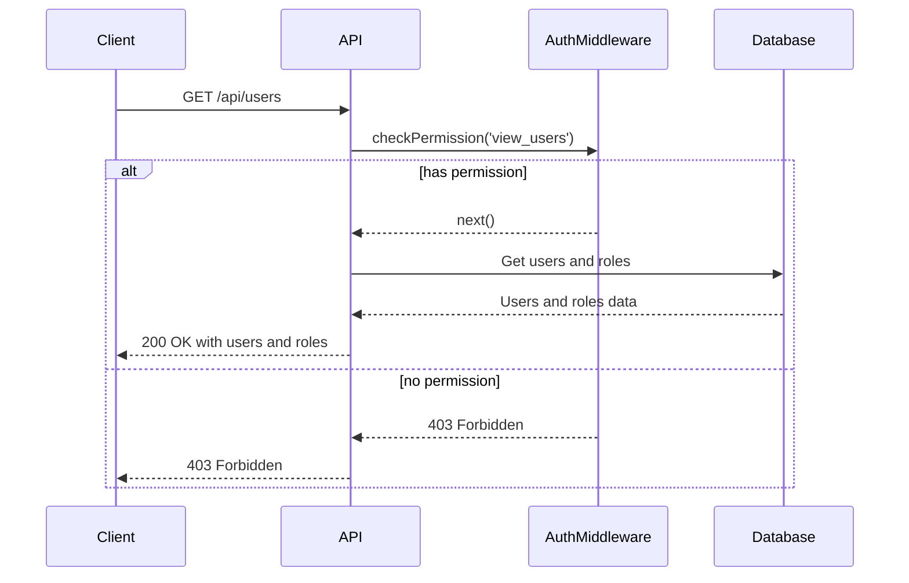
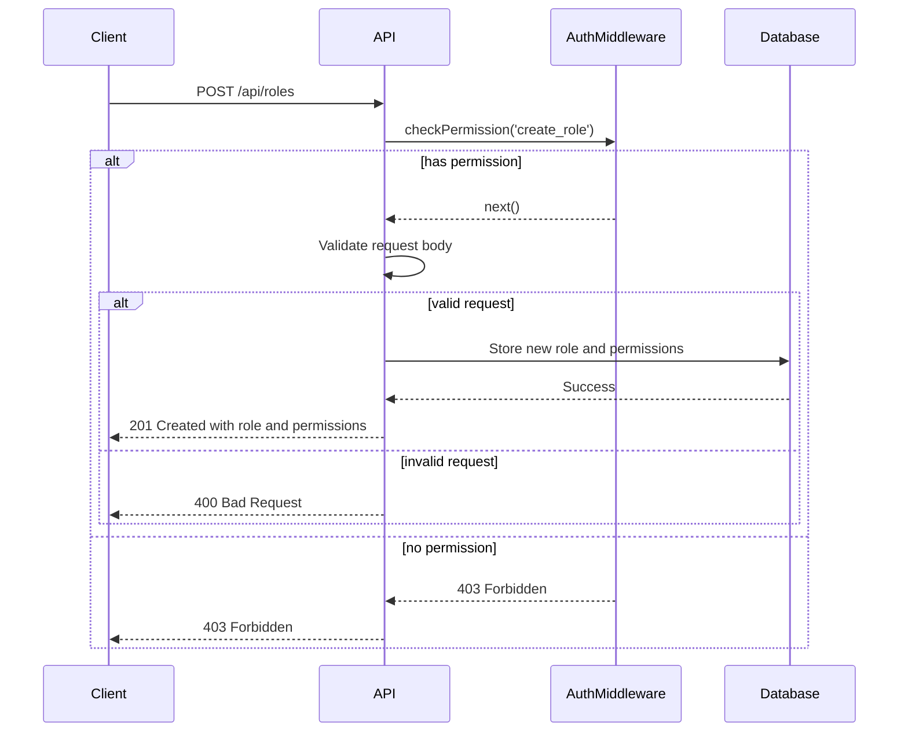
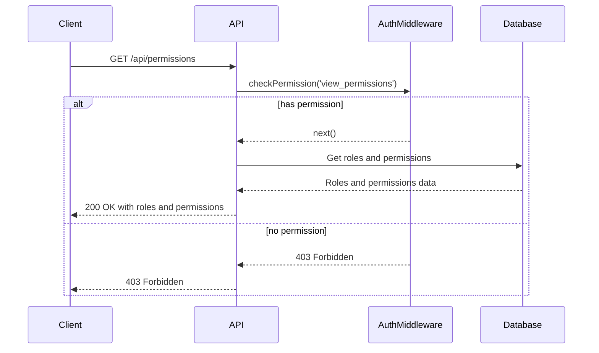
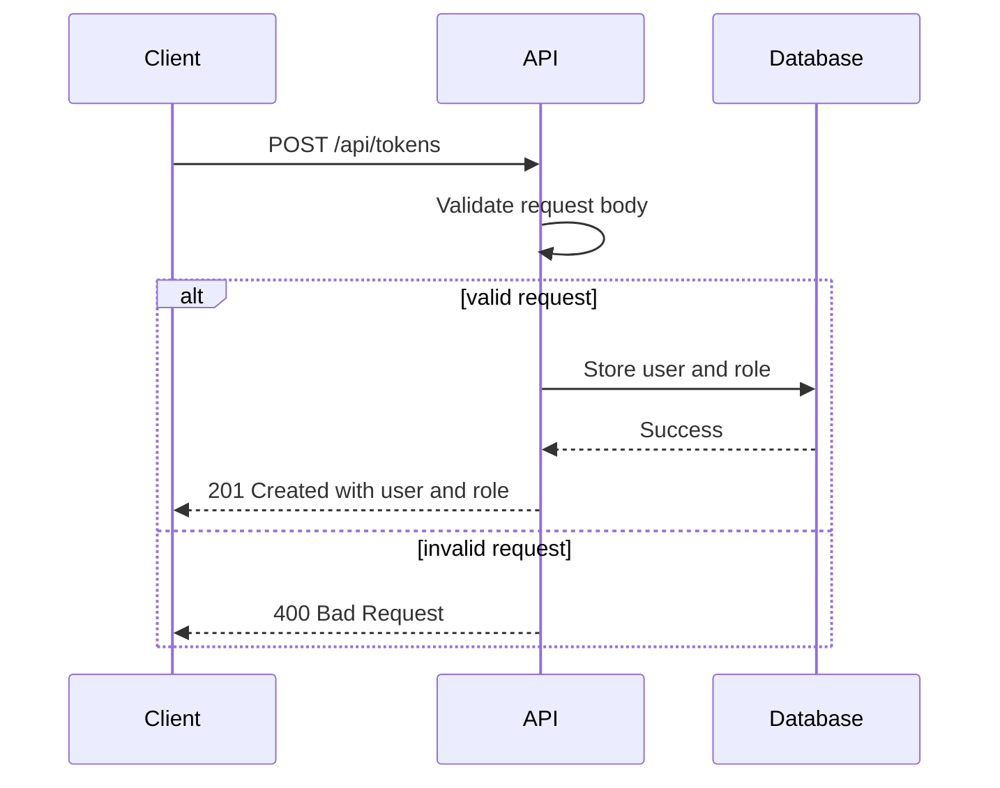
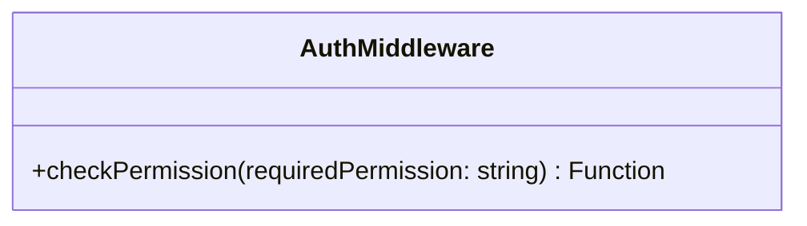
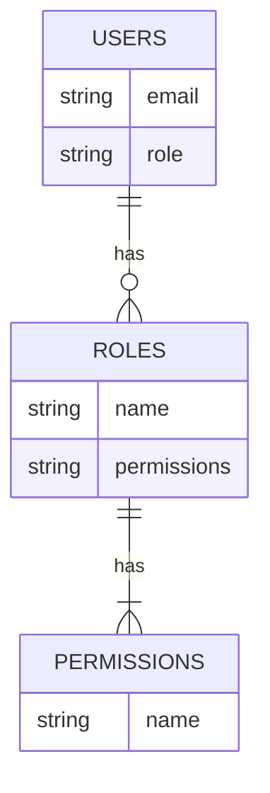

<details>
<summary>Relevant source files</summary>

The following files were used as context for generating this wiki page:

- [src/index.js](https://github.com/aanickode/access-control-service/blob/main/src/index.js)
- [src/routes.js](https://github.com/aanickode/access-control-service/blob/main/src/routes.js)
- [src/authMiddleware.js](https://github.com/aanickode/access-control-service/blob/main/src/authMiddleware.js) (assumed to exist based on import statement)
- [src/db.js](https://github.com/aanickode/access-control-service/blob/main/src/db.js) (assumed to exist based on import statement)

</details>

# Architecture Overview

The Access Control Service is a Node.js application built with Express.js that provides a RESTful API for managing user roles, permissions, and authentication tokens. It serves as a centralized access control system for other services or applications within a larger project or ecosystem.

Sources: [src/index.js](), [src/routes.js]()

## Application Structure

The application follows a modular structure, with the main entry point being `src/index.js`. This file sets up the Express application, configures middleware, and mounts the API routes defined in `src/routes.js`.

```mermaid
graph TD
    A[src/index.js] -->|imports| B[express]
    A -->|imports| C[dotenv]
    A -->|imports| D[routes.js]
    A -->|uses| E[express.json()]
    A -->|mounts| D
    A -->|listens on port| F[PORT]
```

Sources: [src/index.js]()

## API Routes

The `src/routes.js` file defines the API routes and their corresponding handlers. It imports the `checkPermission` middleware from `src/authMiddleware.js` and the `db` module from `src/db.js`.

```mermaid
graph TD
    A[src/routes.js] -->|imports| B[express]
    A -->|imports| C[authMiddleware.js]
    A -->|imports| D[db.js]
    A -->|defines| E[/api/users]
    A -->|defines| F[/api/roles]
    A -->|defines| G[/api/permissions]
    A -->|defines| H[/api/tokens]
    E -->|uses| C
    F -->|uses| C
    G -->|uses| C
```

Sources: [src/routes.js]()

### User Management

The `/api/users` route retrieves a list of all registered users and their associated roles. It is protected by the `checkPermission` middleware, which ensures that only users with the `view_users` permission can access this route.



Sources: [src/routes.js:5-8]()

### Role Management

The `/api/roles` route allows creating new roles with a set of associated permissions. It is protected by the `checkPermission` middleware, which requires the `create_role` permission.



Sources: [src/routes.js:9-16]()

### Permission Retrieval

The `/api/permissions` route retrieves a list of all defined roles and their associated permissions. It is protected by the `checkPermission` middleware, which requires the `view_permissions` permission.



Sources: [src/routes.js:17-20]()

### Token Management

The `/api/tokens` route allows creating new authentication tokens by associating a user with a role. It does not require any specific permission.



Sources: [src/routes.js:21-28]()

## Authentication Middleware

The `src/authMiddleware.js` file (not provided) likely contains the implementation of the `checkPermission` middleware function, which is responsible for verifying the user's permissions based on their role and the required permission for a specific route.



Sources: [src/routes.js:3]() (import statement)

## Data Storage

The `src/db.js` file (not provided) likely contains an in-memory data store for managing users, roles, and their associated permissions. It is imported and used by the `src/routes.js` file to perform CRUD operations on the data.



Sources: [src/routes.js:4]() (import statement)

## Summary

The Access Control Service provides a RESTful API for managing user roles, permissions, and authentication tokens. It follows a modular structure with separate concerns for API routes, authentication middleware, and data storage. The API endpoints are secured using a permission-based access control system, ensuring that only authorized users can perform specific actions. The service serves as a centralized access control system for other services or applications within a larger project or ecosystem.

Sources: [src/index.js](), [src/routes.js]()